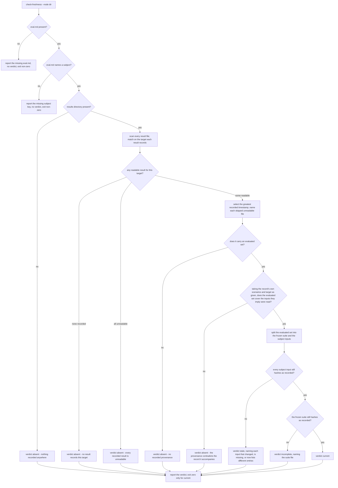

# check-freshness — is this recorded eval result still current?

Read the newest eval result recorded for a target, compare the file hashes that result recorded
against the files in the working tree now, and return one of four verdicts — **current**, **stale**,
**incomplete**, or **absent** — naming the recorded files that no longer match.

## What

`run` writes an eval result to `.agents/aced/results/<target>/<timestamp>.json`. Anyone who later
reads that result — a person, or `run` and `improve` deciding whether to cite it instead of scoring
again — needs to know whether it still describes the configuration on disk. Without an answer they
guess, and a guess that says "still good" turns a passing result into a false claim about code that
has since changed.

This node answers the question **from the record itself**. `run` records the files it read and their
content hashes (`eval-run/run/`); this check re-hashes those same paths in the working tree and
compares. Nothing is inferred: no modification times, no guessed file sets, no guessed directory
names.

**Key terms**

| Term | Meaning |
|---|---|
| **evaluated set** | The list `run` recorded of every input it **reports** consuming to judge the target, each entry a repository path plus a SHA-256 hash. A **file** entry hashes the content read; a **directory** entry hashes the names the listing returned, which is what makes a file *added* to that directory detectable. |
| **recorded provenance** | The evaluated set carried by one result record — **the run's own account** of what it consumed, not a verified trace (see the trust boundary below). A result written before this contract carries none. |
| **the frozen suite** | The node's `<node>.feature` — one member of the evaluated set, handled apart from the rest because a change to it means something different. |
| **subject inputs** | Every member of the evaluated set that is not the frozen suite: the target configuration, the files it loads, any directory `run` recorded listing to find them, and the target's `eval.md`. |

**The four verdicts**

| Verdict | Means | Because |
|---|---|---|
| **current** | Every input the run recorded still hashes to what was recorded. | The run's own account of what it read still holds. **Not** a claim that the tree is unchanged (growth the run never consumed is invisible — the closed world below), nor that the run read everything it should have (the trust boundary below). |
| **stale** | At least one recorded **subject input** differs from the tree, is gone, or (for a directory) now lists different entries. | At least one input the scores rest on has moved, and this check cannot tell which scores depended on it — so no individual score can be relied on without re-running. Unlike `incomplete`, there is no fact left that survives the change. |
| **incomplete** | Every subject input matches, but the recorded **frozen suite** differs from the tree's. | Every input the scores rest on is unmoved, so the existing scores survive; the suite grew or changed past them, so the result no longer covers the whole suite. Merging this into `stale` would throw away that surviving fact. |
| **absent** | There is no recorded provenance this check can compare against. | No results directory, no result recorded for this target, no readable result, the newest result carries no evaluated set, or the evaluated set it carries **contradicts the record it accompanies** (see the trust boundary below). |

**The closed world — stated, because a guard's blind spot must never be implicit**

This check compares **the inputs the result was computed from**, and nothing else. It never
re-resolves what the subject depends on *now*. That is deliberate: inferring a prose configuration's
dependent file set is a guess, and resting a freshness answer on that guess is what got the first
attempt at this capability rejected. So `current` means **every input this result was computed from
still hashes as recorded** — it is never a claim that the subject has not grown.

That reading leaves one gap: a file **added** after the run, which no recorded entry would notice.
The gap is closed **at the producer, not here** — `run` records a hash over the entries of every
directory it listed, so a file added to a directory the subject loads from changes a recorded entry
and reads as `stale` (`eval-run/run/`). Growth reaching the subject through a path `run` never
consumed stays invisible by construction, and correctly so: it was not an input, so the result stays
truthful about what it measured. The suite pins **both halves** — the addition that must be caught,
and the growth that must not be guessed at.

**The trust boundary — `evaluated` is an account, not a trace**

The other half of the same boundary. `run` is prose an agent executes, not a script, so the evaluated
set is **what the run reports it consumed**. Nothing observes the agent's actual reads. An
**over**-report is catchable — a recorded file the subject does not load is visible in the record
against a known fixture. An **under**-report is not: a run that skimmed, or never opened a reference
file it should have loaded, records a *shorter* set whose every entry then matches perfectly, and
this check answers `current` with full confidence. That failure is silent and it points the **unsafe**
way.

What is checkable without a trace is **coherence** — a **conditional** relation, never a proof. *If*
the record's `scenarios` and `target` are truthful, *then* a set omitting the frozen `.feature` those
scenario names came from, or omitting the configuration that `target` field names, is **incomplete**:
scores cannot come from a `.feature` never read, and a configuration cannot be judged unopened. The
record establishes nothing on its own — an agent that fabricates scores writes a self-consistent
record and passes. So such a set is **self-contradictory relative to its own claims** — and reads
`absent`, not `current`. That oracle is independent of the **evaluated set** — it does not take the
recorded input list on trust — but it is **not** independent of the record: `scenarios` and `target`
are written by the same agent and are self-reported exactly as `evaluated` is. So it catches only an
**inconsistent** under-reporter. An agent that under-reports **uniformly** — skims the suite and then
records scores only for the scenarios it read — contradicts nothing, and escapes. So does a quietly
skipped reference file. Both read `current`, and no verdict here can find either. What is closed is
the class that is checkable; the classes left open are the ones that matter most. Reading `current` as "the run's account still holds" is sound; reading it
as "the run read everything it should have" is not, and this node never claims the second.

**Non-goals** — scoring anything (`run`); comparing two versions (`compare`); the project-wide
roll-up (`report`); deciding **what a caller does** with a verdict — no node consumes this verdict
yet, and wiring the callers is a separate change against each of those nodes; judging whether a
recorded *pass* was well-founded (a judge-protocol
question, out of scope here); **re-resolving the subject's current dependent set** (the closed world
above); **verifying that the run actually read what it recorded** (the trust boundary above — that
needs harness-level tool-call telemetry, which no ACED node has); writing, repairing, or deleting any
result.

## Use Cases

This engine is **not an ACED subject** — it decides by comparing recorded hashes against files on
disk, so its output is deterministic and directly assertable by `node:test` rather than LLM-graded.
It therefore carries **no `**Fit:**` line** and ACED's graded lenses do not apply to it, following
the `sdd-roles/extract-situation/` precedent. Its suite is boolean throughout and binds to the
engine's own tests.

**Subject** — given one spec node directory (its `eval.md` and its frozen `.feature`), report whether
the inputs the newest result recorded for that node's target was computed from still hash as recorded
in the working tree.

### Actors and their goals

Enumerated actor-first; entry points are mapped afterward, so a goal with no way in stays visible.

| Actor | Goal | Reaches it through |
|---|---|---|
| A person reviewing a recorded eval result | decide whether the pass they are reading still describes the configuration on disk, and if not, see which inputs moved | UC1 |
| A gating automation — a CI job or a scheduled run citing a recorded result | stop the moment a cited result stops holding, without parsing a report | UC2 |
| `run` and `improve` (sibling capabilities) | skip re-scoring when the recorded result still holds | **nothing — the caller side is unbuilt** (below) |
| *Affected without invoking:* whoever is handed a report, a diagnosis, or a PR comment that cites a recorded result | not be shown a passing result that stopped being true | reached only through the actors above |

**The unserved goal, recorded rather than hidden.** `improve` already carries this goal in prose —
*"ensure a recent result exists — run `run` first if the latest `results/` file is stale or missing"* —
with no definition of `stale` to consult, and `run` has the same goal when it considers citing a
recorded result instead of scoring again. Neither has a way in. The missing way in belongs to **those
two nodes**, not to this one: each needs scenarios whose `Given` *names* a verdict, in the shape UC2's
`only a current verdict exits zero` already uses. That wiring is **cut from this change** and carried
as a follow-up, so until it lands `check-freshness` is specified, tested, and consulted by nobody — a
recorded gap, not an oversight.

There is **one** entry point, `check-freshness --node <node-dir>`; UC1 and UC2 are two goals reaching
it, distinguished by which half of its outcome the actor consumes.

### UC1 — read the verdict on a recorded result

- **Actor** — a person reviewing an eval result before acting on it.
- **Goal** — know whether the result still describes the configuration on disk, and which inputs moved
  if it does not.
- **Entry point** — **trigger:** `check-freshness --node <node-dir>`. **Inputs:** that directory's
  `eval.md` and frozen `.feature`, the recorded results under `.agents/aced/results/`, and the working
  tree. **Outcome:** one of `current` / `stale` / `incomplete` / `absent`, naming each recorded input
  that no longer matches. Nothing is written.
- **Extensions** — every path from the trigger that does not reach a verdict naming the tree's state:

  | Cause | Outcome |
  |---|---|
  | the node directory holds no `eval.md` | no verdict; the missing file is named; fail closed |
  | the `eval.md` omits the `subject:` key | no verdict; the missing key is named; fail closed |
  | no results directory exists anywhere | `absent` — nothing was ever recorded |
  | results exist, but none records this target | `absent` |
  | every result recorded for this target is unparseable | `absent`, each unreadable file named |
  | the newest result is unparseable but an older readable one exists | the unreadable file is named and skipped; the verdict comes from the newest **readable** result |
  | the selected result predates the provenance contract and carries no evaluated set | `absent` — there is nothing to compare |
  | the selected result's evaluated set contradicts its own `scenarios` and `target` fields | `absent` — the provenance is incoherent, so it is not compared (the trust boundary above) |
  | a recorded subject input changed, is gone, or (a directory) now lists different entries | `stale`, naming each |
  | every subject input matches but the frozen suite changed | `incomplete`, naming the suite |

  Two things that look like extensions are **not** — both reach a verdict, and both are limitations of
  what a verdict means rather than divergences from it: growth reaching the subject by a path the run
  never consumed reads `current` by construction (the closed world above), and a run that
  under-reported what it read also reads `current` (the trust boundary above).

### UC2 — gate on freshness without reading the report

- **Actor** — a gating automation: a CI job or a scheduled run that cites a recorded result.
- **Goal** — fail as soon as a cited result stops holding, consuming a status rather than prose.
- **Entry point** — **trigger:** the same invocation. **Inputs:** the same. **Outcome:** exit zero for
  `current` and non-zero for every other verdict.
- **Extensions** —

  | Cause | Outcome |
  |---|---|
  | the check fails closed (no `eval.md`, no `subject:` key) | also non-zero, so the gate stops rather than passing on an undecidable node |
  | the verdict is `absent` | non-zero — a node with no comparable record does not pass a gate on the strength of having no record |

  The exit status alone therefore never distinguishes *not current* from *could not decide*; the
  report names which, and UC1 is the path for an actor that needs to know.

### Surface trace

The surface is one required option, `--node <node-dir>`, needed by both use cases; there are no
optional elements and so no combination to constrain. Nothing else is exposed: the verdict and the
list of non-matching inputs go to standard output, and the exit status is the only other channel —
each traced to UC1 and UC2 respectively.

## Control Flow

One entry point, one pass. Every path ends in a verdict or in a fail-closed exit; nothing is written.

## Scenario map

Every scenario binds 1:1 to a CFG edge, grouped by use case. Scenarios derive from the CFG alone;
the extension lists above are the instrument that made the graph complete, never a source a row is
drawn from — so the counts do not correspond.

### UC1 — read the verdict on a recorded result

Rows follow the CFG top to bottom: resolve the target, select the recorded result, decide the verdict.

| Edge | Path (Given) | Scenario |
|---|---|---|
| `C` → yes | an eval.md naming a subject | `a node whose eval.md names a subject resolves that target` |
| `B` → no | a node directory holding no eval.md | `a node with no eval.md fails closed` |
| `C` → no | an eval.md whose frontmatter omits the subject key | `an eval.md with no subject key fails closed` |
| `D` → no | a repository with no results directory | `a repository with no results directory reports absent` |
| `F` → none recorded | a results directory holding results for other targets only | `a target with no recorded result reports absent` |
| `E` match on recorded target | a result for this target filed under a directory named after something else | `the result is matched by the target it records, not by the directory it sits in` |
| `G` greatest recorded timestamp | two results whose filename order disagrees with their recorded timestamps | `the newest result is the one whose recorded timestamp is greatest` |
| `G` skip unreadable | two results for the target, the newer one not parseable as JSON | `an unreadable result file is skipped and named` |
| `F` → all unreadable | a target whose only results are unparseable | `a target whose every recorded result is unreadable reports absent` |
| `H` → no | a result written before the evaluated set existed | `a result carrying no evaluated set reports absent` |
| `H2` → no, suite missing | a result scoring named scenarios whose evaluated set omits the frozen `.feature` | `a result whose evaluated set omits the suite it scored reports absent` |
| `H2` → no, configuration missing | a result whose evaluated set omits the configuration its own target field names | `a result whose evaluated set omits the configuration it names reports absent` |
| `K` → yes | every recorded file hashes as recorded | `a result whose recorded files all match the working tree is current` |
| `J` → no, content changed | a recorded subject file edited since the run | `a recorded subject file whose content changed makes the result stale` |
| `J` → no, file gone | a recorded subject file deleted since the run | `a recorded file that is no longer in the tree makes the result stale` |
| `K` → no | subject files unchanged, the frozen suite edited | `a changed suite with an unchanged subject is incomplete, not stale` |
| `J` → no, both changed | a subject file and the frozen suite both edited | `a subject change alongside a suite change is reported stale` |
| `J` → yes, mtime only | a recorded file re-timestamped with its bytes unchanged | `a file touched without a content change stays current` |
| `J` → no, a recorded directory grew | a file added to a directory the evaluated set records | `a file added to a recorded directory makes the result stale` |
| `K` → yes, growth outside the recorded inputs | a file added to a sibling assets directory the configuration does not load from | `growth the result never consumed is not reported` |
| `R` read-only | any invocation | `it writes nothing` |

### UC2 — gate on freshness without reading the report

| Edge | Path (Given) | Scenario |
|---|---|---|
| `R` exit code | any of the four verdicts | `only a current verdict exits zero` |

## References

- `eval-run/run/` — the producer of the `evaluated` set this node reads. Without that contract every
  answer here would be a guess, which is what the rejected first attempt at this capability was.
