# run — score the current config against its frozen .feature suite

## What

Resolve a target's frozen `.feature` suite and its `eval.md` run policy, judge every scenario via
`aced-case-judge` over the configured run count, then report the pass rate, per-layer breakdown, and
failing scenarios worst-first, and persist the run.

**Subject** — scoring a target agent configuration against its frozen `.feature` suite (and its
`eval.md` run policy) over N runs and reporting the outcome.

**Key terms**

| Term | Meaning |
|---|---|
| **the evaluated set** | Every input this run reports consuming to judge the target — the configuration, the files it loads, the target's `eval.md`, the frozen `.feature`, and any directory it listed to find them — each recorded as a repository path plus a SHA-256 hash. A **file** entry hashes the content read; a **directory** entry hashes the names the listing returned, which is what makes a file later *added* to it detectable. |
| **the results record** | The timestamped file one completed run persists: the scores, the target it scored, the evaluated set it recorded, and the scoring model it ran under. `check-freshness` reads it; `run` never interprets one. |
| **the scoring model** | The model this run dispatched `aced-case-judge` under — the `eval.md` `judge.model` when the run honored it, otherwise the model it actually dispatched under, and `unknown` when neither is available — the reachable case being an `eval.md` that declares no `judge.model`, leaving the dispatch to the harness, whose choice the dispatching agent cannot observe. Recorded per record, beside the scores rather than inside the evaluated set: it names who produced the transcripts, not an input whose bytes could be re-hashed. |

**Non-goals** — authoring or fixing scenarios (`add-scenario` / `improve`); diffing two versions (`compare`);
the project-wide health roll-up (`report`); how a single case is scored (that is `aced-case-judge`);
deciding whether an already-written result is still current (that is `check-freshness` — `run` records
the provenance it needs, and does not interpret it); **proving** that the recorded inputs are the ones
actually read (see the trust boundary below); judging what a change of scoring model *means* for a recorded result — `run` records which model scored it and stops there, and no node re-scores or invalidates on that basis.

The limit on what `evaluated` can mean is the trust boundary under UC3, the use case it qualifies.

## Use Cases

**Fit:** strong — the capability carries a genuine activation decision (a scoring request versus
sibling eval intents — `compare` / `report` / `add-scenario` — that share the same eval vocabulary),
and its suite resolution, per-shape judge dispatch, blind-judge invocation, layer/run policy, and
scale-aware reporting are judged, not asserted.

### Actors and their goals

Enumerated actor-first; entry points are mapped afterward, so a goal reaching this capability by no
trigger of its own stays visible instead of being absorbed into the surface that already exists.

| Actor | Goal | Reaches it through |
|---|---|---|
| The configuration author — whoever just edited a skill, subagent, command, or AGENTS.md section | know whether the configuration as it stands now passes its frozen suite, and which cases fail worst | UC1 |
| `improve` (sibling capability, the diagnose-and-refine loop) | have a current score to diagnose failing scenarios against before proposing edits | UC2 |
| *Affected without invoking:* `check-freshness`, and any later reader of a persisted record — `compare`, `report`, a reviewer handed a cited pass rate | be able to tell **what the run recorded consuming** and **which model scored it**, and so whether that account still holds | UC3 — **no trigger of its own**; served by UC1's persisted outcome |

The third row is the one this revision exists for. No actor invokes `run` in order to get provenance;
the party that needs it is downstream of a run it never made, and asking *"who calls each entry
point?"* would never have returned it. It has no entry point of its own and needs none — what it
needs is that UC1's outcome carry an extra field.

### UC1 — score the current configuration against its frozen suite

- **Actor** — the configuration author.
- **Goal** — find out whether the config as edited still passes, and where it is weakest.
- **Entry point** — **trigger:** a request to score / run the evals for a configuration, optionally
  naming a target. **Inputs:** the target configuration and the files it loads, the resolved frozen
  `.feature`, and its `eval.md` run policy. **Outcome:** every in-policy scenario judged by
  `aced-case-judge` and collapsed to pass/fail, reported as a pass rate, a per-layer breakdown, and
  the failing scenarios worst-first — each total against its own maximum rather than a raw-total
  average. (The run is also persisted; that half of the outcome serves UC3, not this actor, who reads
  the report.)
- **Extensions** — every path from that trigger that does not reach a scored, reported run:

  | Cause | Outcome |
  |---|---|
  | the request is a diff-two-versions intent carrying the same eval vocabulary | defer to `compare`; nothing is scored |
  | the request is a project-wide health roll-up | defer to `report` |
  | the request is to author a case for a failure | defer to `add-scenario` |
  | no target named and several suites exist | the user is asked which to run; no suite is picked on their behalf |
  | no eval suite exists for the request (including for a target named explicitly) | report that none is initialized, and do not run |
  | the `eval.md` layers omit a scenario's layer | those scenarios are skipped — a **partial result**: the reported rate covers the in-policy scenarios, not the whole suite |

  A scenario **failing** is not an extension: it is the outcome working. The run completes and
  reports, and the CFG carries no abort edge — `a failing scenario does not stop the run` pins that
  the divergence does not exist.

### UC2 — supply `improve` with a score to diagnose against

- **Actor** — `improve`, running the diagnose-and-refine loop over an ACED-tracked target.
- **Goal** — have a result that reflects the configuration it is about to propose edits to, so the
  failing scenarios it classifies are real.
- **Entry point** — the same trigger and the same outcome as UC1; the caller is a capability rather
  than a person.
- **Extensions** — UC1's, unchanged. One more is **owed by the caller, not by this node**: `improve`
  reuses the latest recorded result rather than scoring, *"if the latest `results/` file is stale or
  missing"* — a condition it has no way to evaluate. UC3 makes that condition answerable and
  `check-freshness` answers it; wiring `improve` to consult it is a follow-up against `improve`.

### UC3 — persist the run alongside what it recorded consuming

- **Actor** — `check-freshness` and every later reader of a persisted record. None of them invokes
  `run`; they are affected by what it writes.
- **Goal** — be able to tell, later and from the record alone, **what the run recorded consuming**, and
  so whether that account still holds — without guessing at the configuration's dependencies from
  outside.
- **Entry point** — **none of its own.** It is served as part of UC1's run: a timestamped record is
  written under the shared results directory, keyed by the target it scored, and carries every input
  the run reports consuming to judge that target — the configuration, the files it loads, the target's
  `eval.md`, the frozen `.feature`, and any directory it listed to find those files — each as a
  repository path plus a SHA-256 hash. A **file** entry hashes the content read; a **directory** entry
  hashes the names the listing returned, so a file later added to it is detectable. An input the run
  did not consume is not recorded. The record also carries **the scoring model** — the model the run
  dispatched the judge under — because ACED scores a blind simulation of behavior rather than the
  subject's text, so a result measures the subject *under a model*, and two results for one target are
  comparable only when that half is visible.
- **Extensions** — **one, and one that cannot be a branch.** The success outcome is *"the set records
  what the run reports consuming"*, so the only way to diverge is to record the wrong set, in one of
  two directions. **Over-reporting** — the run records an input it did not consume: a real extension,
  bound by `a file the run did not read is absent from the evaluated set`, whose oracle is an external
  fixture rather than the record. **Under-reporting** — a shorter set whose entries all match: it
  exists in the world and **cannot be made a branch in this graph**, because the only witness to what
  was read is the same self-report under test. See the boundary immediately below (#475).

#### The trust boundary — `evaluated` is `run`'s account of what it consumed

`run` is prose an agent executes, not a script, so the evaluated set is a **self-report**: the agent
writes down the inputs it says it consumed, and nothing observes its actual reads. This is deliberate
and it is bounded. The party that did the reading is the best-placed reporter — strictly better than a
downstream reader inferring a prose configuration's dependencies from outside, which is the approach
this capability replaced. But the two error directions are **not** symmetric:

- **Over-reporting is catchable.** A recorded entry for a file the configuration does not load is visible
  against a known fixture — `a file the run did not read is absent from the evaluated set` binds it.
  Its oracle is that **fixture**: a sibling file the configuration demonstrably does not load, readable
  from outside the record. The record itself is the agent's claim and can settle nothing about itself.
- **Under-reporting is not caught here.** A run that skims, or never opens a reference file it should
  have loaded, records a shorter set whose entries all match, and every downstream reader then sees a
  result that looks *more* current than it is. No scenario in this suite can falsify that, because the
  only witness to what was read is the same self-report under test. `check-freshness` catches the
  sub-case where the omission contradicts the record (a scored `.feature` or the named configuration
  missing from the set); the general case needs harness-level tool-call telemetry, which no ACED node
  has.

So `evaluated` is a **record of what the run reports it consumed, not a verified trace** — and nothing
downstream may read it as the second. Closing the gap is a recorded follow-up.

#### The scoring model — recorded, not adjudicated

ACED never inspects the subject's prose. `aced-case-judge` dispatches a **blind** context that sees
the subject and a mechanically extracted situation brief, and scores the transcript that comes back —
so a pass is a property of *this subject under this model*. A model capable enough to do the right
thing unprompted passes a scenario the subject does not actually prescribe, and the pass is credited
to prose that is doing no work. The record cannot resolve that (only an ablation can), but it can
stop it from being invisible: the model that produced the transcripts is written down.

Three consequences fix the shape:

- **It rides the record, not the evaluated set.** The evaluated set holds *inputs whose bytes can be
  re-hashed*; a model is not a file, and `check-freshness` must not be handed a member it could only
  ever report as unverifiable. The `eval.md` that **declares** `judge.model` is already hashed, so a
  change to the declaration reads as stale by that route — what the record adds is which model
  actually ran.
- **Unknown is a value, not an omission.** The branch is reachable: an `eval.md` that declares no
  `judge.model` leaves the choice to the harness, and the agent doing the dispatching cannot observe
  which model served it. Such a run records `unknown`, so a later grouping never merges unattributed
  results into a named model rather than quietly attributing them.
- **One model per record, never per target.** The model is a property of the run that produced the
  scores — which is what makes a target's results groupable by model later. Ranking models per
  subject is a further capability and out of scope here; this node only makes the grouping possible.

**Its trust boundary is `evaluated`'s.** The value is the same self-report from the same prose agent:
`run` writes down the model it says it dispatched under, and nothing observes the dispatch. It is
also blind by construction to a **silent change under a stable identifier** — a model whose name did
not change but whose behavior did is indistinguishable in the record from one that never changed.
Neither limit is closable at this node.

### Guiding the next step

An all-passing run points the author at `add-scenario` to widen coverage. This is not a use case —
nobody invokes `run` to be given advice — but it is a branch in the graph and carries a scenario.

### Surface trace

`run`'s surface is a prose trigger with **one** optional element: the target name. It is needed by
UC1 and UC2 when more than one suite exists, and its absence is what the several-suites extension
resolves; there is nothing it may not be combined with. UC3 exposes no surface element at all — it
adds a field to the persisted outcome, which is why it is invisible to a surface-first enumeration.
Nothing else is exposed: the report and the persisted record are the only outputs, traced to UC1/UC2
and UC3 respectively.

## Control Flow

```mermaid
flowchart TD
  req[request carrying eval vocabulary] --> route{scoring request?}
  route -- diff two versions --> compare[defer to compare]
  route -- project roll-up --> report[defer to report]
  route -- author a case --> add[defer to add-scenario]
  route -- score a config --> resolve{which suite?}

  resolve -- named target --> named[select that target's suite]
  resolve -- no target, one suite --> auto[select it without asking]
  resolve -- no target, several suites --> ask[ask which suite to run]
  resolve -- no suite --> noinit[report no eval suite initialized, do not run]

  named --> readcfg[read eval.md policy + subject config in full before judging]
  auto --> readcfg
  ask --> readcfg

  readcfg --> loop[for each scenario in .feature order]
  loop --> layer{layer from tag}
  layer -- untagged --> behavior[treat as behavior]
  layer -- tagged --> tagged[use the tag's layer]
  behavior --> skip
  tagged --> skip{layer in eval.layers?}
  skip -- no --> skipit[skip the scenario]
  skip -- yes --> thr{inline threshold on the scenario?}
  thr -- yes --> useinline[use the scenario's inline threshold]
  thr -- no --> usedefault[use eval.md default_threshold]
  useinline --> judge[invoke aced-case-judge blind: pass .feature path + scenario name, never the body]
  usedefault --> judge

  judge --> shape{scenario shape}
  shape -- trigger outline --> perrow[judge once per Examples row, over eval.trigger.runs runs]
  shape -- rubric / boolean --> once[judge over the layer's run count: one run unless the caller sets N]
  perrow --> collect[collect pass/fail; a failure does not stop the run]
  once --> collect
  skipit --> collect

  collect --> compute[pass rate, per-layer breakdown, failing by margin worst-first, totals vs own max never raw-mean]
  compute --> readset[take the set of inputs this run reports consuming: the config, the files it loads, eval.md, the frozen .feature, and any directory listed to find them]
  readset --> kind{entry kind?}
  kind -- file --> hashfile[hash the content as read]
  kind -- listed directory --> hashdir[hash the names the listing returned, plus an entry per file it yielded]
  hashfile --> stamp[record path + hash only, never a modification time]
  hashdir --> stamp
  stamp --> model{model the judge was dispatched under?}
  model -- matches the eval.md declaration --> declared[record the declared model]
  model -- differs from the declaration --> actual[record the model dispatched under, not the declared one]
  model -- no declaration and the dispatch model is unobservable --> unknown[record unknown]
  declared --> write
  actual --> write
  unknown --> write[write timestamped results record under the shared aced results directory, carrying the evaluated set and the scoring model]
  write --> rep[report pass rate + per-layer + failing worst-first]
  rep --> allpass{every case passed?}
  allpass -- yes --> widen[suggest add-scenario to widen coverage]
```

## Scenario map

One scenario per row, grouped by use case and following the suite's section order within each group.
Scenarios derive from the CFG alone — the extension lists above are the instrument that made the
graph complete, not a source a row is drawn from, so the counts do not correspond.

**Three edges carry no row, all of them pre-dating this change:** `layer -- tagged --> tagged`,
`skip -- yes --> thr`, and `thr -- no --> usedefault`. Each is the *taken* side of a branch whose
other side is bound (`an untagged scenario is treated as a behavior scenario`, `layers absent from
the suite config are skipped`, `a scenario's own inline pass bar overrides the default`), so the
default path is exercised only incidentally by whichever scenario happens to traverse it. Naming
them here rather than claiming full coverage: closing them is additive and belongs to a CR that owns
the scoring edges, not to this one.

### UC1 — score the current configuration against its frozen suite

UC2 shares this entry point and adds no scenario of its own: the caller differs, the behavior does
not. What UC2 needs beyond this is owed by `improve`, not here.

| Edge | Path (Given) | Scenario |
|---|---|---|
| `route` → score a config | a request to run the evals for a configuration | `a request to score a config against its suite triggers run` |
| `route` → defer to compare | a request to compare two versions | `a request to diff two versions defers to compare` |
| `route` → defer to report | a request for the eval health across all suites | `a request for a project-wide health summary defers to report` |
| `route` → defer to add-scenario | a request to add a case for a failure | `a request to add a case defers to add` |
| `resolve` → one suite, no target | exactly one suite, no target named | `a single suite is selected automatically` |
| `resolve` → named target | the user names a target configuration | `a named target resolves to its suite` |
| `resolve` → several suites | several suites, no target named | `several suites prompt the user to choose` |
| `resolve` → no suite | no eval suite exists for the request | `no suite reports that none is initialized` |
| `readcfg` read subject in full | a resolved suite and its target configuration | `the full target config is read before judging` |
| `loop` .feature order | a frozen .feature of several scenarios | `every scenario runs in a stable order` |
| `skip` → no | an eval.md whose layers omit a layer | `layers absent from the suite config are skipped` |
| `layer` → untagged → behavior | a scenario with no layer tag | `an untagged scenario is treated as a behavior scenario` |
| `judge` blind (path + name) | a resolved suite and a scenario to score | `the judge receives the scenario location, not its body` |
| `thr` → inline overrides | a scenario with an inline pass bar + an eval.md default | `a scenario's own inline pass bar overrides the default` |
| `shape` → trigger outline per row | a trigger Scenario Outline with several Examples rows | `a trigger outline is judged once per Examples row` |
| `perrow` over run count | an eval.md whose trigger run policy sets more than one run | `the trigger layer is scored over its configured run count` |
| `once` non-trigger run count | a behavior scenario, no caller-set run count | `a behavior scenario is judged once unless the caller sets a run count` |
| `collect` failure does not stop | a frozen .feature where an early scenario fails | `a failing scenario does not stop the run` |
| `rep` pass rate + per-layer | a completed run | `the report states pass rate and per-layer breakdown` |
| `compute` totals vs own max | scenarios whose maxima differ | `totals are reported against their own maximum, not as comparable raw numbers` |
| `rep` failing worst-first | a completed run with at least one failing case | `failing cases are listed worst-first` |

### UC3 — persist the run alongside what it recorded consuming

| Edge | Path (Given) | Scenario |
|---|---|---|
| `readset` membership | a config that loads a reference file | `the results record names every file that was read to judge the subject` |
| `readset` membership | a file beside the config that it does not load | `a file the run did not read is absent from the evaluated set` |
| `readset` membership | a config that loads no reference or asset files | `a subject that loads no additional files still records the files that were read` |
| `kind` → file → `hashfile` | any recorded file | `each evaluated file is recorded with the content hash of what was read` |
| `kind` → listed directory → `hashdir` | a config that loads every file under a directory | `a directory the run expanded is recorded alongside the files it yielded` |
| `stamp` no modification time | any completed run | `the evaluated set records content hashes rather than file timestamps` |
| `write` timestamped record | a completed run | `the run is persisted as a timestamped record` |
| `write` → shared results dir, keyed by target | completed runs for more than one target | `run records for a target are kept under the shared aced results directory` |
| `model` recorded | a completed run over a target's frozen suite | `the results record names the model the run judged under` |
| `model` → declared and honored | an eval.md declaring a judge model the run dispatched under | `a declared judge model the run honored is the model it records` |
| `model` → declared but not honored | an eval.md declaring one model and a run dispatched under another | `a run that dispatched under a model other than the declared one records the one it dispatched under` |
| `model` → cannot be determined | a run whose judge model cannot be determined | `a run that cannot determine its judge model records it as unknown` |
| `model` placement | a completed run over a target's frozen suite | `the scoring model is recorded as a property of the run, not as an evaluated input` |
| `write` per-record model | two runs for one target under different judge models | `each record carries the model that scored that run` |

### Guiding the next step

| Edge | Path (Given) | Scenario |
|---|---|---|
| `allpass` → widen | a run in which every case passes | `an all-passing run points to widening coverage` |

Cross-capability e2e scenarios live in `../../workflows/`.
