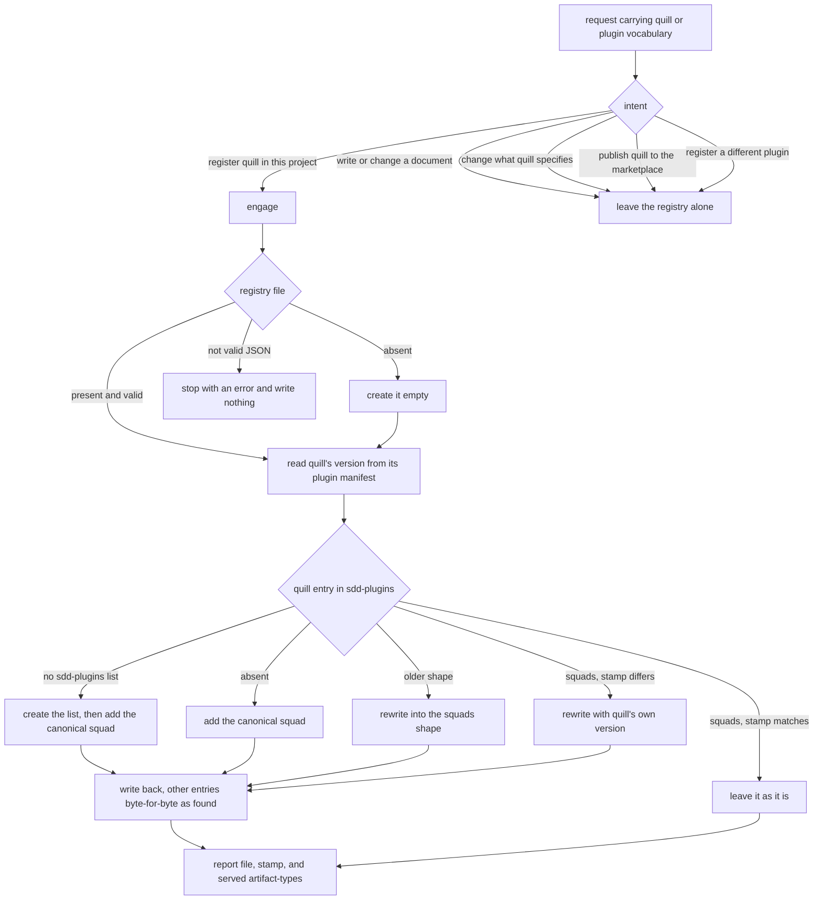

# registry — register Quill as the documentation SDD plugin

Write the quill role-map entry to `.agents/universal-plugin.json` so the conductor resolves Quill for the
documentation artifact-types (`init-quill`). One file is the single place resolution is recorded — the
**lockfile pattern**: the work of deciding which agent plays which role happens once, at setup, so the
conductor never scans plugin directories while a mission is running. Registration is **safe to repeat**
(idempotent) and **fail-closed**: it adds the entry when missing, rewrites an entry written in an older
shape or stamped with an older version, and stops without writing when the file it was handed cannot be
trusted.

**Key terms.** *Registry* — `.agents/universal-plugin.json`, the one file the conductor reads to resolve
roles. *Entry* — one plugin's record inside the registry's `sdd-plugins` list. *Squad* — inside an entry,
one group of artifact-types together with the roles and actor-bars that serve them. *Artifact-type* — the
kind of thing being produced (`documentation`, `guide`, `tutorial`, `article`, `reference` for Quill).
*Version stamp* — the plugin version recorded on the entry, refreshed at registration so the conductor
never has to compare versions at run time.

## Use Cases

**Fit:** strong — `init-quill` makes a genuine activation decision (a request to *register* Quill as the
documentation SDD plugin, versus sibling requests carrying the same Quill/plugin/documentation vocabulary
whose intent is to *write a document*, to *change what Quill specifies*, to *publish the plugin to the
marketplace*, or to register a *different* plugin), and the registration itself is agent-executed against a
real file whose existing entry must be classified by shape before it can be rewritten. Both the activation
and behavior layers therefore carry signal; this is not a deterministic engine with assertable output.
**Subject** — registering Quill in the project's SDD plugin registry (`.agents/universal-plugin.json`) so the
conductor resolves the Quill production-chain for the documentation artifact-types by reading only that one
file (the lockfile pattern), including version-stamp refresh and old-shape migration.
**Non-goals** — resolving roles at runtime (the conductor reads the registry); authoring a spec
(`start-mission`); the global marketplace catalog; editing other plugins' entries.

| Use case | Trigger / inputs | Outcome |
|---|---|---|
| Activation — select `init-quill` | a request carrying Quill / plugin / documentation vocabulary, in a repo that already has a registry | the registry is written only when the intent is to register Quill; a sibling intent leaves the registry alone |
| Registration — add the Quill entry | a registry with no `quill` entry, or no registry file, or a file holding no `sdd-plugins` list | the canonical Quill squad is added, creating the file and the list when they are absent, and no other plugin's entry changes |
| Migration — rewrite an older shape | a `quill` entry written in a shape the conductor no longer reads — the pre-operator `scenario-advisor` / `implementer` role keys, or the legacy `domains[]` with shared `roles` / `governances` | the entry is rewritten into the `squads[]` shape and the older keys are gone |
| Version stamp — refresh or leave alone | a `quill` `squads[]` entry whose recorded version differs from, or matches, the version in Quill's own plugin manifest | a differing stamp is rewritten to Quill's own version; a matching one leaves the file as it was |
| Fail closed — refuse an untrusted file | a registry file whose contents are not valid JSON | it stops with an error and writes nothing, so another plugin's entries cannot be destroyed |
| Confirmation — report the result | a completed registration | it reports the file, the stamped version, and the artifact-types now served |

## Control Flow

A request arrives carrying Quill or plugin vocabulary. `init-quill` engages **only** when the intent is to
record Quill in this project's registry; a request to write documentation, to change what Quill specifies,
to publish Quill to the marketplace, or to register a different plugin leaves the registry untouched.

Once engaged: look for `.agents/universal-plugin.json`. Absent → create it empty. Present but not valid JSON
→ **stop, write nothing**, leave the file exactly as found. Present and valid → read Quill's own version from
its plugin manifest, to be used as the stamp. Then look for the entry named `quill` in `sdd-plugins`: not
found → add the canonical squad, creating the `sdd-plugins` list first when it is absent; found in an older
shape → rewrite it into `squads[]`; found in `squads[]` with a stamp differing from Quill's own version →
rewrite it with that version; found in `squads[]` already stamped with Quill's own version → leave it as it
is. Write the file back without reordering or reformatting any other plugin's entry, then report.

**One rule in `init-quill` is deliberately not drawn above.** The skill states that a squad missing its
`governances` block is rejected without writing. Inside `init-quill`'s own workflow that rule has no
reachable trigger: the only payload the skill ever writes is the canonical entry it constructs itself, which
always carries a `governances` block, and no step inspects an existing entry for one. Specifying it would
freeze an edge no run can take, so it is left unspecified here and filed as a follow-up against the skill
rather than drawn as an edge with no scenario.

## Scenario map

Every scenario binds 1:1 to a CFG edge. The fail-closed edge (`not valid JSON`) and the leave-alone edges
(`stamp matches`, `leave the registry alone`) each have a positive companion driving the same decision in its
firing direction, listed alongside them.

### Activation

| Edge | Path (Given) | Scenario |
|---|---|---|
| intent → engage, and intent → leave the registry alone | a repo whose registry already records another plugin, plus the request text | `init-quill engages only on a request to register quill in this project` |

### Registration

| Edge | Path (Given) | Scenario |
|---|---|---|
| quill entry absent → add the canonical squad | a valid registry with no quill entry | `an absent quill entry is added as the canonical squad` |
| registry file absent → create it empty, then add | no registry file exists | `a missing registry file is created holding the quill entry` |
| no sdd-plugins list → create the list, then add | a valid registry file holding no sdd-plugins list | `a registry without an sdd-plugins list gets one` |
| write back, other entries byte-for-byte as found | a valid registry recording the aced plugin | `another plugin's entry survives registration byte-for-byte` |

### Migration

| Edge | Path (Given) | Scenario |
|---|---|---|
| older shape → rewrite into squads | a quill entry using the pre-operator role keys | `a pre-operator role-key entry is rewritten into the squads shape` |
| older shape → rewrite into squads | a quill entry using the legacy domains list | `a legacy domains entry is rewritten into the squads shape` |

### Version stamp

| Edge | Path (Given) | Scenario |
|---|---|---|
| squads, stamp differs → rewrite with quill's own version | a quill squads entry stamped with a version the manifest does not carry | `a differing version stamp is rewritten to the manifest version` |
| squads, stamp matches → leave it as it is | a quill squads entry stamped with the manifest version | `a matching version stamp leaves the file as it was` |

### Fail closed

| Edge | Path (Given) | Scenario |
|---|---|---|
| not valid JSON → stop and write nothing | a registry file whose contents are not valid JSON | `a registry that is not valid JSON is left exactly as found` |

### Confirmation

| Edge | Path (Given) | Scenario |
|---|---|---|
| report file, stamp, and served artifact-types | a completed registration | `a completed registration is reported with its stamp and artifact-types` |
