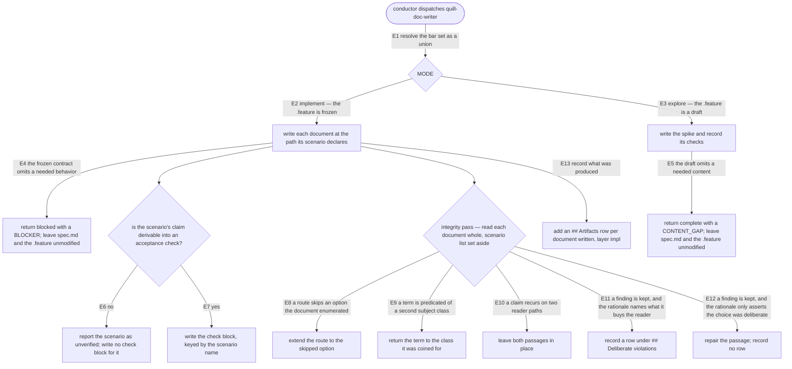

# doc-writer — the impl-producer role

Write the documentation against the frozen `.feature` and co-produce its per-scenario acceptance checks
(`quill-doc-writer`).

## What

When a documentation change reaches the build step, someone has to write the actual page — and someone
else has to check it. This node specifies the **writer** half. It is the role the SDD conductor hands a
finished, unchangeable behavior contract to, and it does two things with it: it writes the documents the
contract describes, and it writes down **how each of those scenarios is checked** so a second agent, who
never saw the writing happen, can run those checks and reach its own verdict.

The second artifact is the load-bearing one. A judge that has to invent its own checks is grading against
its own taste; a judge handed checks it can run against the file is grading against the contract. So the
writer's output is always a **pair**: the documents, and a `verification.md` that names — per frozen
scenario — the path, the required sections, the absence of filler text, and the reader-path continuity
the judge will confirm.

The role also reads each finished document **whole**, with the scenario list put away. Sentences written
to satisfy one scenario at a time are written to stand alone, so they arrive without the context their
neighbors set up. That defect is only visible from a reader's seat, never from a scenario's, so it is
caught here rather than at any per-scenario check.

**Non-goals** — running the checks (that is [`judge/`](../judge/README.md)); modifying `spec.md` or the
frozen `.feature`; authoring the behavior contract (that is [`spec-writer/`](../spec-writer/README.md)).

### Key terms

| Term | Plain meaning |
|---|---|
| **frozen `.feature`** | the behavior contract, agreed at the spec gate and no longer editable by anyone downstream |
| **`verification.md`** | the producer-to-judge channel: one block of acceptance checks per frozen scenario, written by this role and **run** by the judge |
| **actor bar** | a governance stating what a role is graded on. The Quill bar `quill:quill-builder-impl` **adds to** the SDD bar `sdd:builder-impl-governance`; it does not stand in for it |
| **integrity pass** | the whole-document read, scenario list set aside, that catches defects sitting *between* two passages |
| **deliberate violation** | a judged defect the writer keeps on purpose, declared up front with a reason |
| **catalog entry** | one named prose defect in `quill:quill-builder-impl`'s judged catalog (e.g. *term drift*) |

## Use Cases

**Fit:** partial — the role never decides whether to engage (the conductor dispatches it by name), so it
has no activation decision and this node freezes no near-miss. Its conduct is still run and graded by a
model, so behavior and quality carry signal.

| Use case | Trigger | Inputs | Outcome |
|---|---|---|---|
| **U1 — `dispatch(MODE: implement)`** | the conductor reaches the deliver step of a documentation mission | `DOMAIN`, `DOMAIN_PATH`, `SPEC_PATH`, `FEATURE_PATH`, `SOLUTION_PATH`, `MODE: implement` | each document written at the path its scenario declares; `<DOMAIN_PATH>/verification.md` carrying one check block per frozen scenario plus any `## Deliberate violations` rows; an `## Artifacts` row per document; an output packet carrying `GOVERNANCES_APPLIED`, `ARTIFACTS_WRITTEN`, `VERIFICATION_WRITTEN`, `STATUS`, `CONTENT_GAPS`, `OBSERVATIONS` |
| **U2 — `dispatch(MODE: explore)`** | the conductor spikes a draft contract before the spec gate | the same inputs with `MODE: explore` and a `.feature` carrying no `@frozen` tag | a spike document and a spike `verification.md`; every content need the draft omits returned as a `CONTENT_GAP`; `spec.md` and the `.feature` left unmodified |

`GOVERNANCES_APPLIED` is named here because the role's bar set is otherwise unrecorded, and an act that
records nothing cannot be checked. The set is a **union**, never a substitution: the Quill impl bar
`quill:quill-builder-impl` states that it unions onto `sdd:builder-impl-governance`, so loading the Quill
bar alone drops the generic conformance rules (a check anchored to its frozen scenario, never
free-authored; no green-by-tampering) and the structural-fit bar with them.

## Control Flow

One graph serves both use cases; `MODE` is the branch they enter on.

**Reading convention:** nodes are decisions and outcomes. **Labeled** arrows (`E1`…`E13`) are the
branches under contract, and each has a row in the scenario map below. Unlabeled arrows are sequencing
into a decision node and carry no branch of their own.

## Scenario map

### U1 — `dispatch(MODE: implement)`

| Edge | Path (Given) | Scenario |
|---|---|---|
| E1 resolve the bar set | any dispatch | `the bar set names the plugin bar and the SDD bars it unions onto` |
| E2 implement — the `.feature` is frozen | a frozen suite declaring two target documents | `each document is written at the path its scenario declares` |
| E4 the frozen contract omits a needed behavior | the spec's What names content no frozen scenario covers | `a behavior the frozen contract omits is escalated, not written in` |
| E6 the claim is not derivable into a check | a frozen scenario whose claim no inspection of the file settles | `a scenario it cannot check is reported unverified rather than given a passing check` |
| E7 the claim is derivable | a suite of three frozen scenarios | `the verification carries one check block per frozen scenario, keyed by name` |
| E7 the claim is derivable | a scenario whose claim is a distinction no single literal string settles | `the recorded check settles a claim the judge must decide by reading` |
| E8 a route skips an enumerated option | the document enumerates four refund states and a later route reaches three | `a route that skips an option the document enumerated is extended to reach it` |
| E9 a term is predicated of a second subject class | a term coined for a document is later predicated of an act | `a term predicated of a second subject class is returned to the class it was coined for` |
| E10 a claim recurs on two reader paths | the same claim appears in two sections the sidebar reaches independently | `a claim reached by two reader paths is left in both places` |
| E11 a kept finding whose rationale names the reader benefit | a catalog entry fires on a passage the writer keeps | `a deliberate violation with a reader-benefit rationale is declared as a row` |
| E12 a kept finding whose rationale only asserts deliberateness | a catalog entry fires on a passage the writer keeps | `a rationale that only asserts deliberateness is not filed; the passage is repaired` |
| E13 record what was produced | two documents written | `the artifacts table gains one impl row per document written` |

### U2 — `dispatch(MODE: explore)`

| Edge | Path (Given) | Scenario |
|---|---|---|
| E3 explore — the `.feature` is a draft | a draft suite carrying no `@frozen` tag | `a spike run records its acceptance checks like a delivery run does` |
| E5 the draft omits a needed content | the spec's What names content no draft scenario covers | `in explore mode a content need the draft omits is returned as a gap, not a block` |

### Rubric policy — the cut and the trade it makes

One scenario is graded (`@rubric`): whether a recorded check actually **settles** a claim that no string
match decides. It carries two dimensions, `settleability` (max 3) and `claim_reach` (max 3), against a
`threshold` of 5.

**Why the cut sits at 5 of 6.** A false pass here ships a `verification.md` the judge cannot run, which
silently turns the impl gate into a rubber stamp for that scenario — the one failure this whole node
exists to prevent. A false fail costs one more authoring round on one check block. The cost is lopsided,
so the cut buys down the false pass and sits one point under the attainable maximum.

**The trade, and what pays for it.** A check whose condition is slightly under-determined — it names the
passage and the condition, but leaves one term's boundary to the judge's reading — passes when it reaches
the **whole** claim; thinner determinacy is paid for by reach. The converse trade is also accepted: a
perfectly determinate condition that decides only part of the claim passes, paid for by determinacy.
What neither buys is a two-point loss on either dimension — a check nobody can run the same way twice,
or one that decides a proxy rather than the claim, fails whatever the other dimension earns.

**What the wrong subject banks.** The default wrong subject here is the **config-quoting memorizer**: it
copies the four check kinds out of the agent definition (target path, required headings, no placeholder,
reader-path continuity) and repeats them under each scenario name. It banks `settleability` 1 — it names
a heading, a real condition, but not the one that decides this claim — and `claim_reach` 0 to 1, since
restating the scenario name reaches nothing past it. Its total is 1–2 against a cut of 5.

**Honest limit.** That margin is stated in points, not measured against this judge's noise at the cut
(cSEM). The scores here were reasoned once, not scored twice, so the distance from 2 to 5 is an argument
rather than evidence. Recorded as a limitation rather than asserted as a rate.
