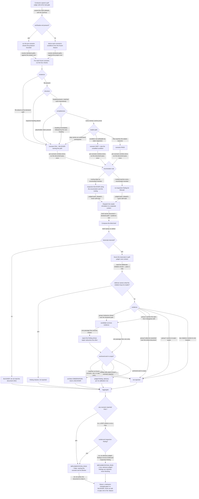

# judge — the impl-judge role

Run one static-inspection check per frozen `.feature` scenario against the authored docs and report pass/fail
(`quill-judge`).

## What

At the impl gate the SDD conductor spawns this role **cold** — a fresh context holding no memory of how the
document was written — and asks one question: *does the documentation the impl-producer authored conform to the
contract that was frozen at the spec gate?*

It answers with **two instruments**, and the split between them is the whole of this node
([`../../design/doc-eval-model.md`](../../design/doc-eval-model.md)):

- **Inspection** decides by comparing two structured things. It runs the **four scenario-scoped checks**
  (existence, structure, completeness, reader-path) against **each frozen scenario**, reporting one of **three
  verdicts** per scenario — PASS, FAIL, or SKIP — and it runs the **enumeration rule** (a route must reach every
  option the document named) **once per document**, not once per scenario. Its verdict is a boolean.
- **Judgment** decides by simulating a reader. It runs the frozen **defect catalog** in two passes: pass 1 is a
  reader simulation dispatched to a **separate context that is blind to the catalog**, and pass 2 scores that
  returned transcript against the catalog in `quill-judge`'s own context. `quill-judge` holds the catalog, so it
  can never be its own blind reader — the dispatch is the design, not an optimization.

Two consequences carry most of the risk in this node, and each has a scenario a wrong implementation loses:

1. **Blindness is a payload rule.** Pass 1 receives the document, the declared control-flow path, and the
   audience row — **and nothing else**. Not the catalog, not an entry name, not the spec's coverage table, and
   not the producer's deliberate-violation record. Anything naming a defect tells the simulated reader what to
   trip on, and its finding becomes an opinion about prose rather than evidence about a reader. The
   deliberate-violation record is therefore read in **pass 2 only**.
2. **Advisory-versus-blocking is decided at the aggregator, not at the entry.** Every catalog entry's
   calibration row currently reads `advisory` (a first calibration ran and moved no row), so a judged finding is
   **reported and never fails the gate today**. Only an **evidenced inspection** finding, or a scenario reported
   FAIL, can set the run failing. An aggregator that fails the run on any evidenced integrity finding would make
   the entire catalog blocking on the day it shipped — which is exactly the failure the advisory state exists to
   prevent.

**Key terms.** *Frozen scenario* — a scenario in the `.feature` ratified at the spec gate, which no role may
edit. *Blind reader* — the separately dispatched context that reads the document without being told what defects
to look for. *Advisory finding* — a judged finding that is reported to the producer but does not fail the gate.
*Declared path* — the one route through the document the spec says a reader takes.

**Non-goals** — authoring the document or its acceptance checks (that is `doc-writer`); modifying `spec.md` or
the `.feature`; fixing a gap by editing (a behavior-changing gap is a `BLOCKER`, not an edit); asserting tone,
register, length, or word choice; deciding *what* the document should say (the spec gate settled that).

## Use Cases

**Fit:** partial — `quill-judge` is dispatched **by name** by the conductor at the impl gate and makes no
activation decision, so the trigger layer carries no signal for it (trigger-balance / near-miss is **N/A**, and
its absence here is not a gap). Its inspection and judgment conduct is LLM-run and graded, so the behavior layer
carries the signal.

**No `@rubric` scenario is authored for this node, and that is a selection result, not an omission.** Every
candidate gradient was run through the substitutability test
(`sdd:suite-format-governance`) and each came back **non-substitutable**, so each is a boolean `Then` instead:
*"exemplary citation discipline makes up for firing on an entry's near-miss"* — nobody accepts that trade, since
a false positive is precisely what teaches a producer to route around the judge; *"a well-argued finding makes up
for leaking the catalog into the blind brief"* — nobody accepts that either, since the leak invalidates the
evidence rather than weakening it; *"strong evidence makes up for obeying a defense that only asserts
deliberateness"* — the defense rule is a floor, not a price. A rubric summing these would make each of them
purchasable with points earned elsewhere, which is the one thing a rule must never be. The graded reading in
this node happens **inside** the dispatched reader simulation; what this node owns about it — who reads, what
they are given, what evidence a finding must carry, and what blocks — is rule-shaped throughout.

**Subject** — when the conductor spawns it cold at the impl gate, running the four scenario-scoped doc-eval
checks (existence, structure, completeness, reader-path) anchored to each **frozen** scenario and reporting
PASS / FAIL / SKIP per scenario, then the document-scoped pass ([`../doc-impl-bar/`](../doc-impl-bar/)) once
per document — its inspection rule as a boolean, and its defect catalog as a graded pass whose reader
simulation runs in a **separate context blind to the catalog**.
**Non-goals** — authoring the document or its checks (that is `doc-writer`); modifying `spec.md` or the
`.feature`; fixing a gap by editing (a behavior-changing gap is a `BLOCKER`, not an edit).

| Use case | Trigger / inputs | Outcome |
|---|---|---|
| **Cold dispatch** — enter the impl gate | the conductor spawns `quill-judge` with `DOMAIN`, `SPEC_PATH`, `FEATURE_PATH`, `IMPLEMENTATION_PATHS`, `VERIFICATION_PATHS` | it declares the governance set it applied, sources the per-scenario checks, and resolves each declared document path against the project root |
| **Scenario inspection** — run the four checks per frozen scenario | one frozen scenario and the document it names | the scenario is reported PASS, FAIL (with a blocker), or SKIP (with the unsettled condition noted) |
| **Document inspection** — run the enumeration rule | the whole document, once, with the scenario list set aside | a routing that skips an enumerated option is an inspection blocker citing both passages; a complete routing raises nothing |
| **Blind reader simulation** — dispatch pass 1 | the document, the declared control-flow path, and the audience row | a reader transcript returned from a separate context that was never shown a defect name |
| **Transcript scoring** — run pass 2 against the catalog | the returned transcript, the frozen catalog, and the producer's `## Deliberate violations` record | findings that carry two distinctly-located citations and survive their defense are reported; the rest are not |
| **Aggregation** — report the gate verdict | the per-scenario verdicts, the inspection findings, and the judged findings | `IMPLEMENTATION_PASS`, the failing scenarios, the findings with their advisory flag, and a blocker where one fired |

## Control Flow

One dispatch runs the six stages in order. Cold dispatch sources the checks; scenario inspection produces one
verdict per frozen scenario; the document-scoped pass then runs **once**, first as the boolean enumeration rule
and then as the judged catalog pass, which dispatches its reader simulation to a separate context before scoring
the returned transcript; aggregation collapses everything to one gate verdict. No stage edits an artifact: a
behavior-changing gap leaves as a `BLOCKER`.

## Scenario map

Every scenario binds 1:1 to a CFG edge, grouped by use case. The **edge** column names the edge each scenario
puts **under test**; the **path** column names the decisions already taken on the way there. The holding edges of
the earlier checks (a file present at its declared path, every section carrying prose) and the single-entry
branch of the subsumption decision are therefore **path**, carried in the `Given` of the rows below rather than
tested by rows of their own — testing them in isolation would assert nothing a wrong implementation could lose.

### Cold dispatch

| Edge | Path (Given) | Scenario |
|---|---|---|
| extend the SDD defaults with the Quill bar | the conductor spawns quill-judge cold for a documentation domain | `it applies the SDD default impl-gate bars alongside the Quill bar` |
| verification.md present → run the recorded checks | the producer recorded a check per frozen scenario | `it runs the acceptance checks the producer recorded` |
| verification.md absent → derive from the frozen .feature | the domain folder holds only the spec and the frozen suite | `a missing verification file falls back to the frozen feature` |
| resolve declared paths against the project root | a frozen scenario naming a document path | `a declared document path resolves against the project root` |

### Scenario inspection

| Edge | Path (Given) | Scenario |
|---|---|---|
| existence: file absent → FAIL | a frozen scenario naming a path the tree does not carry | `a missing document fails the scenario with a blocker` |
| structure: heading present, matched case-insensitively | the document exists and carries the required heading in lower case | `a heading differing only in case satisfies the structure check` |
| structure: required heading absent → FAIL | the document exists and carries two other headings | `a required section absent from the document fails the scenario` |
| completeness: placeholder token → FAIL | the document exists with every required heading present | `placeholder text fails the completeness check` |
| completeness: heading immediately followed by the next heading → FAIL | the document exists with every required heading present | `an empty section fails the completeness check` |
| reader-path: step names an undeclared prerequisite → FAIL | a sequential-flow scenario over a document whose prerequisites list is declared | `a step naming an undeclared prerequisite fails the reader-path check` |
| reader-path: condition not settleable → SKIP | a scenario asserting a condition static inspection cannot read | `an unsettleable reader-path condition is reported SKIP` |
| all four checks hold → PASS | the document exists, is fully headed, prose-filled, and its flow reaches the outcome | `a document satisfying all four checks passes the scenario` |

### Document inspection

| Edge | Path (Given) | Scenario |
|---|---|---|
| per-scenario verdicts done → run the document pass once | three frozen scenarios naming one document | `the document-scoped pass runs once for the document` |
| enumeration rule: routing skips a member → BLOCKER | the document enumerates a set and a later passage routes across it | `a routing that skips an enumerated option is a blocker` |
| enumeration rule: routing reaches every member | the document enumerates a set and a later passage routes across it | `a routing that reaches every enumerated option raises no inspection finding` |

### Blind reader simulation

| Edge | Path (Given) | Scenario |
|---|---|---|
| judged pass: dispatch, never self-read | quill-judge holds the defect catalog | `the reader simulation is dispatched to a separate context` |
| brief carries document + declared path + audience row | the spec declares one path and one audience row | `the blind brief carries the document, the declared path, and the audience row` |
| brief names no defect | the catalog, the coverage table, and the violation record are all in quill-judge's hands | `the blind brief names no defect` |
| no transcript returned → BLOCKER | the dispatched context returns an empty result | `a reader simulation that returns no transcript is a blocker` |
| transcript returned → score it here | the dispatched context returns a reader transcript | `a returned transcript is scored by quill-judge itself` |

### Transcript scoring

| Edge | Path (Given) | Scenario |
|---|---|---|
| read the deliberate-violation record — pass 2 only | the producer recorded a defended violation | `the deliberate-violation record is read while scoring` |
| defense does not name what it buys → still reported | the recorded rationale asserts only that the choice was deliberate | `a defense that only asserts deliberateness does not clear the finding` |
| defense names what it buys → cleared | the recorded rationale names the audience and what the violation buys it | `a defense naming what the violation buys its reader clears the finding` |
| group A absence shown over the declared path | the transcript reports a passage treating a term as given | `a group A finding shows the absence over the declared path` |
| group A absence asserted over the whole document → not reported | the transcript reports a document-wide absence | `a group A candidate evidenced only as a document-wide absence is not reported` |
| group C quotes the spec line | the transcript reports a passage relying on a sibling document | `a group C finding quotes the spec line it disagrees with` |
| group C carries no spec quote → not reported | a candidate carrying one document quote and no spec quote | `a group C candidate carrying no spec quote is not reported` |
| two citations resolve to one location → not reported | a candidate whose two quotes share a heading and a line | `two citations resolving to one location are not a finding` |
| one passage fires several entries → repair subsumes | the transcript's evidence for one passage matches two entries | `a passage firing two entries yields the finding whose repair subsumes the other` |
| matches no anchor → not reported | the transcript proposes a criterion of its own | `an impression matching no anchor is not reported` |
| tone, register, length, or word choice → not reported | the transcript reports a stylistic reaction | `tone, register, length, and word choice are not reported` |
| collides with a frozen scenario → architect observation | a frozen scenario fixes what a catalog entry would fire on | `a catalog entry colliding with a frozen scenario yields an architect observation` |

### Aggregation

| Edge | Path (Given) | Scenario |
|---|---|---|
| an advisory judged finding is not an evidenced inspection finding | every scenario PASS and one confirmed advisory judged finding | `an advisory judged finding leaves the implementation passing` |
| a SKIP verdict is not a FAIL | four scenarios PASS and one SKIP, the enumeration rule holding | `a scenario reported SKIP does not fail the implementation` |
| evidenced inspection finding → failing | every scenario PASS and the enumeration rule fired with both citations | `an evidenced inspection finding fails the implementation` |
| any scenario FAIL → failing | one frozen scenario reported FAIL | `a scenario reported FAIL fails the implementation and blocks` |
| do not author the document to clear it | a frozen scenario reported FAIL for a missing heading | `it does not author the document to clear a failing scenario` |
| return: a gap is a BLOCKER, never an edit | quill-judge finds a behavior-changing gap during the run | `a behavior-changing gap is a blocker, not an edit` |
