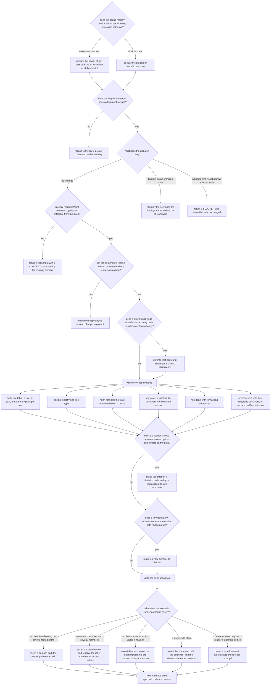

# spec-writer — the spec-producer role

Author `spec.md` + a boolean `.feature` of doc behavior for a documentation artifact (`quill-spec-writer`).

## What

Quill's **spec-producer**. When the SDD conductor dispatches it for a documentation artifact-type
(`documentation`, `guide`, `tutorial`, `article`, `reference`), it writes two things and returns:
the **`spec.md` body** — what the document must land, in the shape the documentation contract bar
([`../doc-spec-bar/`](../doc-spec-bar/README.md)) requires — and the **`.feature`**, a boolean suite
whose every scenario names a document path, the audience it serves, and what the reader can do
afterwards. It *acts*: it writes the files itself rather than advising someone else to.

The problem it solves: documentation fails silently. Nothing compiles a guide, so a page that serves
nobody, buries its reason to exist, or leaves a reader at a fork with no way to choose still looks
finished. This role turns those failures into a contract a later gate can check — and, because it is
the **first** role in Quill's chain, whatever it fails to freeze is unenforceable everywhere
downstream.

**Non-goals** — running the checks (that is [`../judge/`](../judge/README.md)); authoring the actual
document ([`../doc-writer/`](../doc-writer/README.md)); writing the control frontmatter (`status`,
`project-path`, `approval`, `produced-by` — the conductor's and the gate's, per
`sdd:ownership-governance`); asserting prose wording, style, or tone; deciding *which* plugin serves
an artifact-type (the conductor's registry resolution).

### Key terms

| Term | Plain meaning |
|---|---|
| **dispatch** | the conductor handing this role an input packet and spawning it |
| **output packet** | the structured block it returns — status, counts, gaps, observations, and the governances it loaded |
| **actor bar** | a governance stating what "good" means for one role at one gate — here the three spec-gate bars (**oracle** = is this worth building and is it in scope, **builder** = is it fully and testably specified, **architect** = does it fit the project's structure) |
| **document surface** | a prose page a checker can inspect — headings, sections, paragraphs. An agent definition or a config file has none |
| **What element** | one of the seven things the documentation contract bar requires in `## What` — audience, doc type, north star, reason to exist, key points, non-goals, prerequisites |
| **key-points row** | one claim the document is incomplete without |
| **reader path** | the `## Control Flow` graph of the questions a document must answer to route a reader — not its table of contents |
| **suite** | the `.feature` file this role authors |

## Use Cases

**Subject** — when the conductor dispatches it in explore, authoring the `spec.md` body and a boolean
`.feature` (document path, audience, observable reader outcome) for one documentation artifact (`documentation`,
`guide`, `tutorial`, `article`, or `reference`).
**Non-goals** — running the checks (that is `judge`); authoring the actual document (`doc-writer`); writing the
control frontmatter (`status`, `project-path`); asserting prose wording, style, or tone.

**Fit:** partial — the conductor spawns this role **by name** off the registry, so there is no
activation decision to grade (no `@trigger` layer, no near-miss); its conduct once dispatched is
LLM-run and judged, so the behavior layer carries the signal (`aced:aced-fit`).

| Use case | Trigger | Inputs | Outcome |
|---|---|---|---|
| **UC1 — author** | the conductor dispatches `quill-spec-writer` in explore for a documentation domain | `DOMAIN`, `DOMAIN_PATH`, `SPEC_PATH`, `COMMAND_SURFACE` naming a target with a document surface, `USER_INPUT`; `JUDGE_FEEDBACK` absent | a `spec.md` body at `SPEC_PATH` and a `.feature` at `DOMAIN_PATH`; or `needs-input` with a `CONTENT_GAP` per missing What element |
| **UC2 — revise** | the conductor re-dispatches after the spec gate returned findings | the UC1 inputs plus `JUDGE_FEEDBACK`, and `USER_ANSWERS` where the prior pass returned questions | the named scenarios edited and the answers folded in — or a `BLOCKER` when a finding would narrow a frozen suite |
| **UC3 — recuse** | the conductor dispatches it for a target with no document surface | the UC1 inputs, but `COMMAND_SURFACE` names code, config, or an agent definition | a recusal naming the SDD-default production chain; nothing authored |

Every use case enters the same graph below at `P`.

## Control Flow

**Reading the graph.** `P` runs on every dispatch — the pre-flight that loads the three spec-gate
actor bars **forward**, exactly the set the gate grades backward. Loading only this plugin's own
builder bar is the defect the two `P` rows exist to catch: a producer that never read the oracle bar
has no reason to reach `E1`, and one that never read the architect bar has no reason to reach `F1`.

Edges that decide nothing of their own — the reconvergences (`P1→B`, `P2→B`, `F1→G`, `G*→H`,
`H1→I`, `I1→J`) and the two pass-throughs (`H→I`, `I→J`) — carry no row of their own; the downstream
row covers them with the path class `any`, per the reconvergence-collapse rule in
`sdd:suite-format-governance`. The five `K*→M` edges reconverge the same way and are covered by the
single `→M` row, whose path class is `any`.

## Scenario map

### UC1 — author

| Edge | Path (Given) | Scenario |
|---|---|---|
| `P→P1` | the registry binds `builder-spec` and leaves `oracle-spec` and `architect-spec` unbound | `it declares the SDD-default bars it fell back to` |
| `P→P2` | the registry binds a plugin bar to all three spec-gate slots | `it declares the bar bound to each slot` |
| `B→C` | the target path holds a prose page | `it authors a contract for a target with a document surface` |
| `C→D` | the dispatch carries no findings and `DOMAIN_PATH` holds no suite | `it authors a fresh suite covering every key-points row` |
| `D→D1` | a draft page exists and no input names who it is for | `it returns a gap for the audience instead of reading one out of the draft` |
| `D→E` | every What element is supplied by the command surface | `it returns complete with no content gap` |
| `E→E1` | the parent page already resolves the same problem for the same audience | `it returns the scope finding for a document with no reason of its own` |
| `E→F` | the parent page covers a different problem | `it states the reason to exist in the domain's own terms` |
| `F→F1` | a sibling node already owns the entry point | `it defers an entry point a sibling node owns` |
| `F→G` | no sibling node owns the entry point | `it writes an entry point no sibling node owns` |
| `G→G1` | the command surface names two readers with their goals | `each audience row names a role, its goal, and an entry point` |
| `G→G2` | the command surface describes a first-time walk-through | `it declares exactly one doc type` |
| `G→G3` | the command surface states what the reader leaves able to do | `the north star carries the state that would mean the document missed` |
| `G→G4` | the command surface names the facts the page must land | `each key-points row states a claim rather than naming a section` |
| `G→G5` | the command surface excludes a topic | `each non-goal names where the excluded topic lives` |
| `G→G6` | the page assumes prior knowledge | `each prerequisite names the document that supplies it` |
| `G→G6` | the page assumes no prior knowledge | `it declares self-containment explicitly` |
| `H→H1` | the reader must choose between two transports | `the criterion becomes a decision node and each option its own outcome` |
| `I→I1` | a key-points row enumerates three transports | `the reader path routes to every enumerated member` |
| `K→K1` | two audiences are routed to one claim | `a load-bearing claim is asserted on each routed path` |
| `K→K2` | the reader path routes a case across two members | `a routing scenario asserts the discriminator` |
| `K→K3` | the draft carries the claim under its own heading, third in the file | `no scenario asserts the heading wording, the section order, or the tone` |
| `K→K4` | a claim reached on one path | `each scenario names the path, the audience, and the observable reader outcome` |
| `K→K5` | the command surface states the page should leave the operator confident | `it lowers an uncheckable reader state into a document state a check can read` |
| `→M` | any | `it leaves the control frontmatter to the conductor and the gate` |

### UC2 — revise

| Edge | Path (Given) | Scenario |
|---|---|---|
| `C→V2` | the findings name two of nine scenarios in an unfrozen suite | `a revision touches only the scenarios the findings name` |
| `C→V2` | the prior pass returned a gap and the user answered it | `it folds the supplied answer into the gapped element` |
| `C→V1` | the suite carries the frozen tag and the finding would remove a scenario | `it blocks rather than narrowing a frozen suite` |

### UC3 — recuse

| Edge | Path (Given) | Scenario |
|---|---|---|
| `B→B1` | the target path holds an agent definition | `it recuses from a target with no document surface` |

The recusal guard's positive companion is UC1's `B→C` row: the same decision, taken the other way on
a target that does have a document surface.

## Specified ahead of the implementation

Two scenario groups specify behavior `plugins/quill/agents/quill-spec-writer.md` does not yet
carry. Both are legitimate under `sdd:suite-format-governance` — *when an act matters but records
nothing, add the record; do not delete the act* — and both are a delta the implementation must close
at the impl gate. They are listed here so the conductor carries one complete delta forward.

| Site | What the suite specifies | What the agent has today |
|---|---|---|
| `P→P1`, `P→P2` | the output packet lists the actor bars it loaded, distinguishing a bound plugin bar from an SDD-default fallen back to | the agent loads the bars but its `## Output` block has no field that records which ones |
| `B→B1` (UC3) | the output packet reports a recusal naming the SDD-default production chain | `STATUS` is `complete \| needs-input \| blocked` — no recusal value, and no recusal step anywhere in the agent's `## Steps` |

Everything else the suite asserts is already stated in the agent definition — including the
static-inspection rule the `K→K5` scenario guards (`quill-spec-writer.md:34`), which was written but
unguarded until this scenario.
