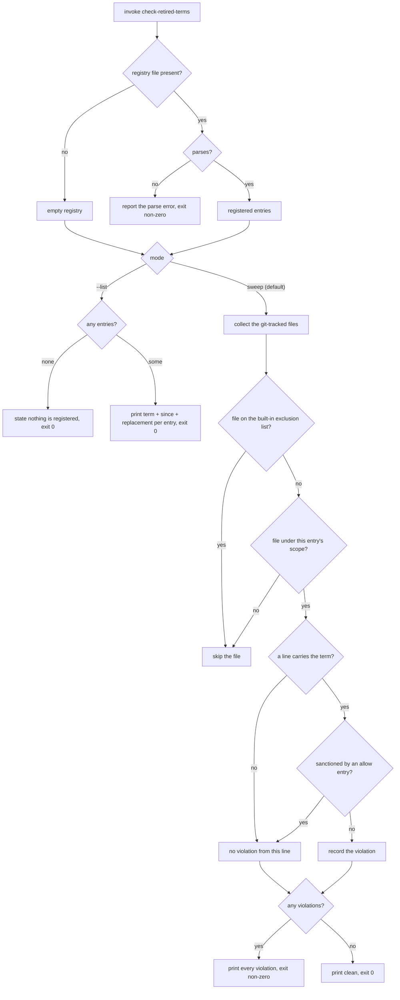

# retired-terms — flag survivors of a retired path or convention, corpus-wide

When a design decision **retires** a path, directory, or naming convention, the old name does not
vanish from the corpus: it survives in skills, spec READMEs, and docs that nobody re-read. Nothing
mechanical looks for those survivors today, so they are found by accident — a person happening to
notice one while reviewing something else.

**retired-terms** closes that hole with a **registry plus a sweep**. An author records the retired
term once in `.agents/sdd/retired-terms.toml`, saying what replaced it. From then on, a
**verify-time** sweep reads the registry, scans every git-tracked file across the whole repo — not
only the node someone happened to touch — and **fails the check** with a `file:line:term` list of
every survivor.

It is the same shape as the shipped `check:metaphor-free` guard in `packages/cyberlegion`, with one
difference that matters: that guard's banned list is **hardcoded in its own source** and scoped to one
package. Here the list is **declared data** any CR can append to, and the scan is **corpus-wide**.
The two stay **separate capabilities** rather than one shared engine, because they change for
different reasons: `metaphor-free` changes when a *persona* appears in the fleet layer and encodes a
standing package charter, while this changes when a *decision retires something*, and its list is
append-only history. A change to one forces no change to the other, so the resemblance is
coincidental — the shared abstraction would couple a charter to a changelog.

**Non-goals.** It does not *decide* that something is retired (a CR does, and then registers it); it
does not rewrite or fix a survivor (it reports; a person or a follow-up CR edits); it does not curate
its own registry through a manage skill (the file is hand-edited — contrast
[`../spec-anchors/`](../spec-anchors/README.md), which is curated because discovery *depends* on it
being well-formed); it reads no spec frontmatter and writes nothing at all.

**Key terms.**

| Term | Plain meaning |
|---|---|
| **retired term** | a path, directory, or naming convention a decision replaced — text that should no longer appear anywhere live |
| **survivor** | an occurrence of a retired term still sitting in a tracked file |
| **registry** | `.agents/sdd/retired-terms.toml` — the declared list of retired terms |
| **sweep** | one pass over every tracked file, matching every registered term |
| **sanctioned occurrence** | a survivor an `allow` entry deliberately permits (history, a glossary that names the old convention on purpose) |

### The registry format

`.agents/sdd/retired-terms.toml` holds one array of tables. Each entry registers one retired term:

```toml
[[retired]]
term = "artifacts/specs/"                       # the literal text that is retired
since = "304-m2-eval-suite-sweep"               # the CR that retired it
replacement = "a colocated project-spec node under .agents/specs/<project>/"
scope = ["plugins/", ".agents/specs/"]          # optional: only scan under these prefixes
allow = [                                       # optional: sanctioned occurrences
  ".agents/specs/sdd/DESIGN-NOTES.md",                       # whole file: superseded, kept for history
  ".agents/specs/sdd/glossary.md :: motive-model",           # one line: the live project that still lives there
  ".agents/specs/sdd/design/actors-governance.md :: motive-model",
]
```

- **`term` is matched as literal text, case-sensitive** — no globs, no regular expressions, no
  word-boundary mode. What gets registered is paths and conventions, and an author must be able to
  predict, from the line alone, exactly what will fire. A false positive is answered with an `allow`
  entry, never by making the matcher cleverer.
- **`scope`** lists repo-relative **include** prefixes. With no `scope`, the whole tracked tree is
  scanned. It exists because a retired convention usually stays legitimately present somewhere — a
  superseded tree kept for history, generated docs — and the interesting surface is the *live*
  instruction one.
- **`allow`** has two forms. A bare path sanctions **every** occurrence in that file (a wholly
  historical document). A `path :: substring` entry sanctions **only** the lines containing that
  substring — so the rest of the file stays guarded. Keyed on text rather than a line number, so it
  survives edits above it.
- **An `allow` entry is for an occurrence that is still correct, never for one that is merely
  inconvenient.** A genuine survivor is **fixed**, not allow-listed — allow-listing it is how a guard
  becomes decoration. The legitimate cases are narrow and nameable: durable history, and a term
  retired for *one* usage while another usage stays live (the repo's `artifacts/specs/` is retired as
  the suite location yet still holds the live `motive-model` project, so references to *that* are
  sanctioned while a stale suite-location reference is not).
- **Built-in exclusions**, always applied, never configured away. The rule: **a surface whose job is
  to name the retired term is not drift.** Two kinds qualify, and nothing else does:
  - **The guard's own definition** — the registry file, the engine source and its test, and **this
    node's own `README.md` and `retired-terms.feature`**. A guard cannot state what it bans without
    writing the banned text down; excluding its own definition is what stops it reporting itself.
    (The `metaphor-free` guard learned this the hard way — its boundary prose leaked the very word it
    was defining.)
  - **Durable provenance** — every `ledger/` shard and every file under `.agents/plans/`. These
    record what was true *then*; rewriting them to the current vocabulary would falsify the record.

  Note how narrow this is. A spec README that merely *mentions* a retired convention is **not**
  excluded — that is the drift case, and excluding it would gut the guard. Only the document that
  *defines the ban* gets out.

## Use Cases

**Subject** — the registry format, the corpus-wide sweep over it, and the listing of what is
registered.
**Non-goals** — it never edits a survivor, never writes the registry, and never touches spec
frontmatter, `status`, `approval`, or a freeze.

| Trigger | Inputs | Outcome |
|---|---|---|
| **`check-retired-terms`** (default, no verb) — the verify-time sweep, run from the root `check:specs` chain and by any author before pushing | the repo root | every survivor as `file:line:term` with the replacement to use, and a non-zero exit; a clean corpus exits 0 |
| **`check-retired-terms --list`** — an author asks what is retired before writing | the repo root | each registered term with the CR that retired it and its replacement, exit 0 |

`--list` earns its place because the sweep only ever speaks when something is already wrong: without
it, the vocabulary boundary is legible only to whoever opens the config file, and the guard teaches
nothing until it fires.

Every scenario in [`retired-terms.feature`](./retired-terms.feature) enters through one of these two.

## Control Flow

Both entry points share the registry read, then split:



## Scenario map

### `check-retired-terms` — the sweep

| Edge | Path (Given) | Scenario |
|---|---|---|
| registry parses → registered entries | a registry with one entry | `the registry loads one registered term per entry` |
| registry absent → empty registry | no registry file | `an absent registry sweeps clean` |
| registry does not parse → error exit | a malformed registry | `a malformed registry fails the check loudly` |
| line carries the term, not sanctioned → violation | a tracked file in scope carrying the term | `a survivor is reported with its location and replacement` |
| no line carries the term → clean exit 0 | a tracked corpus with no survivor | `a corpus with no survivor passes` |
| line carries the term, not sanctioned → violation | survivors in several files | `every survivor is reported, not the first` |
| file on the built-in exclusion list → skipped | a ledger shard carrying the term (durable provenance) | `provenance is never flagged` |
| file on the built-in exclusion list → skipped | this node's own spec README (the guard's definition) | `the guard's own defining document passes the guard` |
| file not under the entry's scope → skipped | an entry with `scope`, a file outside it | `a file outside the entry's scope is not scanned` |
| file under the entry's scope → scanned | an entry with no `scope` | `an entry with no scope scans the whole tracked tree` |
| sanctioned by an allow entry → no violation | an allow entry naming a file only | `a file-only allow sanctions the whole file` |
| sanctioned by an allow entry → no violation | an allow entry naming file + substring, a matching line | `a substring allow sanctions the lines that match it` |
| line carries the term, not sanctioned → violation | an allow entry naming file + substring, a non-matching line in the same file | `a substring allow leaves the rest of its file guarded` |
| collect the git-tracked files | an untracked file carrying the term | `an untracked file is outside the sweep` |
| invoke check-retired-terms | the repo's verify run | `the root check chain runs the sweep` |

### `check-retired-terms --list`

| Edge | Path (Given) | Scenario |
|---|---|---|
| entries present → print each | a registry with entries | `list shows each registered term with its replacement` |
| no entries → state nothing registered | no registry file | `list states plainly that nothing is registered` |

## Delivery

Implemented by the **`check-retired-terms`** skill — `plugins/sdd/skills/check-retired-terms/` —
carrying a self-contained `.mts` script (the repo's node ≥23.6 / no-deps convention), parsing its
registry with the same minimal hand-rolled TOML subset `discover-specs` already uses for
`spec-anchors.toml`. It joins the root `check:specs` chain alongside `check-plan-safety` and
`resolve-tracking`, so it runs on every `pnpm verify` and in CI.

The CR that introduces it also **seeds** the registry with the recurrence that motivated it — the
retired suite location `artifacts/specs/<feature-name>/`, superseded by the colocated project-spec
node — so the guard ships live rather than inert.

Seeding it is **not** a matter of allow-listing whatever the first run reports. Sweeping the seed term
over the live tree already finds a genuine survivor the guard is supposed to catch:
`plugins/aced/readme.md` still documents ACED's eval suites as living under
`artifacts/specs/<suite-name>/` in three places, long after they moved to `.agents/specs/aced/`. The seeding CR **fixes** those lines and allow-lists only the occurrences that
are still correct (the live `motive-model` project, and superseded documents kept for history) — which
is the guard proving itself on its first run rather than being tuned until it is quiet.

**Why a malformed registry fails rather than falls back.** [`../discovery/`](../discovery/README.md)
deliberately ignores a corrupt `spec-anchors.toml` and falls back to the fixed conventions: there, a
bad config must not break an unrelated scan. Here the registry **is** the check. A guard that answers
a typo by silently passing is a false green, which is the exact failure this node exists to prevent —
so it exits non-zero and names the parse error.

## Source

- new — distilled by the doctrine Scanner from a recurrence in which the retired suite location
  `artifacts/specs/<feature-name>/` survived in seven skills and a spec README after the convention
  was replaced, and was found only because a person noticed it while reviewing an unrelated node. The
  sibling in spirit is the `referenced-artifact-escalation` guard at the spec gate (broken artifact
  references); the sibling in mechanism is `check:metaphor-free` in `packages/cyberlegion`.
