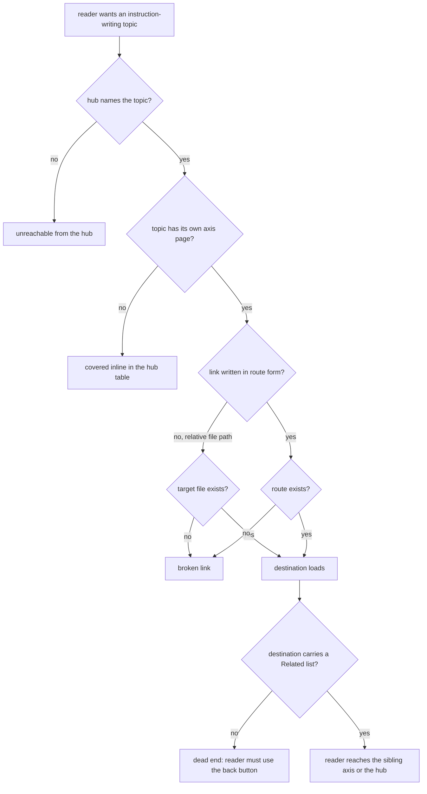

# agent-configuration — the instruction-writing section

## What

The documentation section that teaches how to write agent configuration. It has an **entry page**
and a set of **axis pages**, and its job is to get a reader from "I want to write better
instructions" to the specific axis that answers their question, and back out again.

Three source files, at `src/content/docs/agent-configuration/`:

| Page | Role | Covers |
|---|---|---|
| `overview.md` | **entry page** (hub) | what agent configuration is; a table of instruction topics and a table of settings topics, each row either linking to an axis page or covering the topic inline |
| `instruction-purpose.md` | axis page | what a block of instruction is *for* — procedure, criteria, policy, reference, menu, tone, structure |
| `instruction-target.md` | axis page | which of the agent's outputs an instruction governs — artifact, user, or agent |

**The section's own decisions** are **reachability** and **cross-reference integrity**: whether the
hub names a topic at all, whether a named topic has its own page or is covered inline, what form an
internal link takes, and whether a reader who has finished an axis page can get to its sibling.

**Non-goals.** The prose quality, accuracy, and voice of any page — those are the author's, judged by
review, not by this contract. Frontmatter schema validation, slug derivation, and base-path URL
construction are **co-owned** with Astro and Starlight and belong to `tooling/site-config/`; whether
this section appears in the sidebar belongs to `tooling/navigation/`. This node freezes none of them.

### Key terms

- **entry page** — the section's hub (`overview.md`), the page a reader is expected to arrive at
  first and the only one that enumerates the section's topics.
- **axis page** — a page covering one axis of instruction writing in depth, reached from the hub.
- **route form** — an internal link written as an absolute site route (`/agent-configuration/…/`),
  which Starlight resolves under the site's base path. The alternative, a **relative file path**
  (`../instructions.md`), is not used elsewhere in this section.
- **inline topic** — a topic the hub covers in a table row without a page of its own.

## Use Cases

| # | Entry point | Trigger / inputs / outcome |
|---|---|---|
| U1 | **Reach an axis from the hub** — a reader opens `/agent-configuration/overview/` and scans the instruction-topics table | *Trigger:* reader wants a specific axis. *Inputs:* the topic tables in `overview.md`. *Outcome:* either a link to that axis page, or enough inline coverage to answer the question. |
| U2 | **Follow an internal link** — a reader activates any internal link in a section page | *Trigger:* a link click. *Inputs:* the link's href form. *Outcome:* the destination page loads under the site's base path. |
| U3 | **Return from an axis page** — a reader finishes an axis page and wants the sibling axis or the hub | *Trigger:* end of an axis page. *Inputs:* the page's `## Related` list. *Outcome:* the reader reaches the sibling axis or the hub without using the browser's back button. |

## Control Flow

## Scenario map

### U1 — Reach an axis from the hub

| Edge | Path (Given) | Scenario |
|---|---|---|
| `B:yes → C:yes` | a topic that has its own axis page | `the hub links a topic that has its own page` |
| `B:yes → C:no` | a topic with no page of its own | `the hub covers a page-less topic inline` |
| `B:no` | an axis page that exists in the section | `every axis page is reachable from the hub` |

### U2 — Follow an internal link

| Edge | Path (Given) | Scenario |
|---|---|---|
| `D:yes → G:yes` | a link in route form naming a page in this section | `a route-form link resolves under the base path` |
| `D:no → E:no` | a link in relative file-path form | `a relative link whose target is missing is broken` |
| `D:no → E:yes` | a link in relative file-path form | `a relative link is flagged even when its target exists` |

### U3 — Return from an axis page

| Edge | Path (Given) | Scenario |
|---|---|---|
| `H:yes` | an axis page carrying a Related list | `an axis page routes the reader to its sibling axis` |
| `H:no` | an axis page carrying no Related list | `an axis page without a Related list is a dead end` |

## References

- [Diátaxis](https://diataxis.fr/) — backs freezing **reachability from the hub** rather than page
  order: an explanation-type page is entered from an orienting page rather than read in sequence, so
  "the hub names every axis" is the load-bearing property and "the pages appear in a given order" is
  not.
