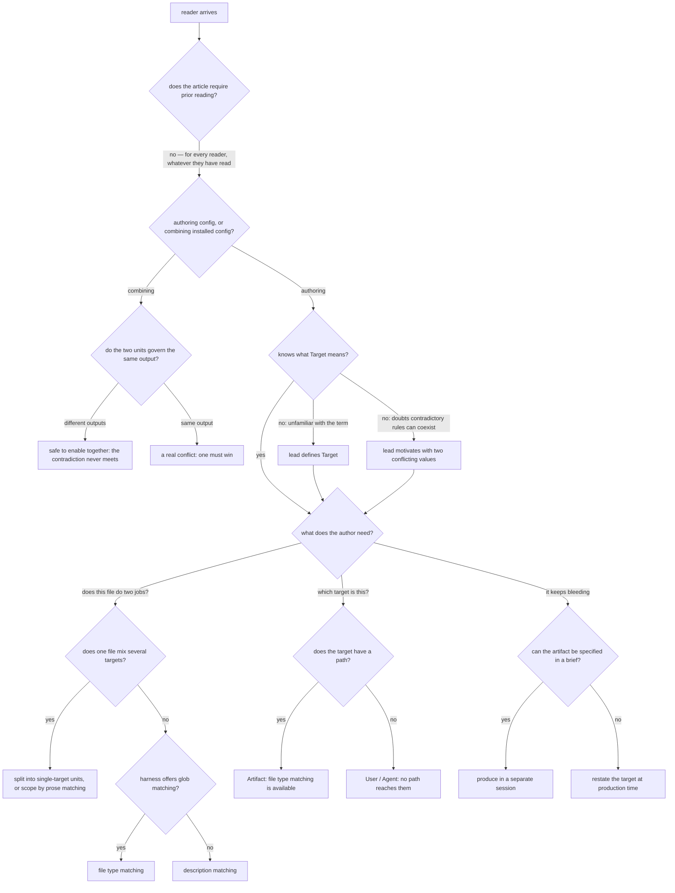

# instruction-target — the "Target" article

Specifies the document at `src/content/docs/agent-configuration/instruction-target.md`, published at
`/agent-configuration/instruction-target/`.

## What

**Target** is one of the two axes of instruction writing. This article teaches a reader to identify
**which of the agent's outputs an instruction governs** — a produced artifact, this session's
conversation, or another agent's context.

### Why the article exists: composition

Naming a target is not the point; it is the means. The point is **composition**.

Agent configuration that mixes targets cannot be taken apart — a file that shapes both replies and
written documents must be adopted whole or not at all, and any two such files will eventually
contradict each other. Once each unit governs **one** target, the same contradictions become
harmless: they apply to different outputs and never meet.

That single fact serves two audiences from opposite sides:

| Audience | Who they are | What Target gives them |
|---|---|---|
| **Agent config author** | writes skills, subagent definitions, rules, `AGENTS.md` sections | a **seam to split on**. Separating config by target turns one monolithic file into single-target units that can be reused independently. |
| **Agent config user** | installs and enables config in their own setup | **freedom to combine**. Units scoped to different targets can be enabled together without fighting, so composing them is safe by construction rather than by luck. |

The author's act and the user's freedom are the same property seen from each end: **separation at
authoring time is what makes composition possible at use time.** An article that teaches the
taxonomy but never lands this has taught a vocabulary and withheld its purpose.

This is the same thesis the sibling **Purpose** article carries — separate cleanly to compose
freely. Purpose splits by *what a block is for*; Target splits by *who reads it*. Neither axis is
useful alone, which is why each article must state the shared payoff rather than assume it.

### Doc type: explanation

The reader is **building understanding, not performing a task**. Success is that they can make a
decision they could not make before — whether to split a config file, whether two units will fight.

This sets the bar and rules two others out. It is **not a how-to**: it must not degrade into a
procedure for configuring one harness. It is **not a reference**: it names Cursor's `globs:` and
Copilot's `applyTo:` as *evidence that a mechanism exists*, never as a settings table to keep current.
The most likely way this article decays is drifting toward reference as harnesses are added to it.

### Prerequisites

The reader should know **what agent configuration is** — that a harness loads instruction files that
shape behavior. That is the section's entry page, `/agent-configuration/overview/`.

Nothing else is assumed. In particular, the sibling **Purpose** article is **complementary, not
prerequisite**: the two axes are orthogonal, so Target must stand alone for a reader who has not read
Purpose. The article may link Purpose freely; it may not depend on it.

### North star

> A reader finishes able to say, of any instruction, **who eventually reads it** — and to act on
> that: an **author** splits configuration into single-target units that do not fight; a **user**
> combines those units freely, knowing that values contradicting on paper coexist when they govern
> different outputs.

A revision that leaves a reader able to recite the three targets but unable to say what separating
them buys has missed the north star.

### Required coverage

The article is incomplete without each of these. The scenarios below check them.

**The idea**

| # | Topic | Must convey |
|---|---|---|
| T1 | **The definition** | Target = which output an instruction governs, and therefore who reads it |
| T2 | **Why separation matters** | separating targets lets contradictory values coexist safely |
| T3 | **The author's payoff** | separating by target is the seam that splits config into reusable single-target units |
| T4 | **The user's payoff** | units governing different targets can be enabled together without conflict |

**The three targets**

| # | Topic | Must convey |
|---|---|---|
| T5 | **The three** | Artifact, User, Agent — where each output goes, the forms it covers, an example of each |
| T6 | **Artifact has a path** | the only target with one, which is why file type matching reaches it and why one file can hold several targets |
| T7 | **User is the default** | everything not written to a file or a brief; every purpose applies, not only Tone; the only target that can answer back |
| T8 | **Agent: briefs vs mail** | a brief becomes the recipient's mission; mail arrives at an agent that already has one, so it competes and must stand alone |

**Binding a target**

| # | Topic | Must convey |
|---|---|---|
| T9 | **The three mechanisms** | file type, description, prose matching — for each: where the target lives, who decides, what it settles |
| T10 | **Which mechanism when** | globs are deterministic but bind at file granularity; description reaches what a path cannot; prose handles mixed-target files and near-identical variants |
| T11 | **The limit of naming** | when one target needs a substantial body of instruction, isolation beats scoping |

**Working with targets**

| # | Topic | Must convey |
|---|---|---|
| T12 | **Drift within a session** | targets bleed by accumulation of unlabeled examples, running toward whichever target was served most |
| T13 | **The four arrangements** | separate session / restate at production / produce early / scope the instruction — ranked by separation strength, each with its cost |
| T14 | **Orthogonality to Purpose** | naming a target does not change what purpose a block serves |

**Non-goals** — each with where it lives instead, so a reader who wants it is not simply left:

| Not covered here | Lives at |
|---|---|
| what a block of instruction is *for* (the other axis) | [Purpose](/agent-configuration/instruction-purpose/) |
| where Tone and Structure separate from expertise | [Persona](/concepts/persona/) |
| which file kinds carry instructions in each harness | [Agent Configuration](/agent-configuration/overview/) |
| a harness's settings reference (`globs:`, `applyTo:`, permissions, hooks) | that harness's own documentation — this article names such fields only as evidence a mechanism exists, and does not track releases |

## Use Cases

Grouped by audience. The author entry points concern **splitting**; the user entry points concern
**combining**.

### Agent config author

| # | Entry point | Trigger / inputs / outcome |
|---|---|---|
| A1 | **Decide whether to split a file** — the author has one config file that shapes more than one kind of output | *Trigger:* a file that feels like it is doing two jobs. *Inputs:* the three targets and the mixed-target discussion. *Outcome:* the author splits it into single-target units, or keeps it whole and scopes by prose. |
| A2 | **Bind a unit to its target** — the author has a single-target unit and must make it apply only there | *Trigger:* writing a skill, rule, or `AGENTS.md` section. *Inputs:* the mechanisms table. *Outcome:* the author picks file type, description, or prose matching. |
| A3 | **Stop a unit bleeding** — the author's instruction is being ignored late in a long session | *Trigger:* observed drift. *Inputs:* the drift section and its four arrangements. *Outcome:* the author picks an arrangement and knows its cost. |

### Agent config user

| # | Entry point | Trigger / inputs / outcome |
|---|---|---|
| C1 | **Predict whether two configs will fight** — the user is enabling two units whose rules look contradictory | *Trigger:* two configs that seem to conflict (a terse-replies unit and a formal-prose unit). *Inputs:* the three targets and the coexistence claim. *Outcome:* the user determines they govern different outputs and enables both, or finds a real conflict. |
| C2 | **Diagnose over-reach** — an enabled config is shaping output the user did not intend | *Trigger:* a voice rule leaking into chat replies. *Inputs:* the per-target sections and the drift section. *Outcome:* the user names the target the unit actually governs and sees whether it was scoped or is drifting. |

## Control Flow

The reader's decision path. The first branch is **which audience the reader is** — it selects which
half of the article they need.

## Scenario map

### A1 — Decide whether to split a file

| Edge | Path (Given) | Scenario |
|---|---|---|
| `A` | any reader, whatever they have read before *(convergence — the outcome does not vary)* | `the article stands alone without prerequisite reading` |
| `R:authoring` | an author holding one file that shapes several outputs | `the article names separation by target as the seam that splits config` |
| `K:yes` | a file holding content governed by more than one target | `a mixed-target file routes to splitting or prose matching` |
| `B:no → C1` | an author unfamiliar with the term | `the article defines Target before naming any mechanism` |
| `B:no → C2` | an author who doubts contradictory rules can coexist | `the opening motivates Target with two values that contradict` |

### A2 — Bind a unit to its target

| Edge | Path (Given) | Scenario |
|---|---|---|
| `K:no → M:yes` | a single-target file on a harness with glob support | `a glob-capable harness routes to file type matching` |
| `K:no → M:no` | a single-target file on a harness without glob support | `a harness without globs routes to description matching` |
| `K` | an author comparing the three mechanisms | `each mechanism states where the target lives, who decides, and what it settles` |
| `H:yes` | an instruction governing a written file | `the Artifact section states it is the only target with a path` |
| `H:no` | an instruction governing a reply or a brief | `the User and Agent sections state that no path reaches them` |
| `H:no` | an instruction governing another agent | `the Agent section distinguishes a brief from mail by the recipient's standing mission` |

### A3 — Stop a unit bleeding

| Edge | Path (Given) | Scenario |
|---|---|---|
| `P` | an author observing drift | `the article attributes drift to accumulation of unlabeled examples` |
| `P:yes` | an artifact that can be specified in a brief | `the article recommends a separate session` |
| `P:no` | an artifact that cannot be specified in a brief | `the article recommends restating the target at production time` |
| `P` | an author comparing the arrangements | `the four arrangements are ranked by separation strength` |

### C1 — Predict whether two configs will fight

| Edge | Path (Given) | Scenario |
|---|---|---|
| `R:combining` | a user holding two units whose rules look contradictory | `the article addresses the user combining units, not only the author writing them` |
| `Z:different` | two units governing different outputs | `two units on different targets are shown coexisting` |
| `Z:same` | two units governing the same output | `two units on the same target are named a real conflict` |

### C2 — Diagnose over-reach

| Edge | Path (Given) | Scenario |
|---|---|---|
| `R:combining` | a user whose enabled unit shapes unintended output | `each of the three targets has its own section` |
| `D` | a user checking what a unit actually governs | `the article states that Target is orthogonal to Purpose` |

## References

- [Diátaxis](https://diataxis.fr/) — classifies this article as **explanation**: read for
  understanding rather than followed step-by-step, which is why the contract freezes the *claims it
  must land* and the *reader questions it must route*, and freezes neither section order nor wording.
