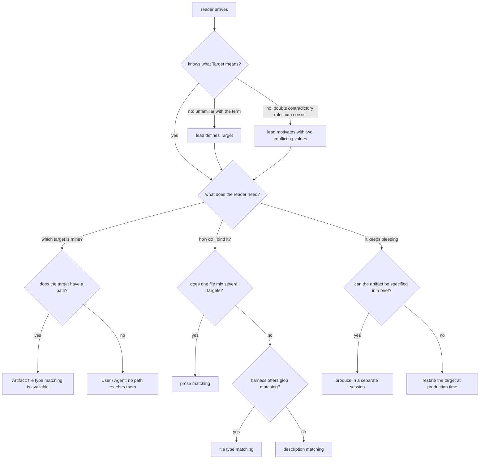

# instruction-target — the "Target" article

Specifies the document at `src/content/docs/agent-configuration/instruction-target.md`, published at
`/agent-configuration/instruction-target/`.

## What

**Target** is one of the two axes of instruction writing. This article teaches a reader to identify
**which of the agent's outputs an instruction governs** — a produced artifact, this session's
conversation, or another agent's context — and to write instructions scoped to one of them.

### North star

> A reader finishes this article able to say, of any instruction they are about to write, **who
> eventually reads it** — and knows which mechanism to use to bind it there.

The article earns its place by resolving one specific confusion: **why two instructions that
contradict each other can both be correct.** Caveman register and careful English cannot both be one
house style; as values on two different targets they coexist without conflict. Every section either
builds toward that claim or shows how to act on it. A revision that leaves a reader able to recite
the three targets but unable to see why separating them matters has missed the north star.

### Required coverage

The article is incomplete without each of these. This is the contract's substance; the scenarios
below check it.

| # | Topic | Must convey |
|---|---|---|
| T1 | **The definition** | Target = which output an instruction governs, and therefore who reads it |
| T2 | **Why separation matters** | separating targets is what lets contradictory values coexist safely |
| T3 | **The three targets** | Artifact, User, Agent — where each output goes, the forms it covers, an example of each |
| T4 | **The three mechanisms** | file type matching, description matching, prose matching — for each: where the target lives, who decides, and what it settles |
| T5 | **Which mechanism when** | globs are deterministic but bind at file granularity; description matching reaches what a path cannot; prose matching handles mixed-target files and near-identical variants |
| T6 | **Artifact is the only target with a path** | which is why it is the only one file type matching can reach, and the only one where a single file holds several targets |
| T7 | **User is the default target** | everything not written to a file or a brief; every purpose applies here, not only Tone; it is the only target that can answer back |
| T8 | **Agent: briefs vs mail** | a brief becomes the recipient's mission; mail arrives at an agent that already has one, so it competes for attention and must stand alone |
| T9 | **Drift within a session** | targets bleed by accumulation of unlabeled examples, running toward whichever target was served most |
| T10 | **The four arrangements** | separate session / restate at production / produce early / scope the instruction — ranked by separation strength, with the cost of each |
| T11 | **The limit of naming** | when one target needs a substantial body of instruction, isolation beats scoping |
| T12 | **Orthogonality to Purpose** | naming a target does not change what purpose a block serves |

**Non-goals.** Teaching Purpose (its own article), persona design, or any harness's configuration
reference. The article names concrete harness mechanisms (Cursor `globs:`, Copilot `applyTo:`) only
as evidence that a mechanism exists — it is not a settings reference and does not track harness
releases.

## Use Cases

| # | Entry point | Trigger / inputs / outcome |
|---|---|---|
| U1 | **Orient** — a reader arrives not knowing what Target means | *Trigger:* a link from the Purpose article or the section hub. *Inputs:* the article's opening. *Outcome:* the reader can define Target and say why it exists. |
| U2 | **Choose a mechanism** — a reader knows their target and needs to bind an instruction to it | *Trigger:* writing a skill, rule, or AGENTS.md section. *Inputs:* the mechanisms table. *Outcome:* the reader picks file type, description, or prose matching. |
| U3 | **Identify the target** — a reader is unsure which of the three their instruction serves | *Trigger:* an instruction that feels like it applies "everywhere". *Inputs:* the per-target sections. *Outcome:* the reader names one target, or recognizes the file mixes several. |
| U4 | **Stop the bleed** — a reader's instruction is being ignored late in a long session | *Trigger:* observed drift. *Inputs:* the drift section and its four arrangements. *Outcome:* the reader picks an arrangement and knows its cost. |

## Control Flow

The reader's decision path through the article. Sections are the nodes a reader lands on; the
branches are the questions the article must answer to route them.

## Scenario map

### U1 — Orient

| Edge | Path (Given) | Scenario |
|---|---|---|
| `B:no → C1` | a reader unfamiliar with the term | `the article defines Target before naming any mechanism` |
| `B:no → C2` | a reader who doubts contradictory rules can coexist | `the opening motivates Target with two values that contradict` |
| `D` | a reader who already knows the term | `each of the three targets has its own section` |

### U2 — Choose a mechanism

| Edge | Path (Given) | Scenario |
|---|---|---|
| `K:yes` | a file holding content under several targets | `a mixed-target file routes to prose matching` |
| `K:no → M:yes` | a single-target file on a harness with glob support | `a glob-capable harness routes to file type matching` |
| `K:no → M:no` | a single-target file on a harness without glob support | `a harness without globs routes to description matching` |
| `K` | any reader comparing the three | `each mechanism states where the target lives, who decides, and what it settles` |

### U3 — Identify the target

| Edge | Path (Given) | Scenario |
|---|---|---|
| `H:yes` | an instruction governing a written file | `the Artifact section states it is the only target with a path` |
| `H:no` | an instruction governing a reply or a brief | `the User and Agent sections state that no path reaches them` |
| `H:no` | an instruction governing another agent | `the Agent section distinguishes a brief from mail by the recipient's standing mission` |

### U4 — Stop the bleed

| Edge | Path (Given) | Scenario |
|---|---|---|
| `P` | a reader observing drift | `the article attributes drift to accumulation of unlabeled examples` |
| `P:yes` | an artifact that can be specified in a brief | `the article recommends a separate session` |
| `P:no` | an artifact that cannot be specified in a brief | `the article recommends restating the target at production time` |
| `P` | a reader comparing the arrangements | `the four arrangements are ranked by separation strength` |

## References

- [Diátaxis](https://diataxis.fr/) — classifies this article as **explanation**: it is read for
  understanding rather than followed step-by-step, which is why the contract freezes the *claims it
  must land* and the *reader questions it must route*, and freezes neither section order nor wording.
