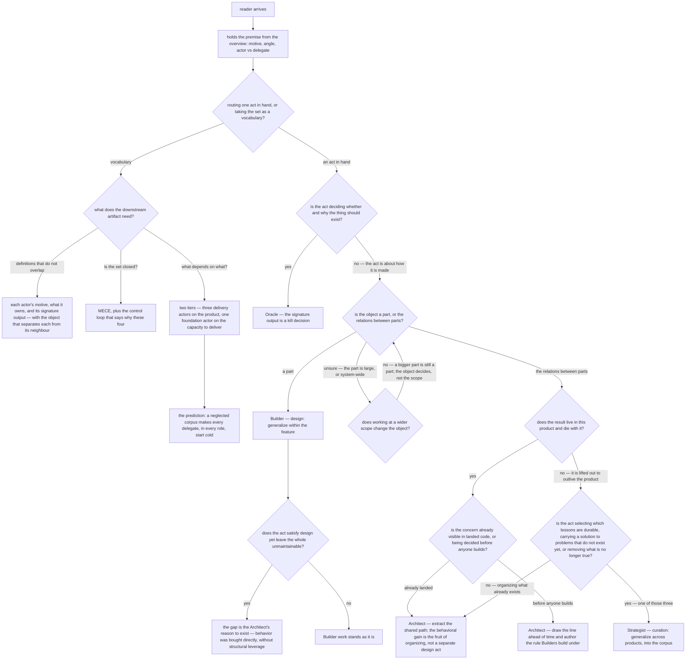

# four-actors — the "Four Actors" article

Specifies the document at `apps/website/src/content/docs/motive-model/four-actors.mdx`, published at
`/motive-model/four-actors/`.

## What

The Motive Model replaces the **title** with the **motive** as the unit of a team. This article is
where that replacement becomes concrete: it names the **four actors** — Oracle, Builder, Architect,
Strategist — and teaches a reader to tell **which actor an act belongs to**.

### Why the article exists: the boundaries, not the roster

A roster is cheap. Four names with four verbs beside them can be read in a minute and used for
nothing, because the question a reader actually arrives with is never *what are the four actors* —
it is *which one am I being right now, and did I just cross into another one?*

The project spec is explicit that this is load-bearing downstream: get the actors and motives right
and the use cases, scenarios, and interfaces follow; get them wrong and "the use cases overlap, the
scenarios blur, and the interfaces inherit the confusion." Overlapping use cases are the symptom of
a reader who cannot place a **boundary**. So the article's real subject is the three seams between
neighbours — Oracle|Builder, Builder|Architect, Architect|Strategist — and the discriminator that
settles each one. The definitions exist to make the discriminators sayable; they are the means, not
the point.

The set is also held to be **MECE** — mutually exclusive and collectively exhaustive. That claim is
worthless to a reader who cannot demonstrate mutual exclusivity on a concrete act, which is the same
thing again: exclusivity **is** the boundaries.

### Audience

Derived from the project spec (`artifacts/specs/motive-model/spec.md`) — the Output 1 use-case row
for the four actors section, and the spec's own statements about what the actor set is for — not
from what the current draft happens to serve.

| Audience                    | Who they are                                                                                                                | What the article gives them                                                                                                                                     |
| --------------------------- | ---------------------------------------------------------------------------------------------------------------------------- | ----------------------------------------------------------------------------------------------------------------------------------------------------------------- |
| **Practitioner spanning roles** | someone building with delegates who moves through several roles in a day and must name the one they are in right now — the compressed case the model is built for | a **decision procedure**: given an act in hand, which actor owns it, and what tells it apart from the neighbour it is most often confused with                   |
| **Model consumer**          | someone deriving a downstream artifact from the model — use cases, governance, an agent definition — who needs the actor set as a vocabulary | a **typed, closed set**: each actor's motive, what it owns, and its signature output, plus why the set is four and where the Strategist sits relative to the other three |

The two need the same facts from opposite ends. The practitioner needs the discriminators to route a
single act; the consumer needs them to keep two definitions from overlapping. Both are served by one
article — **the discriminators are the shared payload**, and neither audience is served by
definitions that do not carry them.

### Doc type: explanation

The reader is **building understanding, not performing a task**. Success is that they can make a
decision they could not make before — *this act is Architect work, not Builder work.*

This rules two types out. It is **not a reference**: the actor table is not a lookup surface to keep
current, and the article decays toward reference the moment its rows become entries rather than
arguments. It is **not a how-to**: it must not become a procedure for staffing or running a team.

### North star

> A reader finishes able to take **any concrete act of building** and say which of the four actors
> owns it — and, where two actors are adjacent, to name the property that decides between them.

**A revision that leaves a reader able to recite four names, four motives, and four signature
outputs, yet unable to say what separates a Builder from an Architect on a concrete act, has
missed.** That is the failure the article exists to prevent: a reader who cannot tell two actors
apart has a roster, not a model.

### Required coverage

The article is incomplete without each row. Each is checkable by static inspection; the scenarios
below check them.

**The idea**

| #   | Topic                            | Must convey                                                                                                                        |
| --- | -------------------------------- | ---------------------------------------------------------------------------------------------------------------------------------- |
| F1  | **An actor is a human + motive** | an actor is a human holding one of four base motives, and the motive is what makes each a real actor — each generates work the others do not |
| F2  | **The set is closed (MECE)**     | the four are mutually exclusive (motives do not overlap) and collectively exhaustive (nothing essential falls outside)             |
| F3  | **Why these four**               | around abundant generation they form a control loop — decide what is worth making, make candidates, keep the whole coherent, make learning compound |
| F4  | **The four, fully specified**    | for each actor: its motive, what it owns, and its signature output                                                                 |

**The generalize ladder**

| #   | Topic                        | Must convey                                                                                                                                    |
| --- | ---------------------------- | ------------------------------------------------------------------------------------------------------------------------------------------------ |
| F5  | **One scale, three rungs**   | Builder, Architect, Strategist differ by scope of reuse and where the result lives — within a feature / across features / across products over time, living in the feature / the product / the corpus, named design / architecture / curation |
| F6  | **What keeps the rungs apart** | the *mechanism* differs: design changes behavior directly, architecture changes behavior through structure, curation changes future capability through knowledge |
| F7  | **Why the Architect exists** | an example in which design is satisfied yet the result is unmaintainable — behavior bought directly, without the structural leverage that lets the rest inherit the quality |

**The boundaries** — the article's core payload

| #   | Topic                       | Must convey                                                                                                                                  |
| --- | --------------------------- | ---------------------------------------------------------------------------------------------------------------------------------------------- |
| F8  | **Oracle \| Builder**       | the Oracle owns *whether and why*, the Builder owns *how*; a Builder who redefines the goal has stepped into the Oracle role                 |
| F9  | **Builder \| Architect**    | the discriminator is the **object**, not scope — a part versus the relations between parts — so a Builder working at system scope is still a Builder, and the same person crosses the line in the same minute |
| F10 | **Architect \| Strategist** | the Architect's result lives in this product and dies with it; the moment it is lifted out as knowledge meant to outlive the product, it is Strategist work |
| F11 | **The absorption objection** | the article raises the objection that curating a corpus is only architecture at another tier, concedes that a Strategist organizes constantly, and names the three acts organizing does not contain — selecting for durability, generalizing across products and time, pruning what is no longer true |

**The Architect's own shape** — where the Builder\|Architect seam is most often mis-set

| #   | Topic                        | Must convey                                                                                                              |
| --- | ---------------------------- | -------------------------------------------------------------------------------------------------------------------------- |
| F12 | **Active, and it is governance** | the Architect draws the lines ahead of the work and authors the rules Builders then build under, rather than tidying what already landed |
| F13 | **The behavioral dividend**  | extracting one shared path across features is Architect work whose behavioral improvement is the fruit of organizing, not a separate design act |

**The two tiers**

| #   | Topic                    | Must convey                                                                                                                        |
| --- | ------------------------ | ------------------------------------------------------------------------------------------------------------------------------------ |
| F14 | **Delivery vs foundation** | Oracle, Builder, Architect operate on the product; the Strategist operates on the capacity to deliver, because every other actor's delegate reads from the corpus |
| F15 | **The prediction**       | infrastructure is the first thing a team neglects, and a decaying corpus forces every delegate, in every role, to start cold        |

**Completeness check.** A document landing F1–F15 cannot still trip the north star's failure mode:
F8, F9, and F10 supply a discriminator for each adjacent pair, F5 and F6 supply the scale the three
product actors sit on, and F11 closes the one seam a reader argues back on.

**Non-goals** — each with where it lives instead:

| Not covered here                                                          | Lives at                                                          |
| ------------------------------------------------------------------------- | ------------------------------------------------------------------- |
| that every actor also *judges*, and why there is no standalone Gatekeeper | [Two faces and the gate](/motive-model/faces-and-the-gate/)       |
| the gate's two-axis verdict, `producer ≠ judge`, the deferred branch      | [Two faces and the gate](/motive-model/faces-and-the-gate/)       |
| the delegation surfaces (brief, contract, shape, corpus) and the bar      | [Delegates and surfaces](/motive-model/delegates-and-surfaces/)   |
| variants (Explorer, QA, Scout, Conductor) and the membership gates        | [Variants and how people grow](/motive-model/variants/)           |
| how a job title maps onto actors                                          | [Positions are not roles](/motive-model/positions-are-not-roles/) |
| applying the same four actors to process and toolchain                    | [Recursion](/motive-model/recursion/)                             |
| definitions of every load-bearing term, in dependency order               | [Glossary](/motive-model/glossary/)                               |

### Prerequisites

The reader must arrive holding **the premise**: that a title is no longer the unit of a team, that
the unit is a motive held from an angle of expertise, and that a human wielding an agent is an
**actor** wielding a **delegate**. That is supplied by [the overview](/motive-model/overview/), the
section's entry page, and the article may assume it.

Everything **after** this article in the reading order — faces and the gate, delegation surfaces,
variants, scenarios, recursion — is downstream. The article may forward to them; it may not depend
on them. In particular it must not require the faces page to make the four actors intelligible: the
actors are defined here, and this is their defining page.

## Use Cases

Grouped by audience. The practitioner entry points are about **routing one act**; the consumer entry
points are about **taking the set whole**.

### Practitioner spanning roles

| #   | Entry point                                                                                                | Trigger / inputs / outcome                                                                                                                                                                                                        |
| --- | ------------------------------------------------------------------------------------------------------------ | ---------------------------------------------------------------------------------------------------------------------------------------------------------------------------------------------------------------------------------- |
| P1  | **Name the actor for the act in hand** — the reader is mid-work and wants to know which role they are in    | *Trigger:* an act whose owning role is unclear. *Inputs:* the four actors with motive, object, and signature output. *Outcome:* the reader names one actor, and knows the motive that made it that one.                            |
| P2  | **Settle a boundary with the neighbour** — the reader is between two adjacent actors                        | *Trigger:* "I zoomed out — am I still a Builder?", or "isn't this just design?". *Inputs:* the ladder and the pairwise discriminators. *Outcome:* the reader applies the property that decides the pair, rather than guessing by scale. |
| P3  | **Decide where a lesson belongs** — the reader has learned something and must place it                     | *Trigger:* a pattern solved more than once. *Inputs:* the Architect\|Strategist boundary and the absorption objection. *Outcome:* the reader keeps it in the product as a convention, or lifts it into the corpus, on a stated criterion. |

### Model consumer

| #   | Entry point                                                                                              | Trigger / inputs / outcome                                                                                                                                                                          |
| --- | ---------------------------------------------------------------------------------------------------------- | ------------------------------------------------------------------------------------------------------------------------------------------------------------------------------------------------------ |
| M1  | **Take the actor set as a vocabulary** — the reader is writing a downstream artifact over the four actors | *Trigger:* authoring use cases, governance, or an agent definition against the model. *Inputs:* the per-actor motive / object / signature output. *Outcome:* four definitions that do not overlap in the artifact they are writing. |
| M2  | **Justify the closure** — the reader asks why four, and whether a fifth is missing                       | *Trigger:* a candidate role that seems to fall outside. *Inputs:* MECE plus the control loop. *Outcome:* the reader can say what the set claims and what would falsify it.                          |
| M3  | **Place the Strategist** — the reader must know what depends on what                                     | *Trigger:* laying out dependencies between the actors. *Inputs:* the two-tier split. *Outcome:* the reader treats the Strategist as foundation to the other three, and knows the consequence of neglecting it. |

## Control Flow

The reader's decision path. The first branch is **which audience the reader is** — it selects
whether they are routing a single act or taking the set whole.

## Scenario map

### P1 — Name the actor for the act in hand

| Edge     | Path (Given)                                          | Scenario                                                                            |
| -------- | ----------------------------------------------------- | ------------------------------------------------------------------------------------- |
| `PRE`    | a reader who has read the section's entry page only   | `the article assumes the premise and defines the four actors itself`                |
| `R:act`  | a practitioner holding an act of unclear ownership    | `an actor is a human holding a motive that generates work the others do not`        |
| `V1/R`   | a practitioner naming one actor                       | `each actor carries a motive, what it owns, and a signature output`                 |
| `Q:yes`  | an act deciding whether the thing should exist at all | `deciding whether and why routes to the Oracle, and how routes to the Builder`      |

### P2 — Settle a boundary with the neighbour

| Edge      | Path (Given)                                              | Scenario                                                                          |
| --------- | --------------------------------------------------------- | ----------------------------------------------------------------------------------- |
| `Z`       | a Builder who has zoomed out to system scope              | `the Builder/Architect boundary is decided by the object, not by scope`           |
| `O → W`   | a reader comparing the three product actors               | `the ladder separates the rungs by scope of reuse and where the result lives`     |
| `O → W`   | a reader who cannot see what the rungs actually differ on | `each rung names the mechanism by which it adds value`                            |
| `L:yes`   | work that satisfies design yet is unmaintainable          | `an example shows design satisfied while the whole stays unmaintainable`          |
| `A:before` | a concern being decided before anyone builds             | `the Architect draws lines ahead of the work and authors the rules Builders follow` |
| `A:landed` | a concern visible across features that already landed    | `extracting a shared path is Architect work, not a separate design act`           |

### P3 — Decide where a lesson belongs

| Edge    | Path (Given)                                            | Scenario                                                                        |
| ------- | ------------------------------------------------------- | --------------------------------------------------------------------------------- |
| `W`     | a result that may or may not outlive the product        | `the Architect/Strategist boundary is decided by whether the result outlives the product` |
| `Y`     | a reader who suspects curation is only architecture     | `the article answers the objection that curating a corpus is architecture at another tier` |

### M1 — Take the actor set as a vocabulary

| Edge  | Path (Given)                                                  | Scenario                                                                     |
| ----- | ------------------------------------------------------------- | ------------------------------------------------------------------------------ |
| `V1`  | a reader arriving at the vocabulary, not at a boundary dispute | `the object that separates Builder from Architect is retrievable on both reader paths` |

### M2 — Justify the closure

| Edge   | Path (Given)                                     | Scenario                                                     |
| ------ | ------------------------------------------------ | -------------------------------------------------------------- |
| `V2`   | a reader asking whether a fifth actor is missing | `the four are declared mutually exclusive and collectively exhaustive` |
| `V2`   | a reader asking why these four and not others    | `the four are presented as a control loop around abundant generation` |

### M3 — Place the Strategist

| Edge   | Path (Given)                                    | Scenario                                                       |
| ------ | ----------------------------------------------- | ---------------------------------------------------------------- |
| `V3`   | a reader laying out dependencies between actors | `the model is two-tiered — three delivery actors and one foundation actor` |
| `V4`   | a reader weighing the cost of neglect           | `the tiering yields a prediction about neglected infrastructure` |

## References

- `artifacts/specs/motive-model/spec.md` — the project spec for the whole documentation set; its
  `## Use Cases` (Output 1) names the outcome this article's reader must leave with, and its `## What`
  carries the four-actor table, the generalize ladder, the boundaries, and the two-tier split.
- [Diátaxis](https://diataxis.fr/) — classifies this article as **explanation**: read to build
  understanding rather than followed step by step, which is why this contract freezes the *claims it
  must land* and the *reader questions it must route*, and freezes neither section order nor wording.
