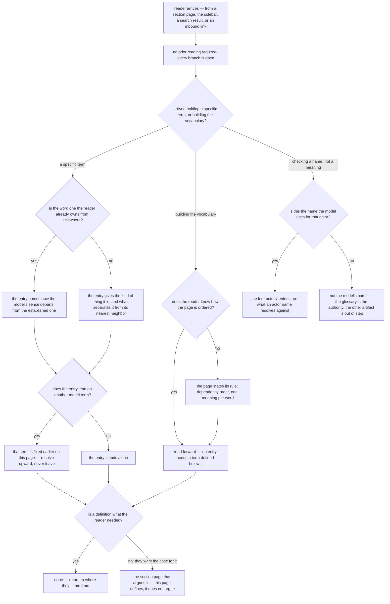

# glossary — the Motive Model glossary

Specifies the document at `src/content/docs/motive-model/glossary.md`, published at
`/motive-model/glossary/`.

## What

The Motive Model is a **vocabulary before it is an argument**: `actor`, `delegate`, `motive`,
`object`, `face`, `bar`, `tier` each carry one fixed sense, and the eight sibling pages
(`overview`, `four-actors`, `faces-and-the-gate`, `delegates-and-surfaces`, `variants`,
`positions-are-not-roles`, `scenarios`, `recursion`) argue *from* those senses rather than
re-establishing them. This page is where a term's meaning is settled.

Its contract comes from the project spec `artifacts/specs/motive-model/spec.md` — the `## Use Cases`
row *"A reader reads the **glossary**"*, whose stated outcome is **every load-bearing term defined in
dependency order, with earlier terms grounding later ones**, and the spec's own `## Glossary` section,
which is the authority for **which** terms are load-bearing.

### Doc type: reference

The reader is **looking one thing up**. Success is that they found it and it was accurate — not that
they were persuaded, and not that they completed a task.

This is the declaration the rest of the node hangs on, and it rules three types out. It is **not an
explanation**: the case for four actors, for the two-tier split, for `producer ≠ judge` is made on the
section pages, and an entry that re-runs one of those arguments has drifted. It is **not a how-to**
and **not a tutorial**: no reader performs a procedure here. The likeliest decay is toward
explanation — an entry growing a paragraph of justification because the argument felt thin on the
page that owns it.

One property distinguishes this reference from the flat, alphabetized kind and must not be mistaken
for a type violation: the entries carry a **dependency order**. That is not a narrative and not a
reading path through an argument; it is a structural guarantee about lookup — an entry may lean only
on senses already fixed above it. The page therefore supports two access patterns without becoming
two documents (see *the split, and how it is resolved*).

### Why it exists

The model reuses words the reader already owns. **Actor**, **agent**, **delegate**, **object**,
**face**, **stub** all have established senses — from UML, the actor model, agency theory, test
doubles — and the model's sense departs from several of them deliberately. Without a place that fixes
each sense once, every section page must either re-define the term or risk the reader importing the
outside meaning; both failures are silent, and the second produces a reader who follows every
sentence and understands the model wrongly.

That is the job no section page can do: the sections spend the vocabulary, and something has to
**hold** it.

### Audience

Derived from the project spec's Output 1 use cases and its `## Glossary` authority, not from the
page's current prose.

| Audience | Who they are | What the glossary gives them |
| --- | --- | --- |
| **Mid-read term-checker** | reading one of the eight Motive Model section pages, stopped by a term used as load-bearing (`bar`, `object`, `tier`) | the term's exact sense and what separates it from its nearest neighbor, resolvable without losing their place or opening a third page |
| **Vocabulary bootstrapper** | new to the model, building the whole vocabulary before committing to the argument | a forward read in which nothing is defined in terms of something not yet defined |
| **Vocabulary adopter** | applying the model in their own artifact — a spec, an ADR, a governance, an agent definition — and must use the words the way the model does | confirmation that their usage is the model's, including where the model departs from the established sense of the same word, and which name is the model's name for an actor |

#### The split, and how it is resolved

The first two audiences want **opposite things from one fact**. A term-checker arriving at a single
entry wants it **self-sufficient** — chasing a definition should not become a chain. A bootstrapper
reading forward wants entries **allowed to lean on earlier ones**, because that is what stops the
page repeating itself twenty-six times.

**Decision: one document, reconciled by making the leaning strictly backward.** An entry may rely on
any term already fixed above it and may not rely on one fixed below it. The bootstrapper reads
forward and never meets an undefined term; the term-checker's chase is bounded, always runs upward,
and never leaves the page. This is the operative content of *dependency order* — it is the mechanism
that lets one page serve both, and G2 and G7 below are the two halves of it.

### North star

> A reader finishes able to state what any load-bearing Motive Model term means and how it differs
> from its nearest neighbor — resolving it from this page alone, following only backward references.

**A revision that leaves a reader able to quote an entry but needing a section page, or an entry
further down, to know what that entry means has missed the north star.**

### Required coverage

The document is incomplete without each row. The scenarios below check them. The authority for the
term set is the project spec's `## Glossary`; the authority for actor names is the project spec's
body.

**Completeness and order**

| # | Topic | Must convey |
| --- | --- | --- |
| G1 | **Every load-bearing term** | each term the project spec's `## Glossary` names has an entry here |
| G2 | **Dependency order** | no entry relies on a model term defined later on the page |
| G7 | **Self-contained resolution** | every model term an entry leans on is defined on this page, so no entry sends the reader elsewhere to be understood |

**What an entry owes**

| # | Topic | Must convey |
| --- | --- | --- |
| G3 | **One defining entry per term** | a term is defined in exactly one entry; it may recur freely inside other entries |
| G4 | **Differentia** | each entry says what kind of thing the term is and what separates it from the term it is most often confused with |
| G5 | **Declared collisions** | where the model's sense departs from an established outside sense of the same word, the entry names the departure |

**Identity and boundary**

| # | Topic | Must convey |
| --- | --- | --- |
| G6 | **Authoritative actor names** | the four actors appear under the names the project spec's body uses, consistently, with no second name for the same actor |
| G8 | **The page states its own rule** | the reader is told that the entries run in dependency order and that each word carries one meaning — otherwise the guarantee they depend on is invisible |
| G9 | **Defines, does not argue** | an entry compresses a claim; the case for it lives on the section page that owns it |

Meeting all nine rules out the failure mode: G1 + G2 + G7 make every entry resolvable on the page,
G4 + G5 make it resolvable *correctly*, and G9 keeps the resolution from turning into the argument
the reader did not come for.

### Non-goals

Each with where it lives instead, so a reader who wants it is not simply left.

| Not covered here | Lives at |
| --- | --- |
| why the model has four actors, why Strategist is an actor and not a layer, why there is no Gatekeeper | [Four actors](/motive-model/four-actors/), [Faces and the gate](/motive-model/faces-and-the-gate/) |
| the premise — production scarcity, abundance, title → motive | [The Motive Model overview](/motive-model/overview/) |
| which variants are confirmed vs forming, and the case for each | [Variants](/motive-model/variants/) |
| the machine-readable form of the same vocabulary for agents | the motive-model governance (project spec, Output 2) |
| site-wide terminology outside the Motive Model | the site's own `/glossary/` page — a different document with a colliding path segment |

### Prerequisites

**None.** The page is self-contained by declaration: a reader arriving cold, from a search result or
an inbound link, can resolve any entry without having read a section page first. The model's
*argument* requires the section pages; its *vocabulary* does not.

## Use Cases

Grouped by audience. Every entry point traces to a coverage row.

### Mid-read term-checker

| # | Entry point | Trigger / inputs / outcome |
| --- | --- | --- |
| T1 | **Resolve one term mid-read** — the reader hits a load-bearing term on a section page | *Trigger:* a term used as though its sense were fixed. *Inputs:* that term's entry. *Outcome:* the reader has the sense and returns to the section page, without opening a third document. (G1, G3, G7) |
| T2 | **Tell two neighbors apart** — the reader cannot see what separates `role` from `actor`, `object` from `scope`, `face` from `direction`, `bar` from `delegate fidelity` | *Trigger:* two terms that feel like the same thing. *Inputs:* both entries. *Outcome:* the reader names the separator. (G4) |

### Vocabulary bootstrapper

| # | Entry point | Trigger / inputs / outcome |
| --- | --- | --- |
| B1 | **Build the vocabulary front to back** — the reader wants the terms before the argument | *Trigger:* arriving from the overview's glossary link or the sidebar. *Inputs:* the page read forward. *Outcome:* every term is grounded by terms already read; nothing was defined by something not yet defined. (G2, G8) |
| B2 | **Learn how to use the page** — the reader does not yet know the entries are ordered rather than alphabetized | *Trigger:* the page opens on a table, not a list of letters. *Inputs:* the page's own statement of its rule. *Outcome:* the reader knows to look upward, not around. (G8) |

### Vocabulary adopter

| # | Entry point | Trigger / inputs / outcome |
| --- | --- | --- |
| A1 | **Check a word against an outside sense** — the reader already owns "actor", "agent", "delegate", or "stub" from another field | *Trigger:* a familiar word used unfamiliarly. *Inputs:* that entry's collision note. *Outcome:* the reader knows the model's sense and where it departs from the one they brought. (G5) |
| A2 | **Confirm an actor's name** — the reader is writing a spec, governance, or agent definition that names an actor | *Trigger:* a name seen in one artifact and not another. *Inputs:* the four actors' entries. *Outcome:* the reader uses the model's name for that actor. (G6) |
| A3 | **Reach the argument behind a term** — the definition is not enough; the reader wants the case | *Trigger:* an entry that compresses a claim. *Inputs:* the entry, plus the section page that owns the claim. *Outcome:* the reader goes to the section rather than expecting the argument here. (G9) |

## Control Flow

The reader's decision path. A reference is not traversed linearly, so the first branch is **what the
reader arrived holding** — one term, or none.

## Scenario map

### T1 / T2 — Mid-read term-checker

| Edge | Path (Given) | Scenario |
| --- | --- | --- |
| `P` | any reader, whatever they have read before *(convergence — the outcome does not vary)* | `the glossary resolves without prerequisite reading` |
| `N:yes` | an entry that leans on another model term | `every term an entry leans on is defined on the page` |
| `N` | a reader looking one term up | `each term is defined in exactly one entry` |
| `T:no → T2` | a term the reader has no competing sense of | `each entry states its kind and what separates it from its nearest neighbor` |

### B1 / B2 — Vocabulary bootstrapper

| Edge | Path (Given) | Scenario |
| --- | --- | --- |
| `R2` | a reader reading the page forward from the top | `no entry relies on a term defined later on the page` |
| `Q` | a reader building the whole vocabulary | `every load-bearing term the model names has an entry` |
| `R:no → R1` | a reader who does not yet know how the page is ordered | `the page states that its entries run in dependency order and each word means one thing` |

### A1 / A2 / A3 — Vocabulary adopter

| Edge | Path (Given) | Scenario |
| --- | --- | --- |
| `T:yes → T1` | a word the reader owns from another field | `an entry whose sense departs from an established one names the departure` |
| `A` | a reader checking an actor's name against another artifact | `the four actors carry the names the project spec's body uses` |
| `W:no → W2` | a reader who wants the case, not the definition | `the page defines without re-running the argument` |

## References

- `artifacts/specs/motive-model/spec.md` — the project spec. Its `## Use Cases` row for the glossary
  is the source of the north star and of G1/G2; its `## Glossary` section is the authority for the
  term set; its body is the authority for actor names (G6).
- [Diátaxis](https://diataxis.fr/) — classifies this page as **reference**: consulted rather than
  read, which is why the contract freezes *which terms are defined*, *that each is resolvable on the
  page*, and *that the ordering guarantee holds* — and freezes neither the term order, the entry
  wording, nor which examples an entry reaches for.
