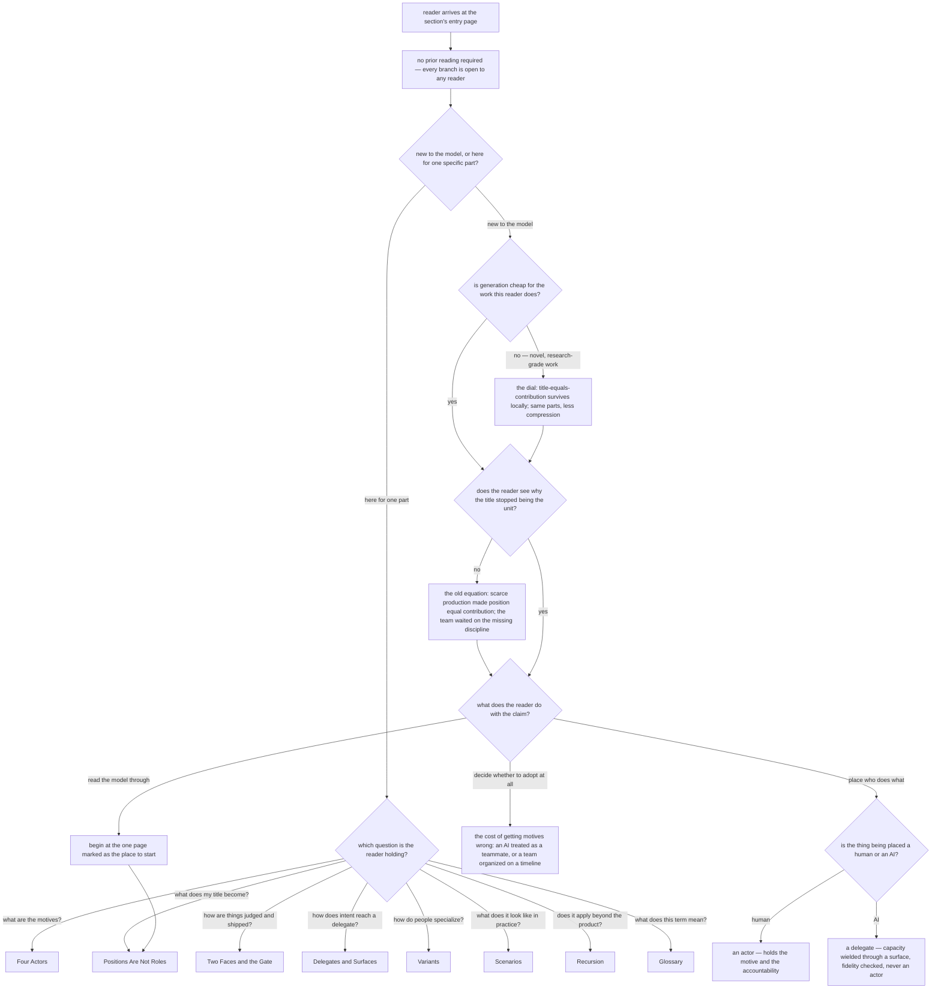

# motive-model/overview — the Motive Model entry page

Specifies the document at `src/content/docs/motive-model/overview.mdx`, published at
`/motive-model/overview/`.

Derived from the project spec `artifacts/specs/motive-model/spec.md` — its `## Use Cases`
(Output 1, the *premise / opening* entry point), its `## What` (the abundance premise, the
actor/delegate pair, delegate fidelity), and its `## Design decisions` (*abundance is a dial*).
The published draft is **not** an input to this contract.

## What

The Motive Model section has nine pages. Eight of them unpack one part of the model and every one
of them presupposes two things: that a **title** stopped being the unit of a team, and that an **AI
is never an actor**. This page is where a reader meets both, and where a reader who came for one
part is routed to the page that owns it.

### Why the page exists: nobody else owns the arrival

The project spec lists nine reader entry points, one per section, and each begins *"a reader reads
the X section."* Nothing in that list says how a reader gets to X, and no section page argues the
premise the other eight stand on — each of them starts from it. Two things therefore have no owner
unless this page holds them:

1. **The premise.** A reader who meets *motive*, *actor*, *delegate*, *face*, or *gate* without
   first being told why a job title stopped bounding a contribution meets a vocabulary with no
   reason to accept it. The premise is an argument, not a definition, and the glossary cannot carry
   an argument.
2. **The route.** Eight pages, two very different arrivals — a reader who wants the model *through*
   and a reader who wants one part *now*. Without a page that discriminates between them, the
   section is an unordered list and the second reader reads pages they did not need.

The page is therefore an **argument plus a switchboard**, and its contract is graded on both.

### Audience

Derived from the project spec, not from the draft. The spec's Output 1 addresses a human reading
the documentation; its *Positions are not roles* section names who that human is by position, and
its `## How it composes` names what the model is *for* — generating use cases, scenarios, and
human–agent interfaces. Those are two different readers with two different arrivals.

| Audience | Who they are | What the entry page gives them |
| --- | --- | --- |
| **Practitioner with a title** | a PM, designer, engineer, or QA specialist building with AI, whose title used to bound what they contributed and who wants to know what it bounds now | the **argument**: why the title stopped being the unit, what replaced it, and how far the claim reaches into work that is *not* cheap to generate |
| **Model adopter** | someone about to describe a team, a workflow, or an agent configuration in the model's terms — including the model's own downstream corpus | the **constraint and the map**: the one rule the vocabulary rests on (an AI is never an actor, and its fidelity is checked rather than assumed), plus the page that owns each part |

They are not opposites and do not split the document. The practitioner needs to be *convinced*; the
adopter needs to be *constrained and routed*. One fact serves both — the actor/delegate line is the
practitioner's payoff (*you can span more of the work*) and the adopter's limit (*and the AI still
is not a party*) — so a single page carries both, and the reader's arrival, not the reader's job,
is the first branch.

### Doc type: explanation

The reader is **building understanding, not performing a task**. Success is a decision they could
not make before: whether this model describes their own work, and which page to open next.

This rules three types out. It is **not a tutorial** — nothing is followed step by step. It is **not
a how-to** — no goal is being accomplished on the page. It is **not a reference**: the load-bearing
terms have a page of record (`/motive-model/glossary/`), and the most likely way this page decays is
drifting toward reference by defining terms it should be routing to.

### North star

> A reader finishes able to say **why a job title stopped being the unit of a team and what replaced
> it** — the direction a person sets right now, a motive held from an angle of expertise — and able
> to state the rule the rest of the model rests on: **an AI is never an actor**, only capacity a
> human wields and checks.

A revision that leaves a reader able to list the model's parts, or the section's pages, but unable
to say what stopped working about titles has missed. So has one that leaves a reader treating an AI
as a teammate with goals of its own.

### Prerequisites

**None.** This is the section's first page and it declares itself self-contained: a reader arriving
from search, from the sidebar, or from outside the site owes no prior reading. Every term the page
relies on is either defined where it is used or linked at first use. The eight sibling pages are
**downstream, never prerequisite** — the page may link them freely and must not depend on them.

### Required coverage

The page is incomplete without each row. The scenarios below check them.

**The argument**

| # | Topic | Must convey |
| --- | --- | --- |
| O1 | **The old equation** | production was scarce, so a position equaled a contribution; the team waited on whoever held the discipline it lacked, and that waiting — not the producing — was the cost |
| O2 | **What AI changes** | a discipline can be codified and run by a delegate acting on a person's behalf, so producing the artifact stops being the scarce, defining act |
| O3 | **The replacement unit** | the unit of a team is the direction a person sets now — a motive, held from an angle of expertise — and a title is a default rather than a boundary |
| O4 | **Abundance is a dial** | the premise is relative to how cheap generation is; where generation stays expensive the title-equals-contribution rule survives locally, and the model degrades gracefully — same parts, less compression |

**The constraint**

| # | Topic | Must convey |
| --- | --- | --- |
| O5 | **An AI is never an actor** | a human holds the motive and the accountability; the AI is capacity the human wields, not a party with goals of its own |
| O6 | **The delegation loop** | an actor authors a delegation surface, the surface configures the delegate, the delegate returns work, and the actor **checks the delegate's fidelity** rather than assuming it |
| O7 | **What the model is for** | the vocabulary is organized so the parts do not overlap, and getting the motives wrong has a named cost — treating an AI as a teammate with its own goals, or organizing on a timeline instead of by motive |

**The route**

| # | Topic | Must convey |
| --- | --- | --- |
| O8 | **Every page is reachable** | all eight sibling pages are linked from here, each with a description of what it covers |
| O9 | **The route discriminates** | each link is distinguished by the question its page answers, so a reader who arrived for one part selects it without reading the others |
| O10 | **One labeled first step** | a reader who wants the model through is given exactly one page marked as the place to start, and the page's closing hand-off names that same page |
| O11 | **The boundary is held** | the parts owned by sibling pages are reached by link, not developed here in place of the link |

**Completeness check.** A page meeting O1–O11 cannot trip the north star's failure mode: O1–O3 land
what stopped working and what replaced it, O5 and O6 land the rule and the check that enforces it,
and O4 stops a reader dismissing the argument where it does not apply.

**Non-goals** — each with where it lives instead:

| Not covered here | Lives at |
| --- | --- |
| the four motives, their objects, signature outputs, and boundaries | [Four Actors](/motive-model/four-actors/) |
| how a specific title (PM, Designer, Engineer, QA) maps onto motives | [Positions Are Not Roles](/motive-model/positions-are-not-roles/) |
| the forward/backward faces, the gate's two-axis verdict, kill and the deferred branch | [Two Faces and the Gate](/motive-model/faces-and-the-gate/) |
| the four delegation surfaces, the bar, the substrate-to-party transition, *delegate* as a verb | [Delegates and Surfaces](/motive-model/delegates-and-surfaces/) |
| variants, the membership gates, and how careers specialize | [Variants](/motive-model/variants/) |
| the model worked through decoupled and compressed situations | [Scenarios](/motive-model/scenarios/) |
| product / process / toolchain as overlapping sets, and codification across the seams | [Recursion](/motive-model/recursion/) |
| the definition of record for every load-bearing term | [Glossary](/motive-model/glossary/) |
| the machine-readable form of the model an agent consumes | the governance artifact (Output 2 of `artifacts/specs/motive-model/spec.md`), not the docs site |

## Use Cases

Grouped by audience. The practitioner entry points concern **being convinced**; the adopter entry
points concern **being constrained and routed**.

### Practitioner with a title

| # | Entry point | Trigger / inputs / outcome |
| --- | --- | --- |
| P1 | **Find out what this is** — the reader has opened the section's first page knowing only its name | *Trigger:* the section title means nothing yet. *Inputs:* the argument (O1–O3). *Outcome:* the reader can state what the model claims and decide whether it describes their work. |
| P2 | **Test the premise against their own work** — the reader's work is novel enough that generation is not cheap | *Trigger:* the abundance claim reads as false for them. *Inputs:* the dial qualifier (O4). *Outcome:* the reader knows the model is abundance-relative and where it degrades, rather than dismissing it whole. |
| P3 | **Find out what their own title becomes** — the reader wants the claim applied to the job they hold | *Trigger:* "I am a QA specialist — what changes?" *Inputs:* the labeled first step (O10). *Outcome:* the reader is on the page that maps their position, without having read the other seven. |

### Model adopter

| # | Entry point | Trigger / inputs / outcome |
| --- | --- | --- |
| A1 | **Take the constraint before using the vocabulary** — the reader is about to model a team, a workflow, or an agent configuration in these terms | *Trigger:* about to assign a part of the model to an AI. *Inputs:* the rule and the delegation loop (O5, O6). *Outcome:* the reader places the AI as wielded capacity whose fidelity is checked, never as a party holding a motive. |
| A2 | **Reach one specific part** — the reader arrives with a known question | *Trigger:* needing the gate, the surfaces, or a term's definition. *Inputs:* the discriminating route (O8, O9, O11). *Outcome:* the reader lands on the owning page directly. |
| A3 | **Judge whether the model is worth adopting** — the reader is deciding whether to organize work this way at all | *Trigger:* weighing this vocabulary against organizing by timeline or by title. *Inputs:* what getting the motives wrong costs (O7). *Outcome:* the reader can name the concrete failure the model is built to avoid. |

## Control Flow

The reader's decision path. The first branch is **which arrival** — a reader new to the model and a
reader who came for one part need opposite halves of the page, and the page must serve both without
making either read the other's half.

Every page the section contains is a leaf of `R`; every coverage row is spent on an edge or a leaf.

## Scenario map

### P1 — Find out what this is

| Edge | Path (Given) | Scenario |
| --- | --- | --- |
| `A` | any reader, whatever they have read before *(convergence — the outcome does not vary)* | `the page stands alone without prerequisite reading` |
| `W:no → W1` | a reader who has not met the model before | `the page states the old equation and why it held` |
| `Q0:new` | a reader new to the model | `the page names what AI changes about producing` |
| `Q0:new` | a reader who has accepted that producing is no longer the scarce act | `the page names the unit that replaced the title` |
| `Q0:new` | a reader checking the claim against their own work | `the shift is presented as a before-and-after a reader can place themselves in` |

### P2 — Test the premise against their own work

| Edge | Path (Given) | Scenario |
| --- | --- | --- |
| `P:no → P1` | a reader whose work is novel enough that generation stays expensive | `a reader whose work is not cheap to generate is given the dial, not an exception` |

### P3 — Find out what their own title becomes

| Edge | Path (Given) | Scenario |
| --- | --- | --- |
| `D:read-through → Z` | a reader who wants the model through rather than one lookup | `a reader reading the model through is given exactly one labeled first step` |
| `Z → R2` | a reader who has finished the entry page | `the closing hand-off names the same page marked as the place to start` |

### A1 — Take the constraint before using the vocabulary

| Edge | Path (Given) | Scenario |
| --- | --- | --- |
| `N:AI` | a reader about to describe a team or a workflow in the model's terms | `the page states that an AI is never an actor` |
| `N` | both arrivals — new to the model, and here for one part | `the rule is reachable from both reader arrivals` |
| `N:AI → N2` | a reader who will hand work to an AI delegate | `the page presents the delegation loop including the fidelity check` |
| `N:human` vs `N:AI` | a reader deciding which side a party falls on | `the page separates what a human holds from what an AI supplies` |
| `R4` | a reader wanting the surfaces enumerated | `the page defers the full treatment of surfaces and delegates` |

### A2 — Reach one specific part

| Edge | Path (Given) | Scenario |
| --- | --- | --- |
| `R` (all leaves) | the eight pages of the section | `every page in the section is reachable from the entry page` |
| `R` (edge labels) | a reader arriving with one question | `the route discriminates by the question a page answers` |
| `R1`, `R3`, `R5`, `R8` | a reader looking for the motives, the gate, the variants, or a definition | `the entry page routes to the owning page instead of standing in for it` |

### A3 — Judge whether the model is worth adopting

| Edge | Path (Given) | Scenario |
| --- | --- | --- |
| `D:adopt → C` | a reader weighing this vocabulary against organizing by title or timeline | `the page names what getting the motives wrong costs` |

## References

- `artifacts/specs/motive-model/spec.md` — the project spec this contract derives from; its
  `## Use Cases` Output 1 *premise / opening* row supplies the north star, and its
  `## Design decisions` supply O4 (*abundance is a dial*) and O6 (*delegate fidelity*).
- [Diátaxis](https://diataxis.fr/) — classifies this page as **explanation**: read for
  understanding rather than followed step by step, which is why the contract freezes the *claims it
  must land* and the *reader questions it must route*, and freezes neither section order nor
  wording.

### Recorded drift — not resolved here

The project spec names the first actor **Oracle**; `artifacts/specs/motive-model/motive-model.feature`
names the same actor **Director**. This page names no actor, so no scenario below depends on the
resolution — the routing scenarios assert the four **motives** (intend, generate, structure,
accumulate), which both artifacts agree on. Flagged for the owning spec, not decided here.
