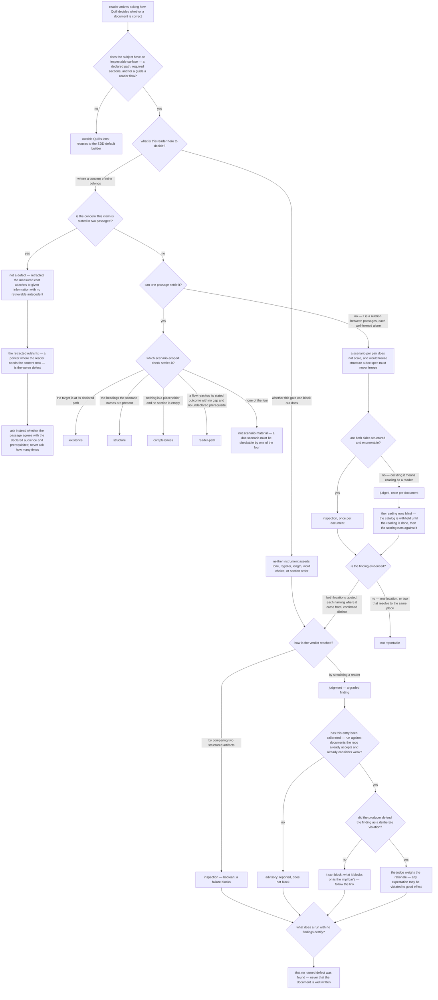

# quill/doc-eval-model — how Quill decides a document is correct

Specifies the document at `src/content/docs/quill/doc-eval-model.md`, published at
`/quill/doc-eval-model/`.

Derived from Quill's own contract — `.agents/specs/quill/design/doc-eval-model.md` (the model this
page is the public rendering of), `.agents/specs/quill/glossary.md` (the fixed vocabulary:
*instrument*, *integrity pass*, *near-miss*, *calibration*), and the judged tier's mechanics in the
`quill-builder-impl` bar. Those are **inputs** to this contract, never its owner: a defect found in
Quill while writing this page is a follow-up against Quill's spec, not a change made here. No
published draft of this page exists, and none is an input.

The section's one-claim-one-owner boundary is [`../README.md`](../README.md).

## What

Quill puts a gate in front of documentation. A gate needs a rule for what a verdict may rest on, and
documentation is where that rule is hardest: "the install page is missing" and "this paragraph reads
badly" are both real defects, and a gate that treats them alike either blocks on taste or refuses to
block at all. Both outcomes end the same way — the gate gets routed around.

Quill's answer is a **split by what decides the verdict**. One instrument compares two structured
artifacts and returns a boolean; the other simulates a reader and returns a graded finding. This
page is where that split is argued, where each side's scope is drawn, and where a reader learns
which of their own concerns Quill can decide — and which it deliberately cannot.

### Why the page exists: nobody else owns the argument

The section's other five pages each hold a piece and none holds the reason.
[`/quill/overview/`](/quill/overview/) names the checks in a table; the two Builder-bar pages carry
each tier's **contents** — the enumeration rule, the defect catalog, what a spec must freeze;
[`/quill/production-chain/`](/quill/production-chain/) says which agent runs which instrument.
Three things therefore have no owner unless this page holds them:

1. **The criterion behind the split.** A reader shown two tiers and told what is in each can still
   not say why a *new* concern belongs to one rather than the other. The criterion — how the verdict
   is reached — is an argument, and a table of contents cannot carry an argument.
2. **The reason a document-scoped pass exists at all.** The four scenario-scoped checks each read
   only the passage their scenario names. A defect that holds *between* two passages survives that
   scope intact, because each occurrence is well-formed against its own scenario and it is the
   **pair** that fails. That gap is a reason, not a list — and it is why the impl bar exists to be
   linked to.
3. **The boundary of the lens.** What Quill will never assert, and what subject it declines
   entirely. A reader who does not get this from the model page infers it from whichever check they
   met first.

**One intent, named without a conjunction:** *a reader knows what decides a Quill verdict.* The six
coverage groups below are not six concerns. They are the criterion (E1–E3), where it puts a concern
one passage settles (E4–E5), where it puts one no passage settles (E6–E8), what it means for the
instrument that decides by reading (E9–E13), the one concern it puts nowhere (E14–E16), and the edge
past which it decides nothing (E17). A reader's *trust* in a judged verdict is not a second subject
here: what decides that verdict is a blind reading (E9), a weighed rationale can unmake it (E11), and
a calibration state gates whether it counts at all (E12) — three answers to the single question.

### Audience

Derived from the subject and the section boundary, not from any draft. Quill's model doc addresses
two decisions: whether to trust the gate, and where a given criterion belongs. Those are two
different readers with two different arrivals.

| Audience | Who they are | What this page gives them |
| --- | --- | --- |
| **Adoption decider** | a docs owner or team lead deciding whether to put Quill's gate in front of their documentation, who has watched a prose linter turn into a style argument and does not want another one | the **boundary**: what a blocking verdict may rest on, what neither instrument will ever assert, why the graded tier does not block yet, and whether their subject is in the lens at all |
| **Doc-spec author** | someone — human or agent — about to write a documentation spec and its `.feature`, deciding what to assert and what to leave alone | the **split as a routing rule**: which concerns a boolean scenario can settle, which are relations between passages that no scenario can hold, and which are judged and therefore not scenario material |

They do not split the document. The decider needs to be **bounded**; the author needs to be
**routed**. One fact serves both — *neither instrument asserts wording, style, or tone* is the
decider's assurance and the author's constraint — so a single page carries both, and the reader's
**arrival**, not the reader's job, is the first branch after the fit question.

### Doc type: explanation

The reader is **building understanding, not performing a task**. Success is a decision they could
not make before: whether this gate is one they can live with, and where a criterion of their own
belongs.

It is **not a how-to** — nothing is accomplished on the page. It is **not a tutorial** — no steps are
followed. It is **not a reference**, and that is the way this page most likely decays: the four
checks, the catalog entries, and the calibration table are all enumerable, so a revision drifts
toward listing them and stops making the argument. The pages of record for those enumerations are
the two Builder-bar pages; this page owns the criterion, not the inventory.

### North star

> A reader finishes able to say **what decides a Quill verdict**: comparing two structured
> artifacts, or simulating a reader.

That is the whole outcome, and it is deliberately one clause. Everything else this page carries is
**entailed** by it rather than added to it — whether a verdict is boolean or graded, whether it
blocks, whether a concern belongs to a scenario, to the document-scoped pass, or nowhere in Quill at
all. The verdict's shape follows from how the verdict was reached; a reader who has the criterion can
derive the rest, and a reader who has only the rest has an inventory.

The reader's ability to **place a concern they arrived with** is how you check they have it. It is
the test of the north star, not a second goal beside it.

**A revision that leaves a reader able to list the four checks and the judged pass, but unable to say
what puts a new concern on one side rather than the other, has missed.** So has one that leaves a
reader believing Quill grades style or tone somewhere, or believing a judged finding blocks a gate
today.

### Prerequisites

**One, declared:** [`/quill/overview/`](/quill/overview/) — what Quill is and which artifact types it
handles. This page assumes the reader knows there is a plugin and that documentation is its subject;
it assumes nothing else.

It does **not** assume SDD's gate vocabulary. *Spec gate*, *impl gate*, and *frozen `.feature`* are
load-bearing here and must be glossed or linked at first use, because a reader can arrive from search
without having met SDD at all. The other four section pages are **downstream, never prerequisite** —
the page links them freely and must not depend on them.

### Required coverage

The page is incomplete without each row. The scenarios below check them.

**The split**

| # | Topic | Must convey |
| --- | --- | --- |
| E1 | **What decides, not where it lives** | the two instruments are separated by **how a verdict is reached** — inspection compares two structured artifacts or matches a pattern; judgment simulates a reader — and not by which file or bar a criterion is written in |
| E2 | **Each instrument's verdict shape** | inspection yields a boolean that blocks; judgment yields a graded finding. The verdict shape follows from how the verdict was reached, rather than being assigned to it — and craft is judged rather than linted because a decision procedure cannot weigh many reader expectations at once |
| E3 | **Style is unassertable at both** | tone, register, length, word choice, and section order are out of scope at the judged instrument exactly as at the boolean one — the graded tier is not where style was moved to |

**The scenario-scoped tier**

| # | Topic | Must convey |
| --- | --- | --- |
| E4 | **The four checks** | existence (the target is at its declared project-root-relative path), structure (the headings a scenario names are present), completeness (no placeholder text, no empty section), reader-path (a sequential flow reaches its stated outcome with every step present and no undeclared prerequisite) |
| E5 | **What that constrains** | every scenario a documentation `.feature` carries must be checkable by one of the four; a concern none of them settles is not scenario material, whatever else is true of it |

**Why a document-scoped pass exists**

| # | Topic | Must convey |
| --- | --- | --- |
| E6 | **Scenario scope is structurally blind** | each of the four reads only the passage its scenario names, so a defect holding *between* passages survives that scope intact — each occurrence is well-formed against its own scenario, and it is the **pair** that fails |
| E7 | **Why another scenario is not the fix** | a scenario per pair does not scale, and it would freeze document structure that a documentation spec must never freeze — so these criteria are graded **once per document** against the impl bar instead |
| E8 | **Which of them is still inspection** | a criterion whose two sides are both structured and enumerable is settled by comparison (a route omitting an option the document itself named is set difference); one whose decision requires reading *as a reader* is judged. They were once classed together because evidence-with-citation made them all feel mechanical — the citation requirement **disciplines** a finding, it does not **decide** one |

**The judged tier's properties**

| # | Topic | Must convey |
| --- | --- | --- |
| E9 | **Why the reading pass is blind** | the reading happens with the catalog withheld and the scoring happens afterward, because a judge shown the catalog before reading finds what it was told to find, and its finding is then an opinion about prose rather than evidence about a reader. **What** the blind pass receives, and how the scoring runs, is the impl bar's (E18) |
| E10 | **It detects defects; it never certifies quality** | good prose is unbounded and cannot be enumerated, while bad prose recurs in a small number of nameable shapes — so zero findings is not a certificate that the document is well written |
| E11 | **Why a defense path exists** | the producer may mark a finding intentional with a rationale the judge must weigh before reporting, because any expectation about prose may be violated to good effect — a catalog with no defense path would be a style guide with a gate attached. **How** a violation is declared, and what does or does not clear a finding, is the impl bar's (E18) |
| E12 | **Why an entry is advisory until calibrated** | an entry does not block until it is calibrated — run against documents the repo already accepts and already considers weak. The asymmetry is deliberate: a miss ships a weak paragraph, while a false positive teaches the producer to route around the judge. The **current standing** of each entry, and what a calibrated entry blocks on, is recorded on the impl-bar page and reached from here by link (E18) |
| E13 | **Evidence, at both instruments** | a failure quotes **both** locations, each citation names **where** it came from and not only what it said — a quote can be accurate and misattributed, which reads as verified precisely because the words check out — and the two locations must be confirmed distinct, since a relation between passages cannot be evidenced by one passage read twice |

**The retraction, and the edge of the lens**

| # | Topic | Must convey |
| --- | --- | --- |
| E14 | **Recurrence is not a defect** | an earlier revision of this model held a claim landed in two passages to be an integrity defect; it is **retracted** for want of empirical warrant. The measured comprehension cost attaches to a passage whose given information has **no retrievable antecedent**, not to a claim appearing twice — so a claim may recur freely, and what it may not do is arrive where the reader cannot retrieve it |
| E15 | **The retracted fix was the worse defect** | the retracted rule prescribed replacing the second statement with a pointer, and a pointer standing where the reader needs the content **now** *guarantees* the bridging cost that recurrence only risked |
| E16 | **The checkable question that replaces it** | the right amount of redundancy is audience-relative and **reverses** — low-knowledge readers gain from explicit, redundant text where high-knowledge readers do better with gaps — so there is no audience-independent setting, and the checkable question is agreement with the spec's declared **audience and prerequisites**, never quantity |
| E17 | **Fit** | Quill applies to artifacts whose correctness is structurally checkable — a declared path, required sections, and for a guide or tutorial a reader flow; a subject with no inspectable document surface is outside the lens and **recuses** to the SDD-default builder rather than being graded here |

**Boundary**

| # | Topic | Must convey |
| --- | --- | --- |
| E18 | **The boundary is held by link** | the **procedure** half of the judged tier — what the blind pass receives, how a violation is declared, the calibration run's steps and scoring, each entry's current standing, what a calibrated entry blocks on — plus the enumeration rule's content, the catalog's entries and near-misses, what a documentation spec must contain and never freeze, and which agent runs which instrument, are each reached by a **link** to the page that owns them, never developed or restated here. This page argues **why** each mechanism exists and states **that** it exists; the impl-bar page says what it does |

**Completeness check.** A page meeting E1–E18 cannot trip the north star's failure mode: E1 and E2
land the criterion itself rather than the inventory, E6–E8 land where the criterion puts a concern
one passage cannot settle, E3 and E10 stop the reader concluding that style was moved to the graded
tier, E12 stops them believing a judged finding blocks today, and E17 stops them applying the lens to
a subject it declines.

**Non-goals** — each with where it lives instead:

| Not covered here | Lives at |
| --- | --- |
| what the document-scoped enumeration rule compares, and its citation form | [Builder bar — impl gate](/quill/quill-builder-impl/) |
| the defect catalog's entries, their near-misses, and the citation each group owes | [Builder bar — impl gate](/quill/quill-builder-impl/) |
| what a judged pass **does** — what pass 1 receives, one finding per passage, the file and fields a deliberate violation is declared in, what does and does not clear a finding | [Builder bar — impl gate](/quill/quill-builder-impl/) |
| how a calibration run is performed and scored, each entry's current standing, and what a calibrated entry blocks on | [Builder bar — impl gate](/quill/quill-builder-impl/) — which carries the per-entry standing table, so a reader sent there is not left uninformed |
| what a documentation spec must contain, and what it must never freeze | [Builder bar — spec gate](/quill/quill-builder-spec/) |
| which agent fills each production-chain role, and the write-vs-run independence anchor | [Production chain](/quill/production-chain/) |
| Quill's install command and its artifact types | [Overview](/quill/overview/) |
| registering Quill in a project, and the registry entry's shape | [Registering Quill](/quill/init-quill/) |
| how a document is actually written well — the craft the judged tier samples for defects | nowhere in this section; the judged tier detects defects and does not teach writing |

## Use Cases

Grouped by audience. The decider's entry points concern **being bounded**; the author's concern
**being routed**.

### Adoption decider

| # | Entry point | Trigger / inputs / outcome |
| --- | --- | --- |
| D1 | **Decide whether the gate can block without becoming a style argument** | *Trigger:* the reader has been burned by a prose linter and wants to know what this one can fail on. *Inputs:* E1, E2, E3, E12. *Outcome:* the reader can state what a blocking verdict may rest on, and that the graded tier reports without blocking until an entry is calibrated. |
| D2 | **Decide whether their own subject is in scope** | *Trigger:* the artifact in question is a runbook, an agent definition, or a config file carrying prose. *Inputs:* E17. *Outcome:* the reader can tell whether it has an inspectable document surface, and knows a subject without one recuses to the SDD default rather than being graded loosely. |
| D3 | **Decide what a green run lets them claim** | *Trigger:* about to report "the docs passed" to someone who will act on it. *Inputs:* E10. *Outcome:* the reader reports that no named defect was found, rather than that the document is well written. |

### Doc-spec author

| # | Entry point | Trigger / inputs / outcome |
| --- | --- | --- |
| S1 | **Decide what a scenario may assert** | *Trigger:* writing the `.feature` for a guide and choosing the `Then`s. *Inputs:* E4, E5, E3. *Outcome:* every scenario is checkable by one of the four checks, and nothing in the suite asserts tone or section order. |
| S2 | **Find out what happens to a concern no scenario can hold** | *Trigger:* the defect the author cares about is a relation between two passages, each fine on its own. *Inputs:* E6, E7, E8, E18. *Outcome:* the author stops trying to write it as a scenario, knows whether it is settled by comparison or by reading, and knows which page carries its content. |
| S3 | **Decide whether to penalize a claim that appears twice** | *Trigger:* a claim is landed in two sections and the author suspects redundancy. *Inputs:* E14, E15, E16. *Outcome:* the author does not write that scenario, checks the claim against the declared audience and prerequisites instead, and does not "fix" it with a pointer. |
| S4 | **Decide whether to trust a judged finding, and know a defense exists** | *Trigger:* an advisory finding has come back on a document the author wrote. *Inputs:* E9, E11, E13, E18. *Outcome:* the author knows the finding came from a blind reading rather than a catalog hunt, can check its citations, knows a deliberate violation may be defended, and is on the page that specifies how to declare one. |

## Control Flow

The reader's decision path. The **fit** question comes first because a reader whose subject is
outside the lens should leave immediately rather than learn a model that will not apply to them.
After that the branch is **which arrival** — the decider needs the boundary, the author needs the
routing rule, and neither should have to read the other's half.

`EV → T1` is a reconvergence, not a loop: a finding that survives evidencing takes its verdict shape
from the instrument that decided it, which is the question `T1` asks. Every coverage row is spent on
an edge or a leaf; `E18` is spent on the leaves the page reaches by link rather than develops
(`W1`, `W2`, `P6`).

## Scenario map

### D1 — Decide whether the gate can block without becoming a style argument

| Edge | Path (Given) | Scenario |
| --- | --- | --- |
| `T1` | a reader weighing the gate, whichever instrument they met first *(convergence — the criterion does not vary)* | `the page separates the instruments by what decides the verdict` |
| `T1 → T2` vs `T1 → T3` | a reader who has accepted that the split is by how a verdict is reached | `the page pairs each instrument with the verdict it yields` |
| `T0` | a reader who expects a doc gate to have opinions about prose | `the page bars style at both instruments, not only at the boolean one` |
| `T0` (both arrivals) | a reader deciding whether to adopt, and a reader placing a concern | `the style bar is reachable from both reader arrivals` |
| `CAL` | a reader asking what the graded tier can fail their build on today | `the page states that a judged entry does not block until it is calibrated` |

### D2 — Decide whether their own subject is in scope

| Edge | Path (Given) | Scenario |
| --- | --- | --- |
| `FIT:yes` | a reader holding an artifact and asking whether Quill applies to it | `the page states what puts an artifact inside Quill's lens` |
| `FIT:no → FIT1` | a reader whose subject has no inspectable document surface | `the page routes a subject outside the lens to the SDD default` |

### D3 — Decide what a green run lets them claim

| Edge | Path (Given) | Scenario |
| --- | --- | --- |
| `G → G1` | a reader about to report a clean run to someone who will act on it | `the page states what a run with no findings does not certify` |

### S1 — Decide what a scenario may assert

| Edge | Path (Given) | Scenario |
| --- | --- | --- |
| `P1` (all four leaves) | an author choosing the `Then`s for a documentation scenario | `the page names the four scenario-scoped checks and what each verifies` |
| `P1:none → P6` | an author holding a concern none of the four settles | `the page states that a concern none of the four checks settles is not scenario material` |

### S2 — Find out what happens to a concern no scenario can hold

| Edge | Path (Given) | Scenario |
| --- | --- | --- |
| `P:no` | an author whose concern is a relation between two passages that are each fine alone | `the page states why a scenario-scoped check cannot reach a relation between passages` |
| `W0` | an author about to write one scenario per pair of passages | `the page states why another scenario is not the fix` |
| `W` | an author deciding which instrument a between-passage concern belongs to | `the page gives the criterion that routes a between-passage concern` |
| `W` (the correction) | an author who reads a citation requirement as evidence a criterion is mechanical | `the page states why the judged criteria were once misclassified as inspection` |
| `W1`, `W2`, `P6`, `DV:no → CAL2` | an author wanting the rule's wording, the catalog's entries, and what a calibrated entry blocks on | `the page reaches the owning pages by link instead of developing their content` |

### S3 — Decide whether to penalize a claim that appears twice

| Edge | Path (Given) | Scenario |
| --- | --- | --- |
| `REC:yes → REC1` | an author who has found the same claim landed in two sections | `the page lands the retraction rather than the retracted rule` |
| `REC1` | an author asking what the evidence actually showed | `the page states what the measured comprehension cost attaches to` |
| `REC1 → REC2` | an author about to replace the second statement with a pointer | `the page names the retracted rule's own fix as the worse defect` |
| `REC2 → REC3` | an author who still wants a rule to apply | `the page gives the checkable question that replaces the retracted rule` |

### S4 — Decide whether to trust a judged finding, and know a defense exists

| Edge | Path (Given) | Scenario |
| --- | --- | --- |
| `BL` | an author who has received an advisory finding on their own document | `the page states that the judged pass reads blind before it scores` |
| `DV` | an author who violated an expectation on purpose | `the page states that a judged finding can be defended as a deliberate violation` |
| `EV` (both branches) | an author checking whether a finding against them is checkable *(the criterion is one claim; the page states it with its failing case named, so one row spends both edges)* | `the page states what makes a finding reportable at either instrument` |

## References

- `.agents/specs/quill/design/doc-eval-model.md` — the model this page renders: the two-instrument
  table, the four scenario-scoped checks, the document-scoped check's justification, the judged
  instrument's properties, the evidence rule, the retraction, and *Fit*. Outside the website tree; an
  input to this contract, not part of it.
- `.agents/specs/quill/glossary.md` — fixes *instrument*, *integrity pass*, *near-miss*, and
  *calibration*, which this page must use with those meanings or gloss on the spot.
- Haviland & Clark, via `.research/documentation-craft/` (E03) — backs E14: the controlled
  replication holds the critical noun repeated in **both** conditions while only one posits an
  antecedent, and the comprehension cost survives at **Δ137 ms, p<.001**. That is what makes the cost
  attach to unretrievable given information rather than to repetition, and therefore what retracts
  the recurrence rule rather than merely doubting it.
- Gopen & Swan — backs E2 and E11: their disclaimer of rule status has two grounds. One — that a
  reader weighing many expectations at once cannot apply them as a procedure — is why craft is
  **judged rather than linted** (E2); it is a claim about a decision procedure's capacity and does
  not bind a reader-simulating judge. The other — any expectation may be violated to good effect —
  transfers intact and becomes the **deliberate-violation** concession (E11) rather than a reason not
  to judge.
- [Diátaxis](https://diataxis.fr/) — classifies this page as **explanation**: read to make a
  decision, not followed step by step, which is why this contract freezes the claims it must land and
  the reader questions it must route, and freezes neither section order nor wording. It is also the
  seam this node sits on — the why/what split against `quill-builder-impl` recorded in
  [`../README.md`](../README.md) is explanation-versus-reference, not a division of subject matter.

### Recorded upstream defects — not resolved here

Two defects in Quill's own artifacts, found while deriving this contract and filed as follow-ups
against `.agents/specs/quill/`. **No scenario above depends on either being resolved**, and neither
is fixed here: Quill is this page's subject, not its owner.

1. `plugins/quill/readme.md` still ships the **retracted** recurrence rule — its check table reads
   "No claim landed twice", and the paragraph below it repeats "a claim asserted twice passes its
   scenario twice". Both are retracted by `.agents/specs/quill/design/doc-eval-model.md`
   (*Recurrence is not a defect*). The same readme also classes all four listed integrity defects as
   inspection, which the model's own correction reverses — three of them are judged. This page is
   contracted against the model, so E14–E16 land the retraction regardless of when the readme is
   fixed.
2. `.agents/specs/quill/glossary.md` hard-codes **"nine"** named prose defects into the *defect
   catalog* entry, coupling the ubiquitous language to a count the catalog will move. Nothing here
   depends on it: E18 forbids this page from enumerating the entries at all.
