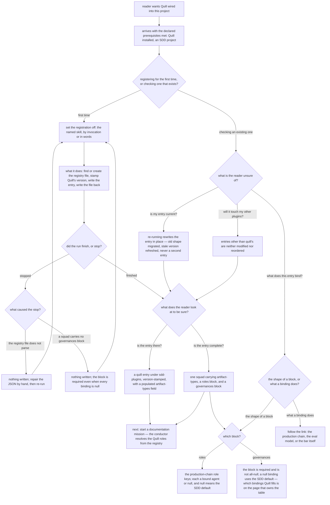

# quill/init-quill — registering Quill in a project

Specifies the document at `src/content/docs/quill/init-quill.md`, published at `/quill/init-quill/`.

Derived from the Quill plugin's own contract — the `init-quill` skill and the registry entry it
writes — and from the section boundary in [`../README.md`](../README.md), which assigns this page
the registry entry's shape, the skill's failure and edge behavior, and the reader's next step.

**The published draft is not an input to this contract.** It is stale: it states that every
governance binding is `null`, and the live registry contradicts that. A spec written to match the
draft would freeze that error. (Which bindings the registry fills is deliberately not stated here —
see *what this page must not copy* below; the falsity of the draft's claim is what this node needs,
and the census is `production-chain`'s.)

## What

This is the page a reader opens when they have Quill installed and nothing is happening — SDD is
still running its default chain over their documentation work. One file decides that: the project's
plugin registry, `.agents/universal-plugin.json`. The page's whole job is to get an entry into that
file and let the reader confirm it landed.

### Why the page exists: the registry is the only thing that switches Quill on

Quill's other pages describe a plugin that is already wired in. Installing Quill does not wire
it in — the SDD conductor resolves roles by reading the registry file and nothing else (the lockfile
pattern), so an installed-but-unregistered Quill is invisible at runtime and fails **silently**: the
mission runs, the default chain produces something, and no error says why Quill never appeared.

Nothing else in the section owns that gap. `overview` owns installing; `production-chain` owns what
the roles do once resolved. The step in between — and the ways it can stop or need re-running — has
no other home.

### Audience

Two arrivals, not two documents. Both need the same registry entry in front of them; they differ in
whether they are producing it or auditing one.

| Audience | Who they are | What the page gives them |
| --- | --- | --- |
| **Project owner wiring Quill in** | someone who has installed Quill in an SDD project and wants documentation missions to actually run through it | the **procedure**: how to set the registration off, what it changes on disk, what to do when it stops, and what to do next |
| **Registry maintainer** | someone with an entry already in the file — carried over from an older Quill, written by hand, or sitting next to another plugin's entry — who needs to know whether it is current and whether re-running is safe | the **shape and the guarantees**: what a correct entry looks like block by block, that re-running rewrites rather than duplicates, and that their other plugins' entries are untouched |

They do not need opposite things from any one fact, so one page serves both. The first branch is
**which arrival**, because it selects whether the reader is running a procedure or comparing a file.

### Doc type: how-to

The reader already understands what they want — Quill registered — and is here to get it done.
Success is that **they got unblocked**.

This rules the other three out. It is **not a tutorial**: the reader is not learning Quill by doing,
and nothing here is a first-time teaching exercise. It is **not reference**: the registry entry is
shown so the reader can act on it, not catalogued. It is **not explanation**: the reasons the plugin
is built this way belong to `overview` and `doc-eval-model`. The likeliest way this page decays is
drifting into explanation — describing what `quill-judge` does instead of stating that the entry
binds it and linking the page that owns it.

### North star

> A reader finishes with Quill **verifiably registered in their own project** — they set the
> registration off, and they can point at the entry in `.agents/universal-plugin.json` that proves
> it.

The outcome names one thing: **verified registration**. The confirmation is how the outcome is
reached, not a second outcome, and the hand-off to the next step (K14) is scope this page was
assigned rather than part of what the reader leaves with.

A revision that leaves a reader able to describe the registry entry but unable to tell whether
**their** project is registered has missed. So has one that leaves a reader whose run stopped with
an error unsure whether their registry file was modified.

### Prerequisites

| The reader must already have | Supplied by |
| --- | --- |
| the Quill plugin installed in the project | [Quill overview](/quill/overview/) — it owns the install command |
| a project that uses SDD, at the level of knowing what a mission is | [SDD overview](/sdd/overview/) |

Beyond the rows above, the page is **self-contained**: every file, term, and action a step needs is
introduced on the page. A reader owes no other reading before following the steps. K15 is the
coverage row that enforces this, and the `S → A` scenario is what checks it.

### Required coverage

The page is incomplete without each row. The scenarios below check them.

**Doing it**

| # | Topic | Must convey |
| --- | --- | --- |
| K1 | **How to set it off** | the skill that performs the registration is named, at least one thing a reader can say or invoke to trigger it is given, and the file it writes is named |
| K2 | **What it changes on disk** | it finds the registry file at the project root or creates it, stamps Quill's own version, writes the Quill entry into the `sdd-plugins` array, and writes the file back |
| K3 | **Each step is followable** | every step in the procedure carries the action to take or the change it makes, on this page, without deferring its content elsewhere |
| K15 | **The prerequisite surface is closed** | every file, tool, and term a step needs is either named in the prerequisites or introduced on the page — nothing required is sprung on the reader mid-procedure. This is the row that carries the self-containment claim `## Prerequisites` declares |

**When it stops**

| # | Topic | Must convey |
| --- | --- | --- |
| K4 | **Corrupt registry — fail closed** | a registry file that does not parse stops the registration with an error and leaves the file **unmodified**, because rewriting it could destroy another plugin's entry; repairing the JSON by hand is what unblocks the reader |
| K5 | **Missing `governances` block — rejected** | a squad with no `governances` block is rejected and **nothing is written**; the block is required even when every binding inside it is `null` |
| K6 | **Which stop is which** | the two failures are told apart by their cause, and each names what the reader does about it |

**Checking and re-running**

| # | Topic | Must convey |
| --- | --- | --- |
| K7 | **How to confirm it worked** | what the reader inspects — a Quill entry under `sdd-plugins`, carrying a version stamp and a squad whose `artifact-types` field lists the documentation types Quill claims. The **field is named; its members are not enumerated here** — that census belongs to `overview`, and copying it would give one fact two homes |
| K8 | **The entry is one squad with three parts** | the entry holds one squad, and that squad carries its `artifact-types`, its `roles` block, and its `governances` block |
| K9 | **Re-running is safe** | an entry already present is **rewritten in place**, never appended alongside — this is how an older-shape entry is migrated and a stale version stamp refreshed |
| K10 | **Other plugins are untouched** | entries in the array other than Quill's are neither modified nor reordered |

**What the entry binds**

| # | Topic | Must convey |
| --- | --- | --- |
| K11 | **The `roles` block** | it carries the SDD production-chain role keys; each holds either a bound agent or `null`, and `null` means the SDD default is used for that role. The keys are **not counted or enumerated here** — that set is `production-chain`'s |
| K12 | **The `governances` block is not presented as unbound** | the page does not state or imply that Quill leaves every governance binding `null` and relies on the SDD default bars throughout — the claim the current draft makes and the registry contradicts. It states the `null`-means-default **rule** (shape, which this page owns) and reaches the census of which bindings Quill actually fills by **link**, never reproducing it |
| K13 | **The boundary is held** | what a bound agent does, what the checks verify, and what any bar requires are reached by link, not developed here in place of the link. The redirect is generic — the page names no set of bars, because a link set that resolves to exactly the bars Quill authors is the binding census again, decoded from presence and absence |
| K16 | **The block descriptions serve both arrivals** | the description of the squad's blocks is reachable from the completion path as well as from the audit path — a reader who has just registered and is checking the entry is complete must not have to enter a maintainer-only section to find out what a complete entry looks like |

**Getting on with it**

| # | Topic | Must convey |
| --- | --- | --- |
| K14 | **The next step** | starting a documentation mission is named as the next thing to do, with the statement that the conductor resolves the Quill roles from the registry without further setup, and a link to the page that owns starting a mission |

**Completeness check.** A page meeting **every row above** cannot trip the north star's failure mode:
K1, K2, K3 and K15 get the reader to a run without springing a requirement on them; K7 and K8 give
them something concrete to look at in their own file, with K16 guaranteeing they can reach it from
the path they are actually on; and K4, K5 and K6 state, for each way the run can stop, that the file
on disk did not change.

*(Stated as "every row above" rather than as an ID range on purpose. A range is the form in which a
row hides: add one, and the sentence still reads true while quantifying over a set that no longer
matches the table. K15 was added to this contract after the range was first written, and would have
fallen outside it.)*

**On K7, K11 and K12 — what this page must not copy.** All three rows were first drafted as
**censuses**: they listed the members of sets whose home is a sibling page. Each failed the
duplication test — a change to Quill's claimed types, its role keys, or its bar bindings would force
the identical edit here **and** on the page that owns the table, which is exactly how this section
went stale in the first place. The rows now assert the **field** and the **rule**, and forward the
membership.

**The rule that generalizes them:** where a set's home is elsewhere, this node names the *field* and
never its *members* — and never its **count** either. A count is a census in compressed form: it
goes stale on exactly the same edit, and a reader can pair it with a partial list to reconstruct the
whole. That extends to link sets, which are decodable the same way, and to this spec's own prose,
which is why the paragraph you are reading names no members while describing what was removed.

The draft's false claim is still killed: K12 bars stating that every binding is `null`, without this
page becoming the second place that has to be right about which ones are not.

**Non-goals** — each with where it lives instead:

| Not covered here | Lives at |
| --- | --- |
| installing Quill, the install command, and which artifact-types Quill claims | [Quill overview](/quill/overview/) |
| which agent fills which production-chain role, what each does, and who writes vs who runs | [Production chain](/quill/production-chain/) |
| the census of which role and governance bindings Quill fills — the binding table itself | [Production chain](/quill/production-chain/), derived from the registry, never from another page's prose |
| how the conductor resolves a role from the registry at mission time | [Production chain](/quill/production-chain/) |
| what the scenario-scoped checks verify, and how the judged pass works | [The doc eval model](/quill/doc-eval-model/) |
| what a documentation spec must contain and must never freeze | [Builder bar — spec gate](/quill/quill-builder-spec/) |
| the document-scoped rule and the judged defect catalog | [Builder bar — impl gate](/quill/quill-builder-impl/) |
| authoring a documentation spec, and running the mission | [SDD overview](/sdd/overview/) |

## Use Cases

Grouped by audience. The owner's entry points are about **getting a run to land**; the maintainer's
are about **trusting a file that already exists**.

### Project owner wiring Quill in

| # | Entry point | Trigger / inputs / outcome |
| --- | --- | --- |
| R1 | **Register Quill for the first time** — the reader has installed Quill and nothing routes to it yet | *Trigger:* a documentation mission ran the default chain. *Inputs:* K1, K2, K3, K15. *Outcome:* the reader sets the registration off and knows what it wrote. |
| R2 | **Recover from a run that stopped** — the registration reported an error instead of finishing | *Trigger:* an error where a written file was expected. *Inputs:* K4, K5, K6. *Outcome:* the reader knows which failure they hit, that their file was not modified, and what to fix before re-running. |
| R3 | **Take the next step** — registration succeeded and the reader wants to use it | *Trigger:* the entry is in place. *Inputs:* K14, with K7 as the precondition. *Outcome:* the reader starts a documentation mission without further setup. |

### Registry maintainer

| # | Entry point | Trigger / inputs / outcome |
| --- | --- | --- |
| V1 | **Confirm the project is really registered** — the reader wants evidence, not a report | *Trigger:* doubt about whether an earlier run took effect. *Inputs:* K7, K8. *Outcome:* the reader can look at their own registry file and decide. |
| V2 | **Re-run over an entry that already exists** — the entry is old-shape, version-stale, or sits beside another plugin's | *Trigger:* a Quill upgrade, or an inherited registry. *Inputs:* K9, K10. *Outcome:* the reader re-runs knowing they will get one rewritten entry and no collateral damage. |
| V3 | **Read what the entry binds** — the reader is looking at the `roles` and `governances` blocks and wants to know what they mean | *Trigger:* an unfamiliar block, or a `null` that looks like a gap. *Inputs:* K11, K12, K13, K16. *Outcome:* the reader can read a binding, knows what `null` means, and follows a link for anything deeper. |

## Control Flow

The reader's decision path. The first branch is **which arrival** — running the procedure or
auditing a file. The procedure branch does not assume success: a how-to whose graph has only a
happy path leaves every reader whose run stopped with nowhere to go.

Every coverage row is spent on an edge or a leaf, **every leaf carries a scenario**, and each stop
cause is routed rather than collapsed into one error node.

**Three edges carry no row of their own**, and the claim above is narrowed to say so: `Q0:existing
→ V`, `V:bind → B`, and `B:shape → B0` are internal routing into a fan-out. Each one's observable
content is the leaf it reaches, so a scenario on the edge itself would assert only that the fan-out
exists — which the leaf scenarios already settle, and which no plausible wrong page gets wrong while
still passing them.

**The fourth entry into that fork is different.** `C2 → B0` is a **convergence**: a reader who has
just finished registering and is checking the entry is complete reaches the same block descriptions
as a maintainer who arrived to audit one. That is a real reader-path claim and a page can fail it —
by filing the block descriptions inside a maintainer-only section the first-time reader never passes,
leaving them unable to finish the completeness check `C2` sent them to make. It carries a coverage
row (K16) and a map row, matching how `S → A` and `C1`/`C2 → N` are already called out as
convergences. The other route into `B0`, `V:bind → B`, appears in that row as the second path rather
than as an edge of its own — which is what a convergence row is for.

**Why "is Quill installed?" is not a branch here.** An earlier draft opened the procedure with that
decision and routed the *no* arm to `overview`. It is cut. Install is a **supplied precondition** —
declared in `## Prerequisites` with its forwarding address — not a decision this page takes, and
*how* to install is co-owned with `overview`, so freezing it here would be scope this node does not
hold. Drawn as a branch it also contradicted the page's own self-containment claim, which bars a
step from sending the reader elsewhere before continuing. Node `A` records the precondition instead,
and the scenario on `S → A` checks that the prerequisite surface is **closed** — that no step needs
anything the prerequisites did not declare — which is the assertion that actually protects a reader
who arrives without Quill installed.

## Scenario map

### R1 — Register Quill for the first time

| Edge | Path (Given) | Scenario |
| --- | --- | --- |
| `S → A` | any reader, having read only the stated prerequisites *(convergence — the outcome does not vary by arrival)* | `the steps assume nothing the prerequisites did not declare` |
| `Q0:first → T` | a reader with Quill installed, arriving to register it | `the page names what to run and what it writes` |
| `T → P` | a reader who wants to know what will change before running it | `the page states what the registration changes on disk` |
| `P` | a reader following the steps in order | `every step in the procedure carries its own content` |

### R2 — Recover from a run that stopped

| Edge | Path (Given) | Scenario |
| --- | --- | --- |
| `X` | a reader whose run stopped with an error | `the page tells the two stop causes apart` |
| `X:parse → X1` | a reader whose registry file contains malformed JSON | `a registry that does not parse stops the run and leaves the file alone` |
| `X:no-governances → X2` | a reader whose payload carries a squad with no governances block | `a squad missing its governances block is rejected before anything is written` |

### R3 — Take the next step

| Edge | Path (Given) | Scenario |
| --- | --- | --- |
| `C1 → N`, `C2 → N` | a reader whose registration has landed *(convergence — the hand-off does not depend on which check they made)* | `the page ends by naming the reader's next step` |

### V1 — Confirm the project is really registered

| Edge | Path (Given) | Scenario |
| --- | --- | --- |
| `C:present → C1` | a reader who has run the registration and wants evidence in the file | `the page names what to look for to confirm the entry is present` |
| `C:complete → C2` | a reader comparing their own entry against a complete one | `the page shows the entry as one squad with its three parts` |

### V2 — Re-run over an entry that already exists

| Edge | Path (Given) | Scenario |
| --- | --- | --- |
| `V:current → RW` | a reader whose project already carries a Quill entry from an earlier version | `re-running rewrites the existing entry rather than appending another` |
| `V:others → UN` | a reader whose registry already registers a different SDD plugin | `other plugins' entries are stated to be left untouched` |

### V3 — Read what the entry binds

| Edge | Path (Given) | Scenario |
| --- | --- | --- |
| `B0:roles → B2` | a reader looking at the roles block and at a null value | `the roles block is presented with what a null binding means` |
| `B0:governances → B3` | a reader who has been told elsewhere that Quill uses the SDD default bars | `the governances block is not presented as unbound` |
| `B:binding → B4` | a reader who wants to know what a bound agent or a bar actually does | `the page links the owning page instead of developing the binding` |
| `C2 → B0` | both arrivals — one reader completing a first-time registration, one auditing an entry that already existed and reaching `B0` through `V:bind` *(convergence — the descriptions do not vary by arrival)* | `the block descriptions are reachable from both arrivals` |

## References

- [Diátaxis](https://diataxis.fr/) — classifies this page as **how-to**: the reader holds a goal they
  already understand and success is completion, not comprehension. That is why the contract grades
  the procedure's followability and the recovery paths, and grades no understanding the reader is
  supposed to leave with.
