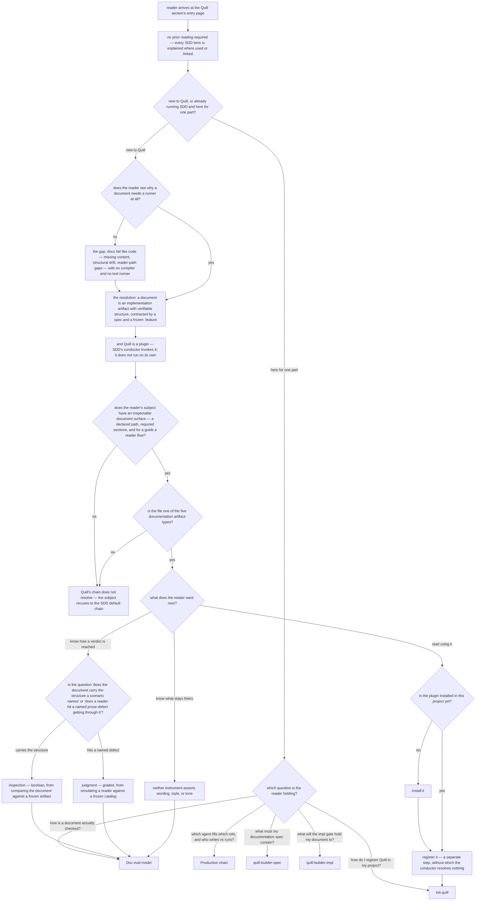

# quill/overview — the Quill section entry page

Specifies the document at `src/content/docs/quill/overview.md`, published at `/quill/overview/`.

Derived from Quill's own contract — its project spec, its `design/doc-eval-model.md` (for the
*shape* of the two instruments, never their mechanics), its glossary, the plugin readme, and
`.agents/universal-plugin.json`, which is the **single authority** on which artifact-types Quill
claims and which roles and bars it binds. Quill's contract is an **input** to this document and
never its owner.

**The published draft is not an input to this contract.** It is stale in two ways this contract
must correct: it reports every bar governance as `null` when the registry binds `quill-builder-spec`
and `quill-builder-impl`, and it documents four verification checks when there are five plus an
entire judged instrument. A contract derived from the draft would launder both errors, and would
launder the draft's unstated audience along with them.

## What

The Quill section has six pages. Five of them develop one part — how a document is checked, who
checks it, how to register the plugin, what a documentation spec owes, what a document owes — and
every one of them presupposes two things: that a **document is an implementation artifact with
verifiable structure**, and that **Quill is a plugin inside SDD rather than a tool that runs on its
own**. This page is where a reader meets both, and where a reader who came for one part is routed to
the page that owns it.

### Why the page exists: nobody else owns the arrival

Two things have no owner unless this page holds them.

1. **The premise.** A reader who meets *frozen `.feature`*, *impl gate*, or *defect catalog*
   without first being told why a document needs a runner at all meets a machinery with no reason to
   accept it. The five sibling pages each start from the premise; none argues it.
2. **The destination.** A reader arrives holding a file and one question — *where does this go?*
   Answering it means naming a leaf: one of the five sibling pages, or the SDD default chain for a
   subject Quill does not resolve for. The screening half of that answer is made once, on arrival,
   and no page downstream of it asks the question.

### The single outcome

The page delivers **one** nameable outcome: *a reader can name where the artifact they are holding
goes next.*

Screening and routing are not two outcomes joined by "and" — they are one question with one kind of
answer, because **a subject Quill does not resolve for has a destination too**. In the control flow
below, the recusal (`F1`, the SDD default chain) is a leaf exactly like the five sibling pages are
leaves. "Does Quill apply to me?" is answered by naming which leaf the reader lands on, so the fit
decision is not a prior gate the routing decision waits on; it is the branch of the routing decision
that leaves the section.

The argument is the **premise** this outcome rests on, not a second outcome. A reader who cannot say
what Quill decides about a document can still land on a leaf, but the landing is a guess — they have
no basis for believing it is the right one. That is why the premise is carried here and not split
onto a page of its own: split it, and every sibling page presupposes a premise the section's first
page did not deliver.

### Audience

Derived from Quill's contract and the section's boundary, not from the draft. Quill's spec addresses
two different arrivals: a maintainer whose documentation has no runner (the problem statement), and
an SDD practitioner whose conductor must resolve a chain for a documentation artifact-type (the
plugin statement).

| Audience | Who they are | What the entry page gives them |
| --- | --- | --- |
| **Docs maintainer without a runner** | someone who owns documentation that drifts — missing content, stale structure, guides whose steps no longer reach the outcome — and who has a test runner for their code and nothing for their docs | the **argument and the fit decision**: why documentation fails the way code fails, what Quill does about it, whether it applies to the artifact they are holding, and what it will never touch |
| **SDD practitioner routing a documentation change** | someone already running SDD who has reached a change whose artifact is a document, and needs to know which production chain resolves and which bars will grade it | the **placement and the map**: that Quill is the squad SDD resolves for five documentation artifact-types, and the page that owns each further question |

They do not split the document, because **both leave with the same thing** — a destination for the
artifact they hold. They differ only in what they need before that destination means anything: the
maintainer arrives without the premise and must be given it, while the practitioner already has it
and needs only the discriminator. One fact serves both — the five artifact-types are the maintainer's
fit test (*is my file one of these?*) and the practitioner's resolution key (*this is why the
conductor picked Quill*) — so a single page carries both, and the reader's **arrival**, not the
reader's job, is the first branch.

### Doc type: explanation

The reader is **building understanding, not performing a task**. Success is a decision they could
not make before: which destination the artifact they own sends them to.

This rules three types out. It is **not a how-to** — registering Quill is a task, and it has its own
page. It is **not a tutorial** — nothing is followed step by step. It is **not a reference**: the
checks, the roles, and the bars each have a page of record, and the most likely way this page decays
is drifting toward reference by tabulating what those pages own. That drift is exactly what produced
the stale binding table in the current draft.

### North star

> A reader finishes able to name **where the artifact they are holding goes next** — the sibling page
> that owns their question, or the SDD default chain if Quill's chain does not resolve for it.

**The failure state.** A reader who has read the whole page, can recite what Quill checks, and still
cannot say which page answers their question or whether their own file qualifies — a reader who
would have to open all five sibling pages to find out — is the state that means the page missed.

The premise enters here rather than as a second outcome. *What Quill decides about a document* — an
implementation artifact whose structure is verifiable, checked by two instruments, one boolean and
one graded — is what makes the destination something the reader can **defend** rather than guess. So
a revision also misses if it routes a reader confidently on a premise it never gave them: landing on
the right leaf for no stated reason is indistinguishable, to the reader, from landing on the wrong
one. And it misses if it leaves a reader believing Quill grades their wording, voice, or tone, since
that reader screens themselves out of a destination that was theirs.

### Prerequisites

**None.** This is the section's first page and it declares itself self-contained. A reader arriving
from search, from the sidebar, or from outside the site owes no prior reading — including no prior
reading of SDD. Every SDD term the page leans on (*plugin*, *production chain*, *frozen `.feature`*,
*gate*) is either explained in a phrase where it is first used or linked to the SDD section. The
five sibling pages are **downstream, never prerequisite** — the page may link them freely and must
not depend on them.

### Required coverage

The page is incomplete without each row. The scenarios below check them.

**The argument**

| # | Topic | Must convey |
| --- | --- | --- |
| O1 | **The gap** | documentation fails the way code fails — missing content, structural drift, reader-path gaps — and unlike code it has no compiler and no test runner |
| O2 | **The resolution** | Quill is that runner: it treats a document as an implementation artifact with verifiable structure, contracted by a spec and a frozen `.feature` before the document is written |
| O3 | **Quill is a plugin, not a tool** | Quill does not run on its own — it fills the delegate roles SDD's conductor resolves for a documentation artifact-type, so it is invoked by the SDD process rather than by a user |
| O4 | **Two instruments, named** | a verdict is reached one of two ways — **inspection**, which compares structured artifacts and returns a boolean, and **judgment**, which simulates a reader and returns a grade — and both are named here and developed elsewhere |
| O5 | **What is never asserted** | neither instrument asserts wording, style, or tone; the prose stays the author's — stated here because a reader screening Quill needs it on arrival, and **linked to the page of record** so the limit has one home rather than two |

**The fit decision**

| # | Topic | Must convey |
| --- | --- | --- |
| O6 | **The five artifact-types** | `documentation`, `guide`, `tutorial`, `article`, and `reference` are the keys by which SDD resolves the Quill chain for a file |
| O7 | **The fit boundary** | Quill applies to a subject with an inspectable document surface — a declared path, required sections, and for a guide or tutorial a reader flow |
| O7a | **The recusal, stated once** | a subject Quill's chain does not resolve for — whether because it has no inspectable surface or because it is not one of the five artifact-types — **recuses to the SDD default chain** rather than being graded here or refused; the two reasons reach the same destination and the page states that destination once |

**Getting it running**

| # | Topic | Must convey |
| --- | --- | --- |
| O8 | **Two steps, not one** | installing the plugin and registering it are separate acts; installing alone leaves the conductor unable to resolve Quill for anything |

**The route**

| # | Topic | Must convey |
| --- | --- | --- |
| O9 | **Every page is reachable** | all five sibling pages are linked from here, each with a description of what it covers |
| O10 | **The route discriminates** | each link is distinguished by the question its page answers, so a reader who arrived with one question selects it without reading the others |
| O11 | **The boundary is held** | the claims sibling pages own are reached by link and not developed here in place of the link — what each check verifies, the judged instrument's properties, the defect catalog's entries, which agent fills which role, and the registry entry's shape |

**Completeness check.** A page meeting all **twelve** rows above — O1 through O11, including O7a —
cannot leave a reader in the north star's failure state: unable to name a destination, or able to
name one only by guessing. Each row is spent by ID below; a row this argument does not spend is a row
nothing depends on, and should be cut rather than left standing.

*Every reader reaches a destination.* O9 puts all five sibling pages within reach and O10 makes each
reachable **by the question the reader is holding**, so a reader does not have to open all five to
find theirs. O6 and O7 settle whether the reader's own file qualifies, and O7a gives the reader who
does not qualify the one destination outside the section, so no branch of the fit decision dead-ends.
O8 closes the one path that can otherwise terminate short of a destination: a reader who installs the
plugin and is not told registration is a further act stops at the install command **believing they
have arrived**, which is the failure state in its most deceptive form — a reader confidently naming
a destination that is not one. Making the two acts distinct is what keeps that path running to
`R3`.

*Every destination is defensible rather than guessed.* O1 and O2 supply the premise, O4 establishes
that a verdict is reached one of two ways — so a reader who can recite artifact-types but not what
Quill checks has not met the bar — and O5 forecloses the "it grades my writing" reading that screens
a qualifying reader out of their own destination. O3 is what stops the reader looking for a command
to run when the answer is a page to open.

*And no destination is absorbed.* O11 keeps each leaf a link rather than a passage, so the page that
routes is never the page that answers.

### Non-goals

Each with where it lives instead. A non-goal here is a **link obligation**, not an omission — O11
makes the link the assertion.

| Not covered here | Lives at |
| --- | --- |
| what each of the four scenario-scoped checks verifies, and why a fifth check is scoped to the whole document | [Doc eval model](/quill/doc-eval-model/) |
| the judged instrument's properties — the blind two-pass, deliberate violation, advisory-until-calibrated, the evidence rule | [Doc eval model](/quill/doc-eval-model/) |
| the content of the document-scoped enumeration rule, the defect catalog's entries, and the calibration procedure | [quill-builder-impl](/quill/quill-builder-impl/) |
| what a documentation spec must contain and must never freeze | [quill-builder-spec](/quill/quill-builder-spec/) |
| which agent fills which role, and who **writes** versus who **runs** | [Production chain](/quill/production-chain/) |
| the registry entry's shape and how it is written | [init-quill](/quill/init-quill/) |
| SDD itself — the mission loop, the gates, the spec lifecycle | the SDD section |
| the sibling plugin covering the agent-configuration domain | the ACED section |

## Use Cases

Grouped by audience. Every entry point below either **names a leaf** or **hands the reader to the
decision that selects one** — `F` for a reader who has not yet placed an artifact, `D` for a reader
whose artifact qualifies. None ends nowhere, and that is the one outcome.

The two-part form is not a hedge. A reader who arrives holding no file cannot name a leaf yet, and
inventing one for them would be a destination they have no artifact to select with; what such a
reader can honestly reach is the decision that will name it. The maintainer's entry points spend more
of the page getting there because they must be given the premise first; the practitioner's go more
directly, because they arrive holding it.

### Docs maintainer without a runner

| # | Entry point | Trigger / inputs / outcome |
| --- | --- | --- |
| E1 | **Find out what this is** — the reader has opened the section's first page knowing only its name | *Trigger:* the section title means nothing yet. *Inputs:* the argument (O1, O2, O3). *Outcome:* the reader holds the premise — what Quill decides about a document, and that SDD invokes it rather than the reader running it — and is handed to the fit decision `F`. This reader brought no file, so `F` is as far as they can honestly get; it names their leaf as soon as they have an artifact to place. |
| E2 | **Check whether it applies to what they own** — the reader is holding a specific artifact | *Trigger:* "I have a README / a config / an architecture note — does this cover it?" *Inputs:* the artifact-types, the fit boundary, and the recusal (O6, O7, O7a). *Outcome:* the reader knows which side of the boundary their artifact falls on. Falling outside **names a leaf** — the SDD default chain (`F1`) — rather than nothing; falling inside **hands the reader to `D`**, which selects the sibling page their question belongs to. Both sides of the boundary are answers. |
| E3 | **Get it running** — the reader has decided to try it | *Trigger:* ready to install. *Inputs:* the two steps (O8). *Outcome:* the plugin is installed and the reader is on the page that owns registration, knowing registration is still owed. |
| E4 | **Find out what it will not touch** — the reader owns prose they do not want an automated grader policing | *Trigger:* "will this rewrite my voice?" *Inputs:* what is never asserted (O5), and the two instruments as the frame for it (O4). *Outcome:* the reader can say what is checked and what stays theirs, and is routed to the page of record for that limit rather than screening themselves out of the section. |

### SDD practitioner routing a documentation change

| # | Entry point | Trigger / inputs / outcome |
| --- | --- | --- |
| S1 | **Find which chain handles a documentation change** — the reader is running SDD and has reached a change whose artifact is a document | *Trigger:* the conductor needs a squad for this artifact-type. *Inputs:* the plugin placement and the artifact-types (O3, O6). *Outcome:* the reader knows Quill's squad resolves for those five types and is on the page that owns the bindings. |
| S2 | **Reach one specific part** — the reader arrives with a known question | *Trigger:* needing the checks, a bar, the roles, or the registry entry. *Inputs:* the discriminating route (O9, O10, O11). *Outcome:* the reader lands on the owning page directly. |

## Control Flow

The reader's decision path. Every **path** through this graph ends at a leaf — that is the one
outcome, and the graph is drawn to show which leaf each arrival reaches.

An **entry point** (`## Use Cases`) covers a *segment* of a path, which is why one may end at a
decision node rather than a leaf without contradicting the sentence above. E1's reader is on a path
that ends at a leaf like every other; they have simply not traversed the rest of it, because `F`
cannot be decided until they hold an artifact to decide it about.

The first branch is **which arrival**, because the two arrivals differ in how much of the path they
traverse: a reader new to Quill walks the premise nodes (`W`, `V`, `P`) before the fit decision can
mean anything, while a practitioner who already holds the premise enters at `R` and reaches a leaf in
one step. Neither is made to walk the other's path.

The graph has **six terminal leaves** — `R1` through `R5`, the five sibling pages, and `F1`, the
recusal to the SDD default chain. `F1` is terminal in exactly the way the five pages are, which is
what makes screening a branch of the routing decision rather than a second outcome. Every other node
flows into one of the six: `G2 → R3`, `N → R1`, and `I1`/`I2 → R1`. Every coverage row is spent on
an edge or a leaf, and no path stops short of one.

## Scenario map

### E1 — Find out what this is

| Edge | Path (Given) | Scenario |
| --- | --- | --- |
| `A` | any reader, whatever they already know about SDD *(convergence — the outcome does not vary)* | `the page stands alone without prerequisite reading` |
| `W:no → W1` | a reader who has not met Quill before | `the page states the gap a documentation runner fills` |
| `V` | a reader who accepts that documentation fails the way code fails | `the page states what Quill treats a document as` |
| `P` | a reader who expects a tool they run themselves | `the page places Quill inside SDD rather than as a standalone tool` |

### E2 — Check whether it applies to what they own

| Edge | Path (Given) | Scenario |
| --- | --- | --- |
| `T:yes` | a reader holding a file they might put under Quill | `the page names the five documentation artifact-types` |
| `F:yes` | a reader deciding which side of the boundary their subject falls on | `the page states what makes a subject structurally checkable` |
| `→ F1` | any subject Quill's chain does not resolve for, by either route *(convergence — `F:no` and `T:no` reach the same destination)* | `a subject the chain does not resolve for is given the recusal, not a refusal` |

### E3 — Get it running

| Edge | Path (Given) | Scenario |
| --- | --- | --- |
| `G:no → G1 → G2` | a reader whose project uses SDD but has never installed Quill | `the page presents installing and registering as two separate steps` |
| `G2 → R3` | a reader who has just installed the plugin | `the next-step guidance names the page that owns registration` |

### E4 — Find out what it will not touch

| Edge | Path (Given) | Scenario |
| --- | --- | --- |
| `D:stays-theirs → N → R1` | a reader who owns prose and expects an automated grader to police voice | `the page states that wording, style, and tone are never asserted` |

### S1 — Find which chain handles a documentation change

| Edge | Path (Given) | Scenario |
| --- | --- | --- |
| `Q0:part → R2` | a practitioner running SDD who has reached a change whose artifact is a document | `the page names the roles Quill fills and defers the bindings to the owning page` |

### S2 — Reach one specific part

| Edge | Path (Given) | Scenario |
| --- | --- | --- |
| `R` (all leaves) | the five sibling pages of the section | `every page in the section is reachable from the entry page` |
| `R` (edge labels) | a reader arriving holding one question | `the route discriminates by the question a page answers` |
| `I` (both branches) | a reader asking how a verdict on a document is reached | `both instruments are named and each routes to the page that owns the split` |
| `R1`, `R4`, `R5` | a reader looking for the checks, the spec bar, or the impl bar | `the entry page routes to the owning page instead of standing in for it` |

## References

- [Diátaxis](https://diataxis.fr/) — classifies this page as **explanation**: read for understanding
  rather than followed step by step, which is why this contract freezes the *claims the page must
  land* and the *reader questions it must route*, and freezes neither section order nor wording. It
  also supplies the decay warning above: the mixed-type drift toward reference is the defect that
  put a stale binding table on the current draft.

### Recorded upstream defects — not fixed here

Found in Quill while deriving this contract. Both are follow-ups against `.agents/specs/quill/`,
not changes made in this section.

1. **The plugin readme's role table under-reports the bars.** `plugins/quill/readme.md` lists the
   five production-chain roles and omits the `governances` block entirely, so a reader of the readme
   cannot learn that the registry binds `quill-builder-spec` and `quill-builder-impl`. This is the
   same omission the stale published draft turned into a positive false claim.
2. **The readme's check table predates the judged instrument.** It documents five inspection checks
   and no judged tier, while `design/doc-eval-model.md` carries a judged instrument with a defect
   catalog, a blind two-pass, and a calibration gate. No scenario below depends on the resolution —
   this page names the two instruments and develops neither.
