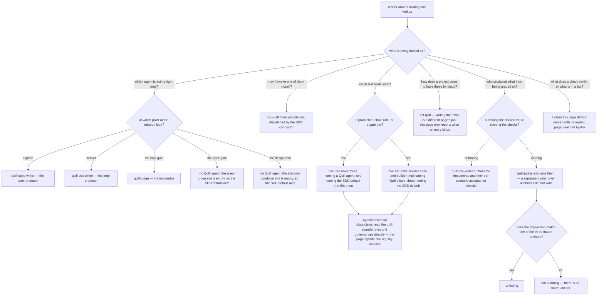

# quill/production-chain — the page of record for Quill's bindings

Specifies the document at `src/content/docs/quill/production-chain.md`, published at
`/quill/production-chain/`.

Derived from `.agents/universal-plugin.json` (the **single authority** on every binding this page
reports), `plugins/sdd/skills/plugin-contract-governance/SKILL.md` (which defines the five role
slots and what an empty one degenerates to), the three agent definitions under `plugins/quill/agents/`,
and `.agents/specs/quill/design/doc-eval-model.md` (*The independence anchor*). The published draft
is **not** an input to this contract — see *Recorded conflict* at the end.

## What

Quill ships three agents. SDD resolves five production-chain roles and five gate bars. Neither set
is a subset of the other: three of Quill's slots are filled, two are empty, two bars are overridden
and three are not, and the mapping between "an agent name in the transcript" and "a role SDD asked
for" is not derivable from either name. This page is where a reader looks that mapping up.

### Why the page exists: the bindings live in a file nobody reads mid-mission

The bindings are decided by one JSON object in `.agents/universal-plugin.json`. A reader watching
`quill-doc-writer` run has that file on disk and will not open it, and if they did, the entry would
tell them `impl-producer` without telling them what an impl-producer is or what happens at the two
slots that read `null`. Two things therefore have no owner unless this page holds them:

1. **The lookup.** Role → agent, agent → phase, bar → gate, and — the part a registry entry cannot
   express — what acts at a slot Quill left empty.
2. **The write-vs-run line.** `quill-doc-writer` authors the documents *and* the acceptance checks
   `quill-judge` will run. That reads like a producer grading itself, and the reason it is not is a
   claim someone has to make in one place: three frozen anchors, none of them written by the judge,
   and no fourth.

This content has decayed once already in exactly the way a reference page decays: a binding table
was copied into prose, the registry moved underneath it, and the copy went on claiming that all five
bar governances are `null`. That is the failure this contract is built to catch, which is why
**naming the authority is itself a required coverage row** rather than a courtesy.

### Audience

Derived from the two ways this lookup is arrived at, not from the draft.

| Audience | Who they are | What the page gives them |
| --- | --- | --- |
| **Mission runner** | someone running an SDD documentation mission on a project with Quill registered, watching agent names go past that they did not choose and did not invoke | the **map**: which agent is acting at the phase they are in, what acts at the phases where no Quill agent appears, whether they may call any of them by hand, and who wrote the thing they are being graded against |
| **Plugin integrator** | someone writing or auditing an SDD plugin's registry entry — Quill's, or their own modeled on it | the **inventory and its authority**: all five role slots and all five bar slots with their current values, the default that fills each empty one, and the file plus entry they can check the whole table against |

They do not split the page. The mission runner reads a binding to **explain something that already
happened**; the integrator reads the same binding to **decide what to write**. One fact serves both,
and the write-vs-run line is the clearest case: it is the runner's reason to trust an impl-gate
verdict and the integrator's constraint to reproduce. Recorded as a single page deliberately, not by
default.

### Doc type: reference

The reader is **looking one thing up**, and success is that they found it and it was accurate. They
arrive holding a question with a short answer — *which agent is this?*, *why did nothing run there?*,
*is `builder-impl` bound?* — and they leave as soon as they have it.

This rules the other three out. Not a **tutorial** or a **how-to**: nothing is performed here, and
the one task in the neighborhood — writing the registry entry — belongs to
[`init-quill`](/quill/init-quill/). Not an **explanation**: the two-instrument argument and the
reasoning behind the judged tier are owned by [`doc-eval-model`](/quill/doc-eval-model/). The most
likely way this page decays is drifting **toward explanation** — narrating how the chain works
instead of tabulating what it binds — and the second most likely is a table going stale under the
registry, which is why the authority row exists.

### North star

> A reader finishes able to **resolve one Quill production-chain binding** — for a phase of the
> mission loop, a role slot, or a bar slot: **which actor holds it, and what that actor is allowed to
> do** — off a page whose every binding is checkable against `.agents/universal-plugin.json`, the
> file that decides them.

A binding is a name **plus a mandate**, and the page misses if it lands either half without the
other. A revision that leaves a reader able to **describe what the three agents do** but unable to
resolve a single slot has missed — it has become an account of the chain rather than the page of
record for it. So has one that resolves a slot to a bare name: a reader who leaves believing
`quill-judge` may author what it grades, that a slot reading `null` means nothing acts there, or
that one of these agents is theirs to invoke, has a name and no mandate.

**On the outcome being one.** Read quickly, "which actor holds it" and "what that actor may do" look
like two concerns. They are one: a slot's value is useless without the mandate that comes with it —
`impl-judge: quill-judge` is precisely the binding that answers *may this agent write the document it
grades?*, and answering it is the same lookup, not a second one. The registry clause is not a third
outcome either; it is the accuracy condition on the one outcome. The split is also barred upstream:
[`../README.md`](../README.md) assigns *"which agent fills which role, **and** who writes vs who
runs"* to this page as a single ownership row, so separating them would contradict an established
boundary rather than sharpen one.

### Prerequisites

**None for a lookup.** A reader arriving from search or the sidebar can complete any lookup on the
page: every phase, role, and bar the page places an agent at is named on the page, so the reader
never has to already know the mission loop to find their row in it.

What the page does **not** make self-contained is the *meaning* of the things it binds — what a
check verifies, what a bar contains, how an entry is written. Those are linked, and following the
link is a new reading task rather than a prerequisite for this one. [`overview`](/quill/overview/)
is the section's entry page and is **upstream but not required**.

### Required coverage

The page is incomplete without each row. The scenarios below check them. The two groups are the two
halves of a binding — **who holds the slot**, and **what holding it entitles them to do**; a page
landing one group without the other trips the north star's failure mode by construction.

**Half one — the slots and who holds them**

| # | Topic | Must convey |
| --- | --- | --- |
| R1 | **The five roles are SDD's** | the production chain is a fixed set of five delegate roles SDD resolves per artifact-type — `spec-producer`, `solution-producer`, `spec-judge`, `impl-producer`, `impl-judge` — and a plugin fills a subset of them; all five appear, not only the filled ones |
| R2 | **Which agent fills which role** | `quill-spec-writer` = spec-producer, `quill-doc-writer` = impl-producer, `quill-judge` = impl-judge |
| R3 | **The empty slots resolve to something** | `solution-producer` and `spec-judge` are `null`, and a `null` role degenerates to the SDD default rather than to nothing; each empty slot names the actor that fills it |
| R4 | **The registry is the authority** | `.agents/universal-plugin.json` decides every binding on the page; the reader is told the page reports it, and is given the entry to look at — the `sdd-plugins` entry named `quill` and its squad's `roles` and `governances` objects |
| R5 | **The bar slots are not all empty** | Quill binds two of the five bar governances — `builder-spec` → `quill-builder-spec` at the spec gate, `builder-impl` → `quill-builder-impl` at the impl gate — and leaves `oracle-spec`, `architect-spec`, and `architect-impl` to the SDD defaults |
| R6 | **Each agent's place in the loop** | `quill-spec-writer` acts in **explore**, before the spec gate; `quill-doc-writer` acts in **deliver**; `quill-judge` acts **at the impl gate** — and the phases where no Quill agent is dispatched are listed rather than omitted |

**Half two — the mandate each holder carries**

| # | Topic | Must convey |
| --- | --- | --- |
| R7 | **Dispatch is the conductor's, not the reader's** | all three agents are spawned by the SDD conductor and are not invoked by a reader directly |
| R8 | **Who writes, who runs** | `quill-doc-writer` authors both the documents **and** their per-scenario acceptance checks; `quill-judge` only **runs** them and authors no criteria of its own |
| R9 | **Three anchors and no fourth** | the judge works from the frozen `.feature`, the frozen document-scoped rule, and the frozen defect catalog; an impression matching none of the three is **not a finding** |
| R10 | **What independence rests on** | all three anchors are artifacts the judge did not write, and the judge is a separate runner from the author — that pair, not the absence of producer-written checks, is what makes the verdict independent |

**The boundary**

| # | Topic | Must convey |
| --- | --- | --- |
| R11 | **Deferred claims are routed, not developed** | what a check verifies and how the judged pass runs, the content of either bar, and how a registry entry is written are each named together with the page that owns them, and are not restated here |

**Completeness check.** A page meeting R1–R11 cannot trip the north star's failure mode, and the two
halves are why. R1–R3 and R5–R6 make every slot and phase individually **lookupable**, so the page
cannot pass while reading as a narrative; R4 supplies the check that keeps a lookup accurate as the
registry moves underneath it. R7–R10 attach the **mandate** to each name, ruling out all three
name-without-mandate readers the north star names: R7 the reader who goes looking for a command to
run, R8–R10 the reader who thinks the judge graded its own writing, R3 and R6 together the reader who
thinks `null` means nothing acts.

**Non-goals** — each with where it lives instead:

| Not covered here | Lives at |
| --- | --- |
| what the four scenario-scoped checks verify, and how the judged pass runs (blind two-pass, deliberate violation, advisory-until-calibrated, the evidence rule) | [Doc Eval Model](/quill/doc-eval-model/) |
| what a documentation spec must contain and must never freeze — the content of the `builder-spec` bar | [Quill Builder-Spec](/quill/quill-builder-spec/) |
| the document-scoped enumeration rule and the defect catalog's entries — the content of the `builder-impl` bar | [Quill Builder-Impl](/quill/quill-builder-impl/) |
| how the registry entry gets written, its shape, and its failure modes | [Init Quill](/quill/init-quill/) — **the values an entry currently binds are this page's**, so a template shown there is a shape, not a second table of record |
| the install command, Quill's domain types, and the route to the rest of the section | [Overview](/quill/overview/) |
| what the five SDD roles mean in general, and the full plugin contract | `sdd:plugin-contract-governance` — the SDD plugin's own governance, not this docs section |

## Use Cases

Grouped by audience. The mission-runner entry points concern **explaining something already
happening**; the integrator entry points concern **deciding what to write**.

### Mission runner

| # | Entry point | Trigger / inputs / outcome |
| --- | --- | --- |
| MR1 | **Name the agent acting at the phase the mission is in** | *Trigger:* an unfamiliar agent name in the transcript, or a phase that produced no agent at all. *Inputs:* R2, R6, R3. *Outcome:* the reader can say which agent is acting, or what acted in place of one. |
| MR2 | **Decide whether to invoke a Quill agent by hand** | *Trigger:* wanting to re-run the judge, or looking for Quill in a command list. *Inputs:* R7. *Outcome:* the reader knows these are conductor-dispatched and stops looking for a user-facing entry point. |
| MR3 | **Weigh an impl-gate verdict** | *Trigger:* a `FAIL`, or the suspicion that the grader wrote what it graded. *Inputs:* R8, R9, R10. *Outcome:* the reader can say who authored the checks, who ran them, and what an impression outside the three anchors is worth. |
| MR4 | **Follow up a question this page defers** | *Trigger:* the lookup succeeded and raised a second question — what does that check actually verify? *Inputs:* R11. *Outcome:* the reader is on the owning page rather than reading a second-hand account here. |

### Plugin integrator

| # | Entry point | Trigger / inputs / outcome |
| --- | --- | --- |
| PI1 | **Audit the role bindings** | *Trigger:* reviewing Quill's squad, or modeling a new plugin's on it. *Inputs:* R1, R2, R3. *Outcome:* the reader has all five slots with a filler named for every one. |
| PI2 | **Decide which bars to write** | *Trigger:* asking whether a doc-specific bar already exists for a gate. *Inputs:* R5. *Outcome:* the reader knows two bars are Quill's and three are SDD's. |
| PI3 | **Check the table is still true** | *Trigger:* the table disagrees with something observed, or is simply old. *Inputs:* R4. *Outcome:* the reader reads the binding off the registry entry instead of trusting the page. |
| PI4 | **Get the bindings into a project** | *Trigger:* no `quill` entry in the project's registry yet. *Inputs:* R11. *Outcome:* the reader is on the page that writes the entry. |

## Control Flow

The reader's decision path. This is a reference page, so the first branch is **which lookup the
reader arrived holding** — not which audience they are, because both audiences arrive at the same
branches from different sides.

Every role slot and every bar slot is a leaf of `B`; every phase of the loop is a leaf of `P`,
including the two that dispatch no Quill agent. Every coverage row is spent on an edge or a leaf.

`V` is an unconditional successor of both tables rather than a decision, deliberately: an earlier
draft branched on *does this reader need the table to be current?*, whose "no" edge led to a leaf
carrying no claim — a decision no reader actually makes and an edge no scenario could lose. Every
reader of either table is routed to the authority.

## Scenario map

### MR1 — Name the agent acting at the phase the mission is in

| Edge | Path (Given) | Scenario |
| --- | --- | --- |
| `P:explore`, `P:deliver`, `P:impl-gate` | a reader who has seen a Quill agent name go past and knows which phase is running | `the page places each Quill agent at the phase that dispatches it` |
| `P:spec-gate`, `P:design-fork` | a reader at a phase where no Quill agent appeared | `a phase that dispatches no Quill agent names what acts there instead` |

### MR2 — Decide whether to invoke a Quill agent by hand

| Edge | Path (Given) | Scenario |
| --- | --- | --- |
| `Q0:invoke → I` | a reader looking for a way to run one of the agents themselves | `the page states the three agents are conductor-dispatched and not reader-invocable` |

### MR3 — Weigh an impl-gate verdict

| Edge | Path (Given) | Scenario |
| --- | --- | --- |
| `W` | a reader holding an impl-gate verdict on a document | `the page separates the agent that authors a document from the agent that runs its checks` |
| `A:yes → A1` | a reader asking what the judge is entitled to report | `the page enumerates the three frozen anchors the judge runs from` |
| `A:no → A2` | a reader holding a judge finding that matches no anchor | `an impression matching none of the anchors is stated not to be a finding` |
| `W:running → W2` | a reader who has noticed the producer wrote the checks | `the page states what the judge's independence rests on` |

### MR4 — Follow up a question this page defers

| Edge | Path (Given) | Scenario |
| --- | --- | --- |
| `Q0:defer → X` | a reader whose lookup succeeded and raised a second question the page does not own | `a deferred claim is named with its owning page rather than developed here` |

### PI1 — Audit the role bindings

| Edge | Path (Given) | Scenario |
| --- | --- | --- |
| `B:role → B1` | a reader auditing a squad entry rather than tracking a live mission | `the page presents all five production-chain roles as one lookup` |
| `B1` | a reader reading the role table straight through *(the empty-slot claim on its second reader path — MR1 reaches it by phase, this reader reaches it by slot)* | `every unfilled role row names the SDD default that fills it` |

### PI2 — Decide which bars to write

| Edge | Path (Given) | Scenario |
| --- | --- | --- |
| `B:bar → B2` | a reader deciding whether to author a doc-specific bar for a gate | `the page separates the bars Quill binds from the bars it leaves to SDD` |

### PI3 — Check the table is still true

| Edge | Path (Given) | Scenario |
| --- | --- | --- |
| `B1 → V`, `B2 → V` | a reader arriving from either table *(convergence — the authority is the same for the role table and the bar table, so one row covers both)* | `the page names the registry file and the entry that decides every binding` |

### PI4 — Get the bindings into a project

| Edge | Path (Given) | Scenario |
| --- | --- | --- |
| `Q0:configure → C` | a reader whose project has no Quill entry yet | `a reader who needs the bindings created is routed to the page that writes them` |

## References

- `.agents/universal-plugin.json` — the authority for R2, R3, and R5. The table this page contracts
  is derived from the `quill` entry's `squads[0].roles` and `squads[0].governances`, never from
  another page's prose.
- `plugins/sdd/skills/plugin-contract-governance/SKILL.md` — backs R1 (the five role keys are a
  closed set SDD owns) and R3 (`null` degenerates to the SDD default; a missing key falls back to
  `<plugin>-<role>`).
- `.agents/specs/quill/design/doc-eval-model.md`, *The independence anchor* — backs R8, R9, R10,
  including the "three anchors and no fourth" formulation and the separate-runner claim.
- [Diátaxis](https://diataxis.fr/) — classifies this page as **reference**: consulted for a single
  fact rather than read through, which is why the contract freezes the *slots that must be
  lookupable* and the *authority a reader can check them against*, and freezes neither the table's
  column order nor its wording.

### Recorded conflict — not resolved here

Three Quill artifacts state that `spec-judge: null` means the **spec gate applies the documentation
criteria itself with no judge agent**: `plugins/quill/readme.md`, the `quill-spec-writer` agent
definition, and `.agents/specs/quill/sdd-roles/README.md`. The SDD plugin contract says the opposite
— `null` degenerates to the SDD default, and for `spec-judge` that default is the cold `sdd-spec-judge`,
which `plugins/sdd/skills/spec-gate/SKILL.md` spawns unconditionally after resolving the slot.

This contract does **not** decide it. R3 and the scenarios below require each empty slot to name
*the actor that fills it*, and assert that a slot reading `null` is not a slot where nothing runs —
neither the row nor the scenario names which actor, so the page stays correct whichever way the
follow-up resolves. Filed as an observation against `.agents/specs/quill/`, per this section's rule
that a defect found in Quill while documenting it is a follow-up, not a change made here.
