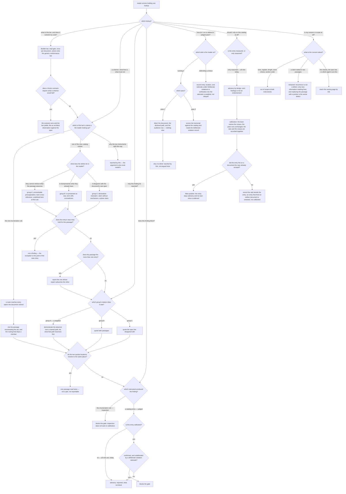

# quill/quill-builder-impl — the impl-gate Builder bar reference

Specifies the document at `src/content/docs/quill/quill-builder-impl.md`, published at
`/quill/quill-builder-impl/`.

Derived from the shipped governance `quill-builder-impl` — the Quill Builder bar at the impl gate —
and from Quill's own contract, which is an **input** to this page and never its owner. The
published draft, if one exists, is **not** an input to this contract.

The section boundary in [`../README.md`](../README.md) assigns this page the **content** of the
document-scoped enumeration rule, the **entries** of the defect catalog, and the calibration
procedure. Claims it must reach by link rather than develop are listed under *Non-goals*.

## What

Quill grades a document twice. Once **per scenario**, against the frozen `.feature`. Once **per
document**, against a bar the scenarios structurally cannot carry — because every criterion in it is
a relation *between* two passages, and each passage is well-formed when read alone. That bar is
`quill-builder-impl`, and this page is its reference.

It is the section's densest page, and the one whose readers most often arrive mid-task holding a
*specific* question: *a finding landed on my paragraph — is it real, and does it block?* Everything
below is organized around answering exactly one such question at a time. How the sibling pages are
read is their contract, not this one's.

### Why the page exists: the criteria have no other home

[`/quill/doc-eval-model/`](/quill/doc-eval-model/) argues **why** a document needs a second,
document-scoped instrument, and **why** one is a comparison while the other is a reading. It does
not say what the criteria *are*. Nothing else does either: the bar itself is a governance loaded by
name inside an agent's context, so a human weighing a Quill finding, or deciding whether to adopt
Quill at all, has no readable surface for it.

Two things therefore have no owner unless this page holds them:

1. **The criteria themselves** — one enumeration rule, and nine catalog entries. An entry without
   its **near-miss** is a style opinion with a rubric attached, so an entry is only usable when
   both halves are in front of the reader at once.
2. **Each criterion's standing** — whether it can block anything today. All nine catalog entries are
   currently advisory, which is the designed starting state and not an outage. A reader who cannot
   see that reads a non-blocking advisory note as a gate failure.

### Audience

Derived from who reads a bar, not from any draft. The governance itself names two faces — a producer
reading it forward while authoring, and a judge reading it backward while running the gate — and
adoption adds a third reader who is deciding whether to trust the instrument at all.

| Audience | Who they are | What the page gives them |
| --- | --- | --- |
| **Author under a Quill impl gate** | someone writing or revising a document that Quill will grade, who has satisfied every scenario and wants to know what is still held against them | the **criteria in advance**: what fires, what must not, and how to declare a violation they made on purpose |
| **Reviewer of a Quill finding** | someone reading a finding the gate produced — a human reviewer, or an agent operator deciding what to do with it — who needs to know whether it is even reportable and whether it stops the gate | the **admissibility and standing rules**: the citation each group of entries owes, and what an entry blocks on |
| **Quill adopter or maintainer** | someone deciding whether to rely on this catalog, or preparing to move an entry from advisory to blocking | the **calibration procedure and the boundary**: what a run measures, what it reports, and what the bar refuses to assert at all |

They are not opposites and do not split the document. The near-miss serves the author (*this will
not fire on me*) and the reviewer (*this finding is not admissible*) from one statement; the
standing table serves the reviewer (*this does not block*) and the maintainer (*this is not measured
yet*) from one table. So a single page carries all three, and the **lookup a reader arrives
holding** — not the reader's role — is the first branch.

**One node, not two — recorded.** This page carries roughly as much contract as the other five in
the section combined, and the obvious seam is catalog versus mechanics-and-standing. It was weighed
and declined, on two grounds:

1. **The subject is one file.** `quill-builder-impl` bundles the enumeration rule, the nine entries,
   the pass mechanics, and the standing table in a single shipped governance. Under
   *one capability per node*, the capability here is *document this one governance*, so a split
   smears one capability across two nodes however the pages are then arranged.
2. **The audiences do not split with it.** The near-miss and the standing each serve two of the three
   audiences from one statement, as above — and an entry and its standing are the pairing a reader
   most often needs whole.

Note what does **not** justify it: the project's `mirror-source` strategy constrains the
node-to-page mapping, not where content boundaries fall, so a genuine two-page split would satisfy
`mirror-source` perfectly well. That argument is an overstatement and is not the reason.

### Doc type: reference

The reader is **looking one thing up**. Success is that they found it and it was accurate.

This rules the other three types out. It is **not a tutorial** — nobody works through the bar in
order. It is **not a how-to**, except incidentally: running a calibration is a procedure, but a
reader arrives at it as one entry among many rather than as the page's goal. It is **not an
explanation** — the argument for two instruments, and for judging craft rather than linting it, is
[`/quill/doc-eval-model/`](/quill/doc-eval-model/)'s, and the most likely way this page decays is
drifting into that argument instead of pointing at it.

The reference type has one consequence the coverage table below spends: **every entry lookup must be
self-sufficient**. A reader who lands on any one catalog entry from the sidebar, from search, or from
a finding that names it has not read the page above it, and the set has no privileged member — one
self-sufficient entry beside a context-dependent one fails the type.

### North star

> A reader can look up **any single criterion this bar carries** — the enumeration rule, or any one
> of the nine catalog entries — and leave with what makes it fire, what must be **cited** to report
> it, and whether it **blocks** today; and, for each of the **nine**, the **near-miss** that must
> not fire it.

The near-miss is scoped to the nine deliberately: it is a property of a *judged* entry, and the
enumeration rule has none — a route either reaches every option or it does not. Stating the fields
as if all four attached to all ten would make the north star false of the criterion a reader most
often looks up first.

A revision that leaves a reader able to say the bar holds one inspection rule and a nine-entry
judged catalog, but unable — for the entry actually in front of them — to say what must *not* fire
it or whether it stops the gate, has missed. So has one that leaves a reader believing a claim
stated twice is a defect.

**One outcome, named without "and": a criterion lookup completes.** The four items above are what a
completed lookup returns, not four concerns bolted together — for a reference page the doc type
already defines success as *found it, and it was accurate*, and an entry retrieved without its
near-miss or its standing has been found inaccurately, not partially. The three audiences enter that
one outcome from three arrivals; they do not add three intents.

### Prerequisites

**Two, both declared and both linked at first use.** The reader must know that Quill grades a
document with **two instruments**, inspection and judgment, and what an **impl gate** is:

| Assumed | Supplied by |
| --- | --- |
| what Quill is, and which artifact types it governs | [`/quill/overview/`](/quill/overview/) |
| the two instruments, and the four scenario-scoped checks | [`/quill/doc-eval-model/`](/quill/doc-eval-model/) |

Everything else the page relies on is defined where it is used. **No sibling page is prerequisite to
a single entry lookup** — the two above are prerequisite to reading the page through, not to
retrieving one criterion from it, and the coverage table holds that distinction.

### Required coverage

The page is incomplete without each row. The scenarios below check them.

**What the bar is**

| # | Topic | Must convey |
| --- | --- | --- |
| B1 | **Identity and scope** | the **Builder** actor bar at the **impl gate**, run **once per document** rather than once per scenario, unioning onto SDD's generic conformance bar; it carries what a frozen `.feature` structurally cannot, because every criterion is a relation between two passages |
| B2 | **Precedence** | where a frozen scenario requires what a criterion would fail, the **scenario wins and the bar yields** — the suite was ratified at the spec gate — and the collision is reported as an architect observation against the spec, never as a gate blocker |

**The inspection side**

| # | Topic | Must convey |
| --- | --- | --- |
| E1 | **The enumeration rule, and its verdict** | where the document names a set and a later passage routes a case across that set, an option **silently absent from the routing** is a defect; reporting it means citing both the enumeration and the routing that skips a member. Its verdict is a **blocker**, not an advisory finding — the enumeration rule is inspection and does not wait on calibration the way every catalog entry does. Without this the north star's *whether it blocks* is unanswerable for the one criterion a reader looks up first |
| E2 | **The bar's inventory, and the split reached by link** | the bar carries **both** instruments — this one enumeration rule, and a judged catalog of nine entries — so a reader landing here directly knows what the page contains. **Link obligation, not a claim to develop:** *why* the two instruments split as they do is [`/quill/doc-eval-model/`](/quill/doc-eval-model/)'s, and the page reaches it by link rather than arguing it |

**The catalog**

| # | Topic | Must convey |
| --- | --- | --- |
| C1 | **The catalog's shape** | **nine** entries in **three** groups, grouped by *what the defect does to a reader*: what the reader cannot retrieve; what misrepresents what they already have; where the document disagrees with its own spec |
| C2 | **Group A — cannot retrieve** | unresolvable presupposition, bare cross-reference, undefined term at first use — each with what it fires on, and with *the reader* meaning a reader on **one declared control-flow path** |
| C3 | **Group B — misrepresents** | re-presented as new, term drift, contradiction — each with what it fires on |
| C4 | **Group C — disagrees with the spec** | declaration mismatch, claim without mechanism, orphan claim — each with what it fires on, including that *claim without mechanism* is **gated entirely by the declared doc type** and fires only in an explanation |
| C5 | **Every entry carries its near-miss** | each of the nine states the case it looks like but must **not** fire on, and the page says why: without one, an entry is a style opinion with a rubric attached |
| C6 | **Every entry lookup stands alone** | for **each of the nine**, what it fires on, its near-miss, and the citation its group owes are all retrievable **at that entry**, without having read the page above it. Quantified over the whole set deliberately: a reader may land on **any** of the nine from the sidebar, from search, or from a finding that names it, so one self-sufficient entry standing beside a context-dependent one fails the doc type rather than half-meeting it. This is also what forces the marking-versus-recurrence distinction to sit **at the surviving entry** — *re-presented as new* — rather than floating in general prose a cold arrival never reaches |
| C7 | **Recurrence is retracted** | an earlier revision held a claim landed twice to be a defect; it is **retracted** on empirical grounds. The surviving entry fires on **new-information marking** — an indefinite article, an existential, a defining move — and never on the recurrence itself. A claim may recur freely, and the retracted rule's prescribed fix, replacing the second passage with a pointer, is the **worse** defect |
| C8 | **Citation, per group** | group A findings are **negatives**, so they must demonstrate an absence over a **named path** and list what that path traverses first — *"I did not find it"* is not a finding; group B must quote **both** passages and confirm the two locations **differ**; group C must quote **the spec line** disagreed with, or it is a preference |
| C9 | **Detects, never certifies** | the catalog names defects and does not certify quality — a document with zero findings is **not** thereby endorsed |
| C10 | **One finding per passage** | where a passage fires more than one entry, report the one whose **repair subsumes** the other, because a catalog that reports every angle on one sentence gets routed around |

**Running a judged pass**

| # | Topic | Must convey |
| --- | --- | --- |
| R1 | **Blind, then scored** | pass 1 simulates a reader on one declared control-flow path and receives **only** the document, that path, and the audience row — not the catalog, not the entry names, not the coverage table, not the deliberate-violation record; pass 2 scores that transcript against the catalog. **Link obligation:** *why* the first pass must be blind is [`/quill/doc-eval-model/`](/quill/doc-eval-model/)'s argument; the page states that it is blind and routes the reason |
| R2 | **Deliberate violation** | the producer may mark any judged finding **intentional**, recorded in the `verification.md` the judge already runs and never authors, under a `## Deliberate violations` heading, one row per claim naming the **entry**, the **location**, and the **rationale**; the judge reads it in the **scoring pass only**, and weighs the rationale rather than obeying it — a defense that merely asserts the choice was deliberate clears nothing |

**Standing**

| # | Topic | Must convey |
| --- | --- | --- |
| S1 | **Advisory until calibrated** | an entry does not block until it has been run against documents the repo **already accepts** and **already considers weak**, with its false-positive rate **reported rather than asserted**; once calibrated it blocks on **confirmed and undefended** only. **Link obligation:** *why* the asymmetry runs that way is [`/quill/doc-eval-model/`](/quill/doc-eval-model/)'s argument; the page states the rule and routes the reason |
| S2 | **Calibration is per entry** | not a majority vote across the catalog — entries clearing together says nothing about any entry not itself run, and an entry that fires on **neither** corpus document has not been calibrated, only untested |
| S3 | **The current state** | **every one of the nine entries is advisory today, so the whole catalog is non-blocking** — the designed starting state, since the entries are reasoned rather than measured, and a row moves to calibrated only with a rate and a named corpus beside it |
| S4 | **What a calibration run is and reports** | name the corpus first and let **the team** name it, not the judge; run the judged pass **unchanged**; score per entry, where every firing on an accepted document is a false positive; record **the rate and the named corpus** together, since a rate with no corpus is not a measurement; an entry that fires on an accepted document **stays advisory** and its near-miss is the thing to widen |

**The boundary**

| # | Topic | Must convey |
| --- | --- | --- |
| X1 | **What is never assertable** | tone, register, length, word choice, and section order are out of scope at **both** instruments, and evidence is what draws that line: a finding quotes two locations, each naming **where** it came from and confirmed to be two different places |
| X2 | **The boundary is held** | the claims other pages own are reached by **link** and not developed here — the four scenario-scoped checks and the two-instrument rationale, the spec-gate bar, and which agent runs this one |

**Completeness check.** Every row is spent below by ID, so that a row dropped in a later revision
shows up here as a gap rather than passing unnoticed. All 22: B1, B2, E1, E2, C1–C10, R1, R2,
S1–S4, X1, X2.

*First failure state — an entry retrieved without what makes it usable.* **C1** establishes the set;
**C2**, **C3**, and **C4** supply each entry's fire condition group by group; **C5** supplies every
near-miss; **C8** supplies the citation each group owes; **C6** forces all of it to sit *at* the
entry a cold reader lands on; **S3** supplies the standing. **C10** keeps one passage from returning
several competing findings, and **C9** stops a clean run being read as an endorsement.

*Second failure state — a reader leaving believing recurrence is a defect.* **C7** rules it out
directly, and **C6** forces the marking distinction to sit at the surviving entry rather than in
general prose a cold arrival never reaches.

*The lookups that are not entry lookups.* **E1** carries the inspection criterion and its blocking
verdict; **E2** carries the bar's inventory and the link out for the split; **B1** places the bar;
**B2** settles precedence against a frozen scenario; **R1** and **R2** carry the pass mechanics and
the defense channel; **S1**, **S2**, and **S4** carry the standing rule, its per-entry scope, and the
procedure that changes it; **X1** bounds what may be asserted at all and **X2** holds the section
boundary. None is load-bearing for the two failure states above, and none is droppable without
leaving a use case in `## Use Cases` unserved.

A page meeting all 22 cannot trip either failure state.

### Non-goals

Each with where it lives instead. This page names them and links; it does not develop them.

The seam against [`/quill/doc-eval-model/`](/quill/doc-eval-model/) is **why versus what**, recorded in
[`../README.md`](../README.md): that page carries the **argument** for the judged tier and states that
each mechanism exists; this page carries the **procedure** — what pass 1 receives and what it does
not, the file and fields a deliberate violation is declared in, the steps of a calibration run and
how it is scored, each entry's standing today, and what a calibrated entry blocks on. Every *why*
below forwards to the same address.

| Not covered here | Lives at |
| --- | --- |
| what each of the four scenario-scoped checks verifies | [`/quill/doc-eval-model/`](/quill/doc-eval-model/) |
| why a document needs a document-scoped instrument at all | [`/quill/doc-eval-model/`](/quill/doc-eval-model/) |
| the two-instrument split — inspection versus judgment — and why a document needs both | [`/quill/doc-eval-model/`](/quill/doc-eval-model/) |
| **why craft is judged rather than linted**, and why a judged verdict is graded rather than boolean | [`/quill/doc-eval-model/`](/quill/doc-eval-model/) |
| **why the first pass must be blind** | [`/quill/doc-eval-model/`](/quill/doc-eval-model/) |
| **why an entry is advisory** until calibrated | [`/quill/doc-eval-model/`](/quill/doc-eval-model/) |
| what a documentation **spec** must contain, and must never freeze | [`/quill/quill-builder-spec/`](/quill/quill-builder-spec/) |
| which agent fills which role, and who **writes** versus who **runs** | [`/quill/production-chain/`](/quill/production-chain/) |
| registering Quill in a project | [`/quill/init-quill/`](/quill/init-quill/) |
| the install command and the governed artifact types | [`/quill/overview/`](/quill/overview/) |
| the generic conformance bar this one unions onto | SDD's own governance, referenced by name |

## Use Cases

Grouped by audience. The author's entry points concern **what will be held against me**; the
reviewer's concern **what may be reported and what it costs**; the adopter's concern **whether to
rely on this at all**.

### Author under a Quill impl gate

| # | Entry point | Trigger / inputs / outcome |
| --- | --- | --- |
| W1 | **Read the bar forward before the gate** — the author has satisfied every scenario and wants what is left | *Trigger:* "my suite is green — what else is checked?" *Inputs:* B1, E1, E2, C1. *Outcome:* the author can name the one enumeration rule and the three defect groups they are about to be read against. |
| W2 | **Test a finding against its near-miss** — a finding has landed on one passage | *Trigger:* "is this actually a defect, or does my case fall in the exception?" *Inputs:* C2–C6, C10. *Outcome:* the author reaches the named entry, reads its near-miss beside it, and can say whether their passage is the defect or the exception. |
| W3 | **Check whether restating a claim is a problem** — the author repeated a claim on a second reader path | *Trigger:* "I said this twice on purpose — is that the defect?" *Inputs:* C7. *Outcome:* the author knows recurrence is retracted and that only new-information marking fires, and does not replace the passage with a pointer. |
| W4 | **Declare a violation made on purpose** — the author broke an expectation knowingly | *Trigger:* "this is deliberate — how do I say so?" *Inputs:* R2. *Outcome:* the author records entry, location, and rationale in the channel the judge already reads, and knows the rationale is weighed rather than obeyed. |

### Reviewer of a Quill finding

| # | Entry point | Trigger / inputs / outcome |
| --- | --- | --- |
| V1 | **Decide whether a finding is admissible** — a finding arrived with its quotes | *Trigger:* "does this finding meet its own evidence bar?" *Inputs:* C8, X1. *Outcome:* the reviewer applies the group's citation rule and rejects a finding that asserts an absence without a path, or whose two quotes resolve to one place. |
| V2 | **Decide whether a finding blocks** — the gate reported something | *Trigger:* "does this stop the gate or not?" *Inputs:* S1, S3. *Outcome:* the reviewer reads the entry's standing and knows an advisory finding is reported and does not block. |
| V3 | **Resolve a collision with a frozen scenario** — a criterion would fail what a scenario requires | *Trigger:* "the bar and the suite disagree." *Outcome:* the reviewer knows the scenario wins, the bar yields, and the collision is filed against the spec as an architect observation. |
| V4 | **Run the judged pass correctly** — the reviewer is executing or auditing the two passes | *Trigger:* "what may the first reader be shown?" *Inputs:* R1, R2. *Outcome:* the reviewer keeps pass 1 to the document, the declared path, and the audience row, and holds the catalog and the violation record back to pass 2. |

### Quill adopter or maintainer

| # | Entry point | Trigger / inputs / outcome |
| --- | --- | --- |
| M1 | **Judge whether the catalog is trustworthy today** — the adopter is deciding whether to switch Quill on | *Trigger:* "will this block my team on prose opinions?" *Inputs:* S3, C9. *Outcome:* the adopter can state that all nine entries are advisory by design, and that zero findings is not an endorsement. |
| M2 | **Move an entry to blocking** — the maintainer wants a measured entry | *Trigger:* "how does an entry stop being advisory?" *Inputs:* S2, S4. *Outcome:* the maintainer can run the procedure, knows the team names the corpus, and knows what must be recorded for the state to change. |
| M3 | **Check the bar is not a style guide** — the adopter fears subjective gating | *Trigger:* "can this fail my document for tone?" *Inputs:* X1, C7. *Outcome:* the adopter can name what neither instrument may assert, and that evidence is the line. |
| M4 | **Reach a neighboring claim** — the adopter wants the checks, the spec bar, or the roles | *Trigger:* arriving with a question this page does not own. *Inputs:* X2. *Outcome:* the adopter lands on the owning page by link. |

## Control Flow

The reader's decision path for a **reference** page: the lookup a reader arrives holding, and the
questions the page must answer to satisfy it. The first branch is **which lookup**, because for a
reference page that is what selects the part the reader needs — and every reader here arrives with
exactly one.

Every criterion the bar holds is reachable from `K`, and each carries its own citation and verdict
path from there — the enumeration rule through `K1CITE` to an unconditional block, a catalog entry
through its group's citation to the calibration gate. Every coverage row is spent on an edge or a
node.

## Scenario map

### W1 — Read the bar forward before the gate

| Edge | Path (Given) | Scenario |
| --- | --- | --- |
| `I1` | an author whose suite is green, arriving at the page first | `the page identifies the bar by actor, gate, and scope` |
| `K:why-the-split → K0` | a reader landing on the page directly, holding no criterion yet | `the page states what the bar carries and links for the split's rationale` |
| `K:enumeration-rule → K1 → K1CITE → K1BLOCK` | a reader looking up the bar's one enumeration rule by name | `the page states the enumeration rule and what reporting it must cite` |
| `K2` (all three edges) | a reader who has reached the judged side | `the catalog is presented as three groups named by what the defect does to a reader` |

### W2 — Test a finding against its near-miss

| Edge | Path (Given) | Scenario |
| --- | --- | --- |
| `K2:cannot-retrieve → GRPA` | an author whose passage was said to assume something the reader lacks | `group A names its three entries and what each fires on` |
| `K2:misrepresents → GRPB` | an author whose passage was said to misstate established content | `group B names its three entries and what each fires on` |
| `K2:disagrees → GRPC` | an author whose passage was said to contradict the document's own spec | `group C names its three entries, and gates claim-without-mechanism on the declared doc type` |
| `N` | any of the nine entries, reached through the page *(convergence — every entry carries one)* | `every catalog entry states the near-miss that must not fire it` |
| `N` | any of the nine entries, arrived at cold from search or a finding's citation *(convergence — the claim holds for every entry, and the cold arrival is what makes it bite)* | `every catalog entry can be used without reading the rest of the page` |
| `N2:yes → N3` | a passage that fires more than one entry | `the page states which finding to report when one passage fires several entries` |

### W3 — Check whether restating a claim is a problem

| Edge | Path (Given) | Scenario |
| --- | --- | --- |
| `O:recurrence → O2` | an author who landed one claim on two reader paths | `the page records recurrence as retracted rather than relocated` |
| `GRPB` (re-presented as new) | an author reading the entry that survived the retraction | `the surviving entry fires on new-information marking, not on the recurrence` |

### W4 — Declare a violation made on purpose

| Edge | Path (Given) | Scenario |
| --- | --- | --- |
| `P:defending → P4` | a producer who broke an expectation knowingly | `the page names the channel, the three fields, and when the judge reads them` |

### V1 — Decide whether a finding is admissible

| Edge | Path (Given) | Scenario |
| --- | --- | --- |
| `CITE` (all three edges) | a reviewer holding a finding from a known group | `each group states the citation it owes, and the three rules differ` |
| `SAMEPLACE` | a reviewer checking a finding's two quotes | `the page requires each citation to name where it came from and the two locations to be confirmed distinct` |

### V2 — Decide whether a finding blocks

| Edge | Path (Given) | Scenario |
| --- | --- | --- |
| `BLK:catalog-entry → T` | a reviewer asking whether a reported finding stops the gate | `the page states that an entry is advisory until calibrated and what it blocks on afterward` |
| `T:no → T1` | a reviewer looking up one entry's standing today | `the page shows a per-entry standing, and every entry is advisory` |

### V3 — Resolve a collision with a frozen scenario

| Edge | Path (Given) | Scenario |
| --- | --- | --- |
| `I2:yes → I3` | a reviewer whose frozen scenario requires what a criterion would fail | `the page states that a frozen scenario outranks the bar and where the collision is filed` |

### V4 — Run the judged pass correctly

| Edge | Path (Given) | Scenario |
| --- | --- | --- |
| `P1` (both edges) | a reviewer executing or auditing the judged pass | `the page states the two passes in order and what the blind pass receives` |
| `P2 → P5` | a reviewer asking why the first pass is withheld the catalog | `the page routes the reason the first pass is blind rather than arguing it` |

### M1 — Judge whether the catalog is trustworthy today

| Edge | Path (Given) | Scenario |
| --- | --- | --- |
| `G1` | an adopter who has run the catalog over a document and found nothing | `the page states that the catalog detects defects and never certifies quality` |

### M2 — Move an entry to blocking

| Edge | Path (Given) | Scenario |
| --- | --- | --- |
| `G2` | a maintainer preparing to calibrate an entry | `the page gives the calibration run as steps and states what must be recorded` |
| `G3` (both edges) | a maintainer scoring a run against a document the repo already accepts, and against one it considers weak | `the page states how a run is scored and that firing on an accepted document keeps the entry advisory` |
| `G` | a maintainer holding a catalog in which some entries have been calibrated and one has not | `the page states that calibration is per entry and not a vote across the catalog` |

### M3 — Check the bar is not a style guide

| Edge | Path (Given) | Scenario |
| --- | --- | --- |
| `O:style → O1` | an adopter holding a complaint about how a passage is written | `the page names what neither instrument may assert` |

### M4 — Reach a neighboring claim

| Edge | Path (Given) | Scenario |
| --- | --- | --- |
| `O:neighbor → O3` | a reader arriving with a question this page does not own | `the page routes the claims it does not own instead of developing them` |

## References

- [Diátaxis](https://diataxis.fr/) — classifies this page as **reference**: consulted one item at a
  time rather than read through, which is what makes C6 (*every entry lookup stands alone*) a coverage
  row rather than a courtesy, and which is why the contract freezes the criteria the page must land
  and the lookups it must route, and freezes neither section order nor wording.
- Haviland, S. E. & Clark, H. H., *What's new? Acquiring new information as a process in
  comprehension* — backs C7. The measured comprehension cost attaches to a passage whose given
  information has **no retrievable antecedent**, not to a claim appearing twice; a controlled
  replication holding the repeated noun constant across both conditions finds repetition itself buys
  nothing. This is the warrant for stating recurrence as **retracted** rather than softened, and for
  the entry firing on *marking* instead.

### Recorded upstream defects — not resolved here

Two defects were found in **Quill's own contract** while writing this node. Per
[`../README.md`](../README.md), a defect found in Quill is a follow-up against Quill's spec, not a
change made here. Both are recorded and accepted as follow-ups, and **no scenario above depends on
either resolution**:

1. **The instrument table's `Scope` cell undercounts the judged tier.** Quill's doc-eval model gives
   the judged instrument's scope as *one check per document*, while the bar it points to carries one
   inspection rule **plus** nine judged entries per document. This page's coverage rows E1, E2, and
   C1 state the inventory directly and derive nothing from that cell, so the scenarios hold whichever
   way it is corrected.
2. **The calibration table admits no state for an entry that ran and never fired.** Its only states
   are `advisory` and `calibrated`, while the procedure requires that an entry firing on neither
   corpus document is *untested rather than calibrated*. Coverage rows S2 and S3 assert the
   distinction as a **rule** and assert today's standing as **all nine advisory**; neither depends on
   a third state existing, so adding one upstream would not narrow any scenario here.
