# quill/quill-builder-spec — the spec-gate Builder bar reference page

Specifies the document at `src/content/docs/quill/quill-builder-spec.md`, published at
`/quill/quill-builder-spec/`.

Derived from the shipped governance it renders — `plugins/quill/skills/quill-builder-spec/` — plus
its spec of record at `.agents/specs/quill/sdd-roles/doc-spec-bar/`, the model it refers to at
`.agents/specs/quill/design/doc-eval-model.md`, and the registry `.agents/universal-plugin.json`,
which is the single authority for which slot this bar fills. Those four live outside the website
project and are **inputs** to this contract, never its owner. Any published draft of the page is
**not** an input.

## What

Quill's spec-gate Builder bar ships as a name-only skill: agents load it, and nothing renders it for
a person. This page is that bar's public surface of record — the place a human looks up **what a
documentation spec must contain**, and **what it must never freeze**.

### Why the page exists: a bar nobody can read is enforced against people who cannot cite it

The bar is graded at a gate. When a spec fails there, the verdict cites an element — *the audience
row names no goal*, *the north star carries no failure mode* — and the person who wrote the spec has
nowhere to look that element up. The requirement exists, the citation is accurate, and the
requirement is unreadable. That is the gap this page closes, and it is a lookup gap, not an
understanding gap.

Two consequences follow, and they are why the page is contracted rather than left to a draft:

1. **A rule that lives only inside a skill file cannot be corrected in public.** This bar carries a
   **retraction**: an earlier revision required a load-bearing claim to appear *in exactly one
   place*, and that rule is withdrawn on empirical grounds. Specs written under it are still in the
   corpus. A reader who meets the retracted rule and cannot find where it was retracted keeps
   applying it.
2. **The most valuable half of the bar is a set of prohibitions.** What a doc spec must *never*
   freeze — order, wording, examples, tone — is what stops a documentation spec from breaking on
   every honest revision. An author revising a document needs that answer as a lookup, on the day
   they are revising, not as an argument they read once.

### Audience

Derived from who reaches for a bar and why, not from any draft. Three arrivals, and each is a
lookup — which is what makes this a reference page rather than an explanation of Quill's method.

| Audience | Who they are | What the page gives them |
| --- | --- | --- |
| **Doc-spec author** | someone writing or revising a `spec.md` for a documentation node — or driving the agent that does — who needs to know what the spec must contain to clear the gate | the required elements, **each with the condition that makes it pass** rather than merely be present |
| **Gate reviewer** | someone grading a doc spec at the spec gate, or reading a verdict and needing the requirement it cites | the same requirements read backward: the pass condition per element, and the rule for what is absent |
| **Document author under a frozen spec** | someone revising a published document who needs to know whether their edit can break its contract | the never-freeze list, the one-line rule that replaces it, and what *is* frozen |

The first two are **not** a split signal. They need the same facts from opposite directions — the
author reads a requirement forward to satisfy it, the reviewer reads it backward to grade it — and a
requirement stated with its pass condition serves both without restatement. That is the same
two-faces property the bar itself has, and the decision is recorded here: **one page, not two.**

The third audience is different in kind and is the reason the never-freeze list is not a footnote:
that reader arrives holding a change, not a spec.

### Doc type: reference

The reader is **looking one thing up**. Success is that they found it and it was accurate.

This rules the other three out. It is **not a tutorial** — nothing is followed step by step to a
first success. It is **not a how-to** — the reader is not accomplishing a goal on the page; they are
retrieving a condition and applying it elsewhere. It is **not an explanation**: why Quill treats
documentation as an inspectable artifact at all, and why judgment and inspection are separate
instruments, have a page of record, and the most likely way this page decays is drifting toward
explanation by arguing for the model instead of stating the bar.

The reference type has one structural consequence: a reader must be able to arrive at one requirement
and leave, without having read what came before it. The scenarios enforce that **per requirement** —
each sits under a heading naming its element, is stated where that heading leads rather than by a
pointer elsewhere, and defines or links its own terms at the point of use. The whole-page form of
the same property — that *no* requirement anywhere leans on an unread earlier passage — is
inter-passage and is left to the document-scoped pass, as the Completeness check records.

### North star

> A reader looking up any requirement of a documentation spec retrieves it **in the form that settles
> their case** — the condition that decides whether it passes, never the requirement's name alone.

One outcome, not two: a lookup returning a name has settled nothing, so retrieval and usefulness are
the same event here rather than two things the page must separately achieve.

A revision that leaves a reader able to recite the seven required elements but unable to say why
"the reader" fails as an audience, why a north star without a failure mode grades nothing, or that
section order is never frozen has **missed**. So has one that leaves a reader carrying the retracted
place-count rule as though it were current, or one that leaves a reader believing this page's
requirements are the whole contract when the bar composes as a union.

### Prerequisites

**None for the lookups themselves.** A reader arriving from a gate verdict, from search, or from the
sidebar owes no prior reading: every term a requirement depends on is defined where it is used or
linked at first use.

Two terms come from elsewhere and are **linked, never re-derived** here: what the static checks
verify (Quill's doc-eval page) and what the generic SDD Builder bar requires (the SDD section). A
reader can apply every requirement on this page without opening either; opening them is how a reader
goes deeper, not how they get unblocked.

### Required coverage

The page is incomplete without each row. The scenarios below check them.

**What this bar is**

| # | Topic | Must convey |
| --- | --- | --- |
| I1 | **Which bar this is** | it is the **Builder** actor's bar at the **spec** gate; the impl-gate bar is a separate document; and it **unions onto** the generic SDD builder-spec bar rather than replacing it, so the generic testability and coverage requirements still apply |
| I2 | **The two faces** | one bar, read **forward** by the spec-producer role while authoring and **backward** by the gate while grading — which is why every requirement is stated with its pass condition |
| I3 | **Fit** | a subject with an inspectable document surface (a declared path, required sections, and for a guide a reader flow) is graded here; a subject without one **recuses** to the SDD-default chain, and carrying prose does not make an artifact a documentation subject |
| I4 | **The boundary** | the impl-gate bar, what the static checks verify, and which agent fills which role are reached by **link**, not developed here |
| I5 | **What the other half of the union binds** | the generic requirements that still reach a documentation spec are **named**, not left as "other requirements also apply" — every edge of the control flow carries a scenario, every guard or negative edge is paired with a **positive companion**, and every scenario asserts an **observable boolean**; their home is linked rather than re-derived here |

**The seven required elements of `## What`** — ten rows, because the audience element carries three
(W1–W3) and the coverage element two (W7–W8).

| # | Topic | Must convey |
| --- | --- | --- |
| W1 | **Audience is a table** | each row names a **role plus what that role is trying to accomplish**; a bare noun fails because it names no goal, so nothing about the document follows from it; the audience list is written **first**, because coverage and use cases are derived from it |
| W2 | **An audience with no entry point is not an audience** | an audience listed and never served by a reader entry point fails; the two remedies are to add the entry point or cut the row |
| W3 | **Opposite needs on one fact is a split signal** | two audiences needing opposite things from the same fact means deciding between one document and two — and the decision must be **recorded either way**, never left open |
| W4 | **The doc type is declared, and chosen by what the reader is doing** | tutorial / how-to / reference / explanation, distinguished by what the reader is doing while reading and by what counts as success for each; the type sets what "good" means, and mixing types in one document is the common structural defect |
| W5 | **The north star carries a failure mode** | one sentence naming what the reader leaves with, plus a **concrete reader state that would mean the document missed**; without it the north star is unfalsifiable and grades nothing |
| W6 | **Why the document exists** | the problem it resolves, in the domain's own terms — and if that cannot be stated without restating the title, the spec says so rather than papering over it, because the document may not need to exist separately from its parent |
| W7 | **A key point is a claim, not a section** | each coverage row is a claim the document must land, never a heading; the test is whether a reader would be **worse off** if the row were dropped and the document left unchanged; each row must be checkable by static inspection |
| W8 | **When the coverage list is complete** | the list is complete when a document meeting **every** row cannot still trip the north star's failure mode; if it can, a key point is missing |
| W9 | **Non-goals carry a forwarding address** | each exclusion names where that material lives instead; a non-goal with no forwarding address reads as an omission rather than a decision |
| W10 | **Prerequisites name a supplier** | what a reader must already know and **which document supplies it**; a document claiming to be self-contained declares that explicitly |

**The other three sections**

| # | Topic | Must convey |
| --- | --- | --- |
| S1 | **Use cases are reader entry points** | one row per way a reader arrives, as **trigger / what they bring / what they leave with**, grouped under their audience; every audience gets at least one, and every entry point traces to a coverage row that serves it |
| S2 | **The control flow is the reader's decision path** | it draws the questions the document must answer to route a reader, **not its table of contents** — a section list records what was written, while the graph records what a reader needs and in what order; where several audiences are served, branching first on which audience the reader is is given as the default |
| S3 | **A disjunction is read by the node it sits in** | in a **decision** node it is fine — that is a question; in an **outcome** node it is a decision deferred onto the reader, and is promoted to a decision node with the criterion on the edges |
| S4 | **A route must reach every option the spec enumerates** | where a coverage row names a set and a node routes a case across it, an omitted member is a **gap, not a simplification** — route to it or state why it is excluded; and this is checked against the **spec**, never against the draft, because at the spec gate the document may not exist yet |
| S5 | **The scenario map binds the coverage list** | the map is one-to-one with the suite, and every coverage row is reachable from at least one scenario; a row no scenario checks is unenforced |
| S6 | **A shared claim is asserted against the reader's paths — and the place count is retracted** | `states X` is satisfied wherever X lands, so a load-bearing claim is required **on each path the control flow routes to it**; the earlier rule requiring it *in exactly one place* is **retracted** — recurrence has no empirical warrant as a defect, and the count got the driving case backwards, because a reader arriving at a later section never read the lead |
| S7 | **A routing scenario asserts the discriminator** | a `Then` naming only where a case lands passes whether or not that destination is right, so the suite ratifies the route the draft took instead of testing it; a destination-only assertion is worth writing only where the set has one member |

**What a documentation spec must never freeze**

| # | Topic | Must convey |
| --- | --- | --- |
| N1 | **The four prohibitions** | section order, wording/phrasing/headings verbatim, the specific examples used, and length/tone/voice are never frozen |
| N2 | **What is frozen, and the rule in one line** | the claims the document must land and the paths a reader takes to reach them are frozen; an example is asserted by its **required kind**, never by which example is used — **freeze the claims and the reader's path; leave the prose to the author** |
| N3 | **The cost the prohibition prevents** | a spec that freezes prose breaks on every honest revision while catching no real defect, and that is the failure mode that makes teams abandon documentation specs; a reordering that serves readers better must not fail the gate |

**Missing elements**

| # | Topic | Must convey |
| --- | --- | --- |
| G1 | **A gap is returned, never guessed** | a missing audience, doc type, north star, or coverage table is returned as a **content gap** for the user to settle; the audience in particular must not be inferred from the document's existing prose, because that launders whatever audience the draft happens to serve into the contract — the exact defect the audience element exists to catch |

**Completeness check.** A page meeting every row above cannot trip the north star's failure mode.
All twenty-six rows are spent below, each named individually and each appearing exactly once — no
range standing in for a member, so the claim can be checked by counting rather than by reading.

- ***Reciting elements without the condition that decides them.*** Closed by **W1**, **W2**, **W3**,
  **W4**, **W5**, **W6**, **W7**, **W8**, **W9**, **W10**, **S1**, **S2**, **S3**, **S4**, **S5**,
  and **S7** — every one written as a pass condition rather than a name. (The one remaining `S` row
  belongs to this group by form too, but is spent in the last bullet, where its closure is the
  load-bearing one.)
  **I2** is the warrant for the form: because one bar is read forward by the producer and backward
  by the gate, a requirement stated without its condition serves neither direction.
- ***Retrieving a requirement that does not settle the reader's case.*** A lookup can be accurate
  and still wrong for the reader holding it. **I1** keeps a reader from applying the spec-gate bar
  at the impl gate, **I3** keeps them from applying it to a subject that recuses, **I4** routes a
  lookup this page does not own to the page that does instead of answering it from a stale copy,
  and **G1** settles the reviewer's case when the element is not there at all.
- ***Not knowing that order, wording, examples, and tone are never frozen.*** Closed by **N1**
  (the four prohibitions), **N2** (what is frozen, and the rule in one line), and **N3** (the cost
  the prohibition prevents).
- ***Mistaking this half of the bar for the whole contract.*** Closed by **I5**, which names the
  generic requirements the union still binds and links their home.
- ***Carrying the retracted place-count rule as though it were current.*** Closed by **S6** —
  **at the passage where recurrence is treated.** The suite requires that passage to mark the rule
  retracted, to give the ground, and not to restate the count itself. It does **not** assert that
  the rule is absent from the page as a whole.

**Two guarantees the boolean suite deliberately does not reach.** Both are inter-passage, and no
scenario-scoped check can settle either — deciding them means reading every passage and judging a
whole-document property, which is the document-scoped pass's shape, not a scenario's:

1. That the retracted place-count rule appears nowhere on the page **as a current requirement**.
2. That **no** requirement anywhere depends on an earlier passage the reader did not read.

Each is narrowed in the suite to the passage where the defect would actually occur — the recurrence
treatment must not itself restate the count rule, and each requirement must define or link its own
terms at the point of use. That keeps both checks **blocking and per-scenario** rather than deferring
them to the judged tier, which is advisory until calibrated. The whole-document residue is real, is
named here rather than silently dropped, and belongs to the document-scoped pass.

**Why I5 exists, and the decision behind it.** This bar composes as a **union** — it adds to the
generic SDD Builder bar rather than replacing it. A reader who applies only the requirements on this
page writes a suite that satisfies every one of them and still fails the gate, because the generic
half is what requires the suite to cover every control-flow edge and to pair each guard with a
positive companion. The alternative was to scope the page to Quill's half and say so; that was
rejected, because a page announcing "there are other requirements somewhere" leaves the reader
exactly where they arrived. I5 takes the middle position the architect bar's one-home rule demands:
**name** the generic requirements so a reader knows what binds them, and **link** their home so the
derivation has one owner. Naming is not duplication; re-deriving would be.

**Non-goals** — each with where it lives instead:

| Not covered here | Lives at |
| --- | --- |
| the impl-gate Builder bar, its document-scoped enumeration rule, and the entries of the judged defect catalog | [the impl-gate bar page](/quill/quill-builder-impl/) |
| what the four scenario-scoped checks verify, how the judged instrument works, and why a document needs both instruments | [the doc-eval model page](/quill/doc-eval-model/) |
| which agent fills the spec-producer role, which runs the gate, and the write-vs-run independence anchor | [the production chain page](/quill/production-chain/) |
| registering Quill in a project, and the registry entry's shape | [the setup page](/quill/init-quill/) |
| what Quill is, the problem it resolves, its domain types, and the install command | [the Quill overview](/quill/overview/) |
| the **derivation** of the generic testability and coverage bar this one unions onto — I5 names its requirements, it does not develop them | the SDD builder-spec governance, in the SDD section |
| the page's published route, its frontmatter, and its place in the sidebar | `tooling/site-config/` and `tooling/navigation/` — co-owned seams this node does not hold, so no scenario below asserts them |
| how to write good prose, and any judgment of tone, register, or length | nowhere in Quill's inspected tier — it is deliberately unassertable |

## Use Cases

Grouped by audience. The author entry points concern **satisfying** a requirement; the reviewer
entry points concern **citing** one; the reviser entry points concern **not breaking** one.

### Doc-spec author

| # | Entry point | Trigger / inputs / outcome |
| --- | --- | --- |
| P1 | **Find out what a doc spec must contain** — the author is starting a documentation node's `spec.md` | *Trigger:* an empty `## What` section. *Inputs:* the seven elements and their pass conditions (W1–W10). *Outcome:* the author can fill every element and knows what makes each one pass. |
| P2 | **Settle which doc type this document is** — the author knows the subject but not the form | *Trigger:* "is this a how-to or a reference?" *Inputs:* the type table keyed on what the reader is doing (W4). *Outcome:* the author declares one type and knows what success means under it. |
| P3 | **Draw the control flow without drawing the table of contents** — the author is at the `## Control Flow` section | *Trigger:* the temptation to list the document's sections. *Inputs:* S2, S3, S4. *Outcome:* the author draws reader questions, promotes any deferred choice to a decision node, and routes to every option the spec enumerates. |
| P4 | **Write a scenario that tests the route rather than ratifying it** — the author is at the `## Scenario map` | *Trigger:* a coverage row that routes a case across a set. *Inputs:* S5, S6, S7. *Outcome:* the author asserts the discriminator and the reader's paths, and does not assert a place count. |
| P5 | **Find out whether this bar applies at all** — the author's artifact is not obviously a document | *Trigger:* a subject carrying prose but no inspectable document surface. *Inputs:* I1, I3. *Outcome:* the author knows whether the spec is graded here or recuses to the SDD-default chain. |

### Gate reviewer

| # | Entry point | Trigger / inputs / outcome |
| --- | --- | --- |
| R1 | **Cite the requirement an element failed** — the reviewer is writing or reading a verdict | *Trigger:* an audience row, north star, or coverage row that is present but not passing. *Inputs:* the pass condition for that element (W1–W10, S1–S7). *Outcome:* the reviewer can state the condition the element missed, in the bar's own terms. |
| R2 | **Decide what to do about an element that is simply absent** — no audience table, no declared type | *Trigger:* a missing required element. *Inputs:* G1. *Outcome:* the reviewer returns a content gap for the user rather than inferring the element from the draft. |
| R3 | **Check that the requirement is graded from the spec, not the draft** — the reviewer has the document open alongside | *Trigger:* judging whether a route covers its set. *Inputs:* S4. *Outcome:* the reviewer grades the contract against the spec's own inventory. |

### Document author under a frozen spec

| # | Entry point | Trigger / inputs / outcome |
| --- | --- | --- |
| F1 | **Find out whether an edit can break the contract** — the author wants to reorder sections, reword a heading, or swap an example | *Trigger:* "will the gate fail this?" *Inputs:* N1, N2. *Outcome:* the author knows the edit is outside the contract, and knows what is inside it. |
| F2 | **Find out why the prohibition exists** — the author suspects the spec is under-specified | *Trigger:* "shouldn't the spec pin the wording?" *Inputs:* N3. *Outcome:* the author can name the cost freezing prose would buy. |
| F3 | **Check a rule they remember against what the bar now says** — the author is applying a rule learned earlier | *Trigger:* a memory of "state the claim in exactly one place". *Inputs:* S6. *Outcome:* the author sees the rule marked retracted, with the ground for the retraction, and applies the replacement. |

## Control Flow

The reader's decision path. Every branch is a **lookup a reader arrives holding** — which is what a
reference page routes. The first branch is not the audience but **fit**, because a reader whose
subject is outside Quill's lens must be turned away before any requirement applies to them; the
audience branch is the second.

```mermaid
graph TD
  START["reader arrives at the spec-gate Builder bar page"] --> B{"does the subject have an inspectable document surface — a declared path and required sections?"}
  B -- no --> B1["outside Quill's lens: the spec recuses to the SDD-default chain; carrying prose does not make an artifact a documentation subject"]
  B -- yes --> G["the Builder bar at the spec gate — it unions onto the generic SDD builder-spec bar, and the impl-gate bar is a separate document"]
  G --> G2["one bar, two directions: the spec-producer role reads it forward while authoring, and the gate reads the same bar backward while grading — which is why every requirement is given with the condition that decides it"]
  G2 --> Q0{"which lookup is the reader holding?"}

  Q0 -- "owned by another page" --> L{"which?"}
  L -- "the impl-gate bar, its enumeration rule, or the defect catalog" --> L1["link: the impl-gate bar page"]
  L -- "what the static checks verify, and how judgment works" --> L2["link: the doc-eval model page"]
  L -- "which agent fills the role, and who writes vs runs" --> L3["link: the production chain page"]

  Q0 -- "what must my spec contain?" --> A{"which section is being filled?"}
  Q0 -- "why did this element fail at the gate?" --> C{"is the element absent, or present but not passing?"}
  Q0 -- "can I change the document without breaking its spec?" --> D{"what is being changed?"}

  A -- "## What" --> A1{"which of the seven elements?"}

  A1 -- "audience" --> E1["a table whose row names a role plus what that role is trying to accomplish — written first, because coverage and use cases derive from it"]
  E1 --> AUD{"do two audiences need opposite things from one fact?"}
  AUD -- yes --> AUD1["a split signal: choose one document or two, and record the decision either way"]
  AUD -- no --> AUD2{"does every listed audience have a reader entry point?"}
  AUD2 -- no --> AUD3["not an audience: add the entry point, or cut the row"]
  AUD2 -- yes --> AUD4["the audience list is settled — derive coverage and use cases from it"]
  AUD1 --> AUD2

  A1 -- "doc type" --> T{"what is the reader doing while they read?"}
  T -- "doing it for the first time, learning by doing" --> T1["tutorial — success is it worked, and they now trust they can do it"]
  T -- "accomplishing a goal they already understand" --> T2["how-to — success is they got unblocked"]
  T -- "looking one thing up" --> T3["reference — success is they found it, and it was accurate"]
  T -- "building understanding, not doing a task" --> T4["explanation — success is a decision they could not make before"]

  A1 -- "north star" --> E3{"can a concrete reader state be named that would mean the document missed?"}
  E3 -- no --> E3a["unfalsifiable — it grades nothing; the failure mode is required, not optional"]
  E3 -- yes --> E3b["one sentence, plus that failure mode"]

  A1 -- "why it exists" --> E4{"can the problem be stated without restating the title?"}
  E4 -- no --> E4a["say so — the document may not need to exist separately from its parent"]
  E4 -- yes --> E4b["state the problem in the domain's own terms"]

  A1 -- "key points" --> E5{"if this row were dropped and the document left unchanged, would a reader be worse off?"}
  E5 -- no --> E5a["not a key point — cut it"]
  E5 -- yes --> E5b["a claim the document must land, checkable by static inspection"]
  E5b --> E5c{"could a document meeting every row still trip the north star's failure mode?"}
  E5c -- yes --> E5d["a key point is missing"]
  E5c -- no --> E5e["the coverage list is complete"]

  A1 -- "non-goals" --> E6["each exclusion names where that material lives instead — no forwarding address reads as an omission rather than a decision"]
  A1 -- "prerequisites" --> E7["what the reader must already know, and which document supplies it; self-contained is declared outright"]

  A -- "## Use Cases" --> A2["one row per arrival — trigger / what they bring / what they leave with — grouped under their audience, every audience served, every row tracing to a coverage row"]
  A -- "## Control Flow" --> A3["the questions the document must answer to route a reader — not its table of contents"]
  A3 --> H{"where does the disjunction sit?"}
  H -- "in a decision node" --> H1["keep it — that is a question"]
  H -- "in an outcome node" --> H2["a decision deferred onto the reader: promote it to a decision node and put the criterion on the edges"]
  A3 --> RTE{"does the route reach every option the spec enumerates?"}
  RTE -- no --> RTE1["a gap, not a simplification: route to it, or state why it is excluded"]
  RTE -- yes --> RTE2["and it is checked against the spec, never against the draft"]

  A -- "## Scenario map" --> A4["one-to-one with the suite; every coverage row reachable from at least one scenario"]
  A4 --> M["and the other half of the union still binds: every control-flow edge carries a scenario, every guard is paired with a positive companion, and every scenario asserts an observable boolean — linked, not re-derived"]
  A4 --> J{"is the claim load-bearing in several passages?"}
  J -- yes --> J1{"asserted against a place count, or against the reader's paths?"}
  J1 -- "a place count" --> J2["retracted — recurrence has no empirical warrant, and the count gets the driving case backwards: a reader arriving at a later section never read the lead"]
  J1 -- "the reader's paths" --> J3["require the claim on each path the control flow routes to it"]
  J2 --> J3
  A4 --> K{"does the Then name what decides, or only where the case lands?"}
  K -- "only where it lands" --> K1["the suite ratifies the draft's route — legitimate only where the set has one member"]
  K -- "what decides" --> K2["the discriminator is the behavior; the destination follows from it"]

  C -- "absent" --> C1["a missing audience, doc type, north star, or coverage table returns as a content gap for the user — and the audience is never inferred from the draft's prose"]
  C -- "present but not passing" --> A1

  D -- "the order of sections" --> D1["never frozen"]
  D -- "wording, phrasing, or a heading" --> D1
  D -- "which example is used" --> D1
  D -- "length, tone, or voice" --> D1
  D -- "a claim the document lands, or a path a reader takes to reach one" --> D2["frozen — that is the contract"]
  D1 --> D3["freeze the claims and the reader's path; leave the prose to the author"]
  D2 --> D3
```

Every coverage row is spent on an edge or a leaf of this graph, and every set the coverage rows
enumerate is routed across in full: the seven `## What` elements are the edges out of `A1`, the four
doc types are the edges out of `T`, and the four prohibitions are the edges into `D1`.

## Scenario map

Every `Then` in the suite is settleable by reading the one passage its scenario names. The two
guarantees that are inter-passage instead, and therefore belong to the document-scoped pass, are
stated in the Completeness check above.

### P1 — Find out what a doc spec must contain

| Edge | Path (Given) | Scenario |
| --- | --- | --- |
| `START` | any reader, whatever brought them *(convergence — the outcome does not vary)* | `the reference page exists at its declared path` |
| `G` | a reader holding one of the two Quill bars and unsure which | `the page states which actor and which gate this bar belongs to` |
| `G` | a reader who expects this bar to be the whole contract | `the page states that the bar unions onto the generic builder bar rather than replacing it` |
| `G2` | a reader who does not know whether this is an authoring aid or a grading standard | `the page states the two directions the bar is read in` |
| `A1` (all seven edges) | an author starting a documentation spec's What section | `the page enumerates the seven required elements of the What section` |
| `E1` | an author writing the audience element | `the page requires an audience row to name a role and a goal` |
| `AUD2:no → AUD3` | an author whose audience list has a row no entry point serves | `the page states that an audience with no reader entry point is not an audience` |
| `AUD:yes → AUD1` | an author whose two audiences need opposite things from one fact | `the page treats opposite needs on one fact as a decision to be recorded` |
| `E3` | an author writing the north star | `the page requires a north star to carry a failure mode` |
| `E4` | an author who cannot state the problem without restating the title | `the page routes a document whose purpose restates its title` |
| `E5` | an author writing the coverage table | `the page states the drop test for a key point` |
| `E5c` | an author whose coverage table is written but not yet checked | `the page states when a coverage list is complete` |
| `E6` | an author writing the non-goals | `the page requires a non-goal to carry a forwarding address` |
| `E7` | an author writing the prerequisites | `the page requires prerequisites to name the document that supplies them` |
| `A2` | an author writing the use-case section | `the page requires reader entry points grouped by audience` |

### P2 — Settle which doc type this document is

| Edge | Path (Given) | Scenario |
| --- | --- | --- |
| `T` (all four edges) | an author who knows the subject but not the form | `the page routes a document to its type by what the reader is doing` |

### P3 — Draw the control flow without drawing the table of contents

| Edge | Path (Given) | Scenario |
| --- | --- | --- |
| `A3` | an author at the control-flow section, holding the document's section list | `the page distinguishes the reader's decision path from the table of contents` |
| `H` (both edges) | an author holding a node that offers two options | `the page routes a disjunction by the kind of node it sits in` |
| `RTE:no → RTE1` | an author whose route omits a member of a set the spec names | `the page treats an unrouted option as a gap rather than a simplification` |

### P4 — Write a scenario that tests the route rather than ratifying it

| Edge | Path (Given) | Scenario |
| --- | --- | --- |
| `A4` | an author binding the coverage list to the suite | `the page binds every coverage row to at least one scenario` |
| `A4 → M` | an author who has met every requirement this page states and believes the suite is done | `the page names what the other half of the union bar still requires` |
| `J1:paths → J3` | an author whose claim is load-bearing in several passages | `the page directs a shared claim to be asserted against the reader's paths` |
| `K` (both edges) | an author writing a scenario for a case that routes across a set | `the page requires a routing scenario to assert what decides` |

### P5 — Find out whether this bar applies at all

| Edge | Path (Given) | Scenario |
| --- | --- | --- |
| `B` (both edges) | an author whose artifact carries prose but may not be a document | `the page routes a subject by whether it has an inspectable document surface` |
| `L` (all three edges) | a reader wanting the impl bar, the checks, or the role bindings | `the page reaches what it does not own by link` |

### R1 — Cite the requirement an element failed

| Edge | Path (Given) | Scenario |
| --- | --- | --- |
| `C:not-passing → A1` | a reviewer arriving at one requirement from a gate verdict | `a reader reaches one requirement without reading the page through` |
| `A1` | a reviewer needing the condition an element missed, not its name | `every requirement is stated with the condition that makes it pass` |

### R2 — Decide what to do about an element that is simply absent

| Edge | Path (Given) | Scenario |
| --- | --- | --- |
| `C:absent → C1` | a reviewer looking at a spec with no audience table | `the page states that a missing element is returned rather than guessed` |

### R3 — Check that the requirement is graded from the spec, not the draft

| Edge | Path (Given) | Scenario |
| --- | --- | --- |
| `RTE:yes → RTE2` | a reviewer grading a route with the document open alongside the spec | `the page states that routing coverage is checked against the spec, not the draft` |

### F1 — Find out whether an edit can break the contract

| Edge | Path (Given) | Scenario |
| --- | --- | --- |
| `D1` (all four edges) | an author revising a published document under a frozen spec | `the page enumerates what a documentation spec never freezes` |
| `D2 → D3` | an author who has learned what is not frozen and needs to know what is | `the page states what the spec does freeze, in one rule` |

### F2 — Find out why the prohibition exists

| Edge | Path (Given) | Scenario |
| --- | --- | --- |
| `D3` | an author who suspects the spec is under-specified | `the page names the cost that freezing prose would buy` |

### F3 — Check a rule they remember against what the bar now says

| Edge | Path (Given) | Scenario |
| --- | --- | --- |
| `J1:count → J2` | an author applying an earlier revision's place-count rule | `the page presents the place-count rule as retracted, with the ground for the retraction` |

## References

External to the website project, and inputs to this contract rather than reachable siblings:

- `plugins/quill/skills/quill-builder-spec/` — the shipped governance this page renders. It is the
  authority for every requirement in the coverage table, including the retraction S6 records.
- `.agents/specs/quill/design/doc-eval-model.md` — supplies the *Fit* rule behind I3 and the
  static-inspection requirement behind W7, and independently records the same retraction of
  recurrence-as-defect that S6 requires the page to land.
- `.agents/universal-plugin.json` — the single authority for the slot this bar fills, and therefore
  for I1. A binding is derived from the registry, never from a sibling page's prose.
- [Diátaxis](https://diataxis.fr/) — backs W4's claim that the doc type sets what "good" means and
  that mixing types in one document is a structural defect, and classifies this page itself as
  **reference**: read by arriving at one item, which is why the contract requires each requirement
  to stand on its own where the reader lands on it, and freezes neither order nor wording.
